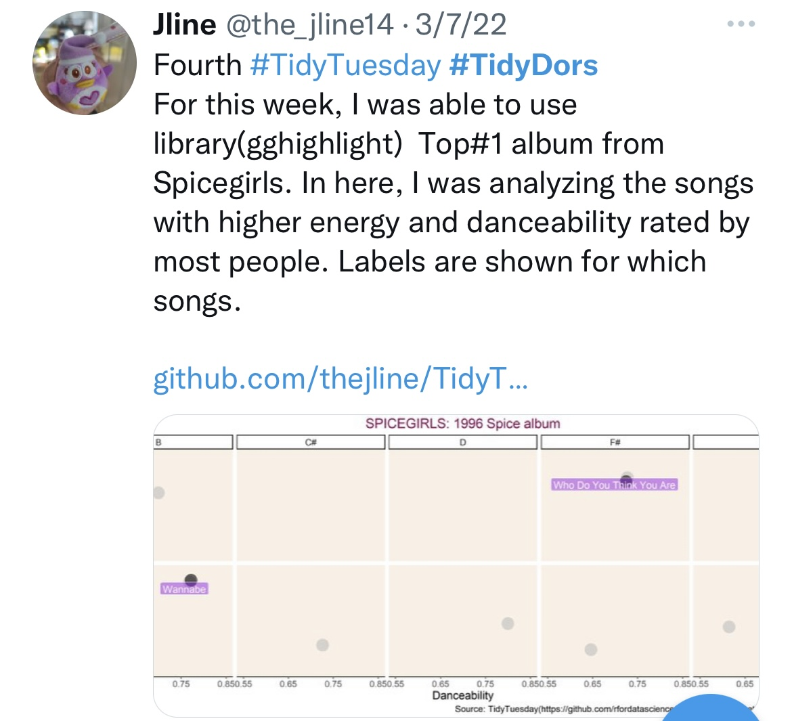
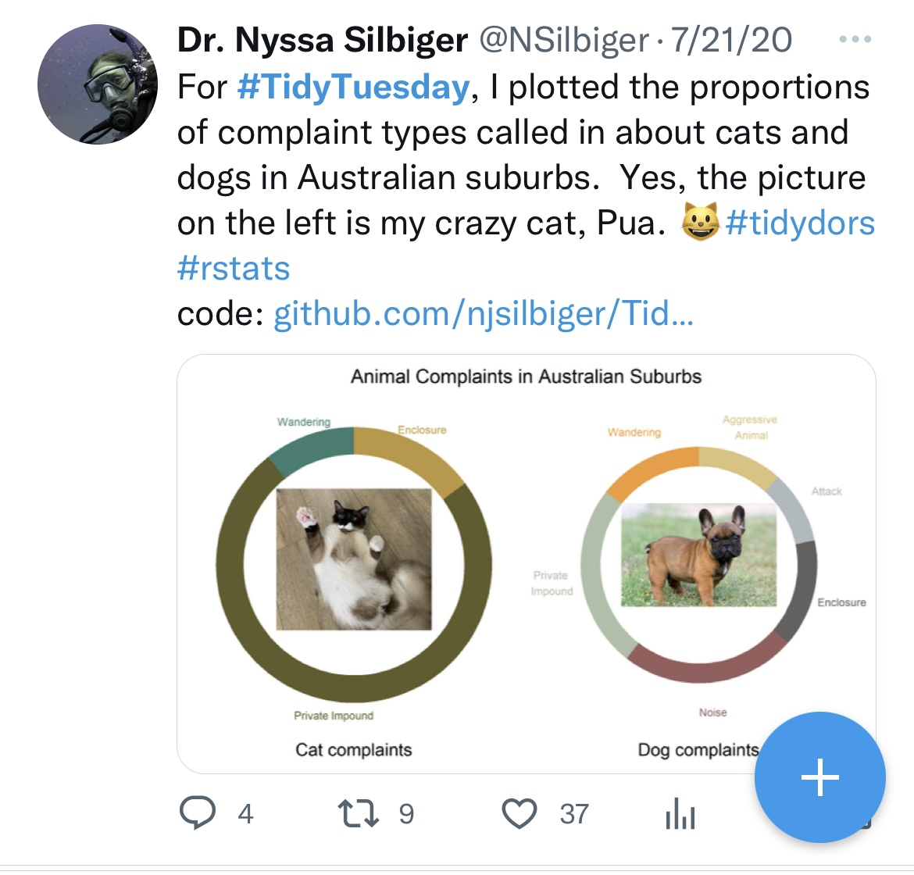
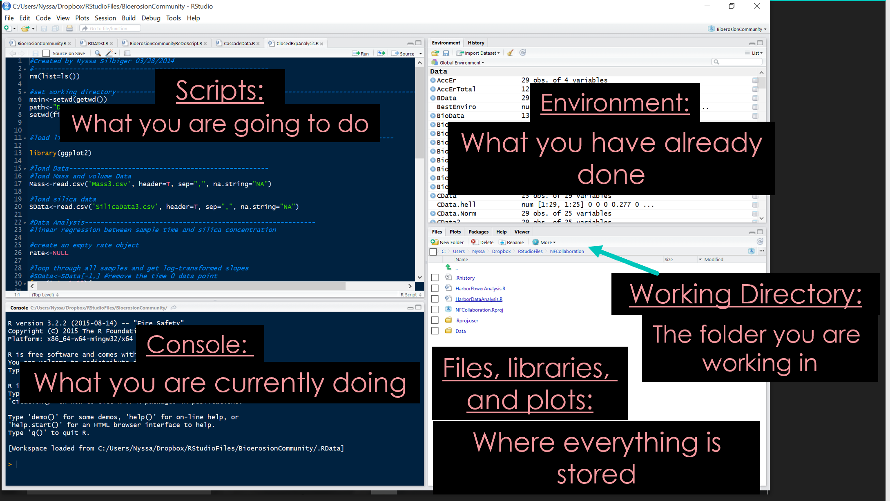
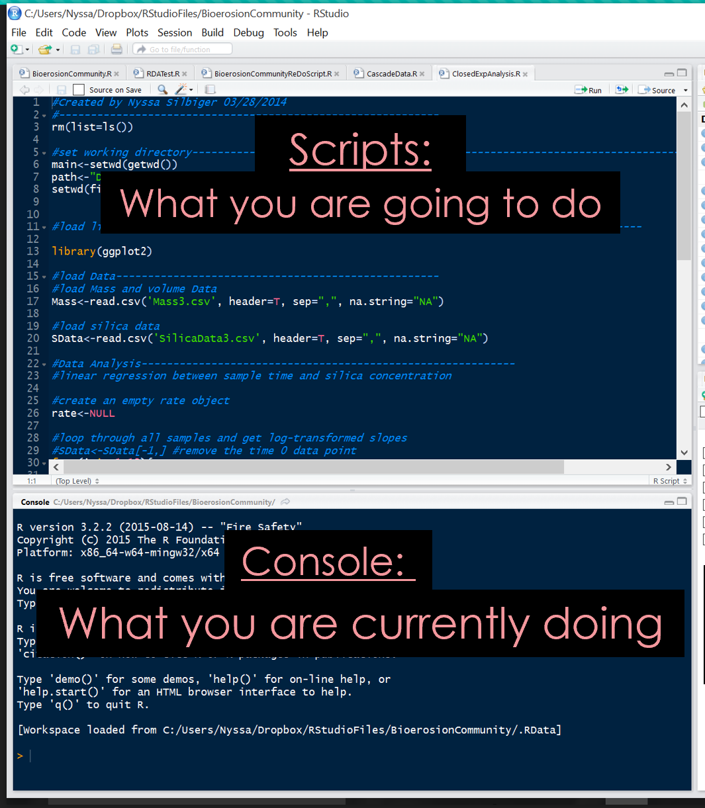

```{r setup, include=FALSE}
options(htmltools.dir.version = FALSE, htmltools.preserve.raw = FALSE)
```
<div style = "position:fixed; visibility: hidden">
$$\require{color}\definecolor{yellow}{rgb}{1, 0.8, 0.16078431372549}$$
$$\require{color}\definecolor{orange}{rgb}{0.96078431372549, 0.525490196078431, 0.203921568627451}$$
$$\require{color}\definecolor{green}{rgb}{0, 0.474509803921569, 0.396078431372549}$$
</div>

<script type="text/x-mathjax-config">
MathJax.Hub.Config({
  TeX: {
    Macros: {
      yellow: ["{\\color{yellow}{#1}}", 1],
      orange: ["{\\color{orange}{#1}}", 1],
      green: ["{\\color{green}{#1}}", 1]
    },
    loader: {load: ['[tex]/color']},
    tex: {packages: {'[+]': ['color']}}
  }
});
</script>

<style>
.yellow {color: #FFCC29;}
.orange {color: #F58634;}
.green {color: #007965;}
</style>


```{r flair_color, echo=FALSE}
library(flair)
yellow <- "#FFCC29"
orange <- "#F58634"
green <- "#007965"
```

---


# Welcome to Data Science Fundamentals in R

Class times: 1:00 - 2:50 Tuesday

Dr. Nyssa Silbiger
- Office hours: Tuesday 3:00 - 4:00 (MSB 612) 

TA is Gabrielle Martineau
- Office hours: Monday 11:30 - 13:30 (MSB 305)
 
--

.center[
_please email us if you plan to come so we don't look like..._


]


---

# Outline of class


Welcome to Data Science Fundamentals in R!


1. What are data?
2. What is your coding background?
3. Introduction to the class.
4. Data structures.


Lab 
1. R intro/refresher
  
---

# Data are everywhere!


---

# Data are everywhere!


---
# Data are everywhere!


---

# Data are everywhere!


---

# Data are everywhere!


---

# Data are everywhere!


---

# We live in a data filled world


## Data can take make forms

- Althetic performance
- Timeseries of polls
- Sequence Data
- Measurements of physical properties
- Spatial data (e.g., Maps)
- Timing of events
- Images
- Networks
- Plain Text 
- So much more....

---
class: inverse, middle, center

# Data are at the center of biology and oceanography

---
# Data are at the center of biology and oceanography


---

# Data are at the center of biology and oceanography


---
# Data are at the center of biology and oceanography


---

# This semester, we will all become data scientists!


---
# What is your experience?

```{r, echo=FALSE, warning=FALSE, message = FALSE}
library(tidyverse)
library(patchwork)

survey<-read_csv("libs/Data/survey.csv")
nr<-nrow(survey)

# make barplots for eachs question
degree<-survey %>%
  count(Grade) %>%
  mutate(n = 100*n/nr,
         x = "Grade") %>%
  ggplot(aes(y = n, fill = Grade, x = x))+
    geom_bar(position="stack", stat="identity")+
    labs(title = "Degree",
         xlab = "")+
    theme_bw()+
  theme(axis.title.x=element_blank(),
        axis.title.y=element_blank(),
        axis.ticks.x=element_blank(),
        axis.text.x = element_blank(),
         legend.text = element_text(size = 14),
        title = element_text(size = 14))

Rexper<-survey %>%
  count(R_experience) %>%
  mutate(n = 100*n/nr,
         x = "R experience") %>%
  separate(R_experience, into =c("R", "experience"), sep = "-")%>%
  ggplot(aes(y = n, fill = R, x = x))+
    geom_bar(position="stack", stat="identity")+
    labs(title = "What is your experience with R?",
         xlab = " ")+
    theme_bw() +
  theme(axis.title.x=element_blank(),
        axis.title.y=element_blank(),
        axis.ticks.x=element_blank(),
        axis.text.x = element_blank(),
         legend.text = element_text(size = 14),
        title = element_text(size = 14))

# git hub
gitexper<-survey %>%
  count(Github_experience) %>%
  mutate(n = 100*n/nr,
         x = "Git experience") %>%
  separate(Github_experience, into =c("Github", "experience"), sep = "-")%>%
  ggplot(aes(y = n, fill = Github, x = x))+
    geom_bar(position="stack", stat="identity")+
    labs(title = "What is your experience with Github?",
         xlab = " ")+
    theme_bw() +
  theme(axis.title.x=element_blank(),
        axis.title.y=element_blank(),
        axis.ticks.x=element_blank(),
        axis.text.x = element_blank(),
         legend.text = element_text(size = 14),
        title = element_text(size = 14))


degree
```

---
# What is your experience

```{r, echo=FALSE, warning=FALSE, message = FALSE}
Rexper
```

---
# What is your experience

```{r, echo=FALSE, warning=FALSE, message = FALSE}
gitexper
```

---
# What do you want to learn?

.center[
```{r, echo=FALSE, message=FALSE, warning=FALSE}
library(wordcloud2)
library(tidyverse)

stop_words <- c('a', 'and', 'for', 'the', 'to', 'in','be','i','it','of','that','with','can','about','if','how','use','my','when','am','on','im')

 words<-survey %>% select(text = WantToDo) %>%
   mutate(text = tolower(text)) %>% 
   mutate(text = str_remove_all(text, '[[:punct:]]')) %>% 
   mutate(tokens = str_split(text, "\\s+")) %>%
   unnest(cols = c(tokens)) %>% 
   count(tokens) %>% 
   filter(!tokens %in% stop_words) %>% 
  # mutate(freq = n / sum(n)) %>% 
   arrange(desc(n)) %>%
   select(words = tokens, freq = n)

 wordcloud2(words, color = "random-light", backgroundColor = "grey")
```
]
---

# But, first, tell me about you...
Ice Breaker: 
1. tell us your name 
1. why you wanted to take this class 
1. if you could create any function in the world what would it be?

---
# Our semester: venturing into the wonderful world of reproducible and transparent data

--

This class is **NOT**:
- A statistics course 
- A bioinformtics course 

--

We **will**:

- Learn best practices for data entry
- Learn how to create clean and reproducible scripts in the program *R*
- Learn to share code and data on a public version-controlled repository
- Work collaboratively on a project
- Create high quality visuals using *R*
- Learn to love working with Data!

--


---
# Our semester: venturing into the wonderful world of reproducible and transparent data


---

# Our semester: venturing into the wonderful world of reproducible and transparent data

### We will learn **R** and **Markdown** languages

  

Image credit: [Allison Horst](https://github.com/allisonhorst/stats-illustrations)
---

# Our semester: venturing into the wonderful world of reproducible and transparent data

#### We will create beautiful graphics that enable us to better understand our data using #TidyTuesday (details to follow)  

.pull-right[]  

.pull-left[]  


---
class: center

# Grading


| Component   |      Percent      |  
|----------|:-------------:|------:|
| Tidy Tuesday Plots |  15% | 
| Lab Assignments |    30%   | 
| Class Participationt | 5% | 
| Final Independent Project | 35%| 
| Short Quizzes|  15% | 

--

I will go over each of these components in future lectures.   


All rubrics are on Laulima and details on syllabus.


---
# Communication


I created a class slack channel that you all can use to easily ask your classmates for help, give advice, and share resources.

[Click Here to Join](https://join.slack.com/t/ocn-682/shared_invite/zt-2o40hw000-WgmQGoxkE8tgvdQnD6MF0A) or see in the syllabus.

What is slack? [See here](https://slack.com/intl/en-pf/)

Is it free? **YES**

---

# How to get class assignments and lectures?

This week, everything will be on Laulima
Starting next week all assignments and lecture slides will be on Github (a free online repository).  

- This is a 3 unit class, with 2 of this units in person and one unit at home. Each week we will have one lecture in class and one online lecture to be completed BEFORE the next in person meeting. 

- We will have weekly lab assignments that are due the following week.


--


What is Github?


--

Stay tuned....

---
# Group work

This class is structured on the principle that you learn just as much from your peers (both teaching and listening) as you do from me.  Therefore, while all your assignments are to be turned in independently you are allowed (encouraged) to work on your homework assignments in groups. At the beginning, the more advanced students will learn to be better coders by helping to mentor the beginners, while the beginners will be brought up to speed more quickly by having advanced coders to ask questions.  

You will also have many "think-pair-share" opportunities during lectures. I encourage you to "pair" with different students each class because every one thinks differently. Learning from different thinkers will help you think more broadly about coding.  

Note that 5% of your grade is based on class participation, which includes helping your peers during class.


---
# Readings

All textbooks are free and online for this class.

- Links for the books are in the syllabus.  

--

- All required reading (listed each week) should be completed **before** class.  

--

- Use active reading. Most readings come with code. If you do it before class then it will be much easier to work through and understand the content in class  


 
  
 
 


---
# Short quizzes

### 10 min quiz, every week  

- Concepts from required readings, labs, and lectures
- Open notes, but no discussing with classmates (but the quiz is only 10 mins... so make sure to prepare and be on time)
- Lowest grade dropped

---
# Projects


### Independent Final Project
- Visualization and explanation of a data set of your choosing (from your own work or found data)
- Bringing together multiple data sets are encouraged!
- In the coming weeks start thinking about what data you would like to use and what questions you would like to answer. You will propose your ideas with me for approval.


---
class: inverse, middle, center

# What is data?

---

# Data comes in lots of forms

### There are several **Data Types** in R that you will need to know

--
.orange[character] : Can be a letter or a combination of letters enclosed by quotes is considered as a character data type by R. It can be alphabets or numbers  
- ex: "a", "my name is Dr. Silbiger"

--

.orange[numeric]: Numbers that have a decimal value or are a fraction in nature have a data type as a numeric (also called "double")  
- ex: 2.0, 14.573849 

--

.orange[integer]: Numbers that do not contain decimal values have a data type as an integer  
- ex: 1, 2, 3, 4

--

.orange[logical]: A variable that can have a value of True and False  
- ex: TRUE, FALSE

---

# Data types con't

.orange[complex]: An imaginary number.
- ex: 1+4i

--

.orange[factor]: They are a data type that is used to refer to a qualitative relationship like colors, good & bad, course or movie ratings, etc. They are useful in statistical modeling.
- ex: "Good", "Better", "Best"

--

### Knowing the names of all these data types and what they mean is important

---
# Data can also come in many *structures*


---
# Data can also come in many *structures*

| Dims   |      Homogeneous (same data type)     |   Heterogeneous (diff data type) |  
|----------|:-------------:|:------:|
|1D |  Atomic vector |    List     |
|2D |    Matrix   | DataFrame |
| ND | Array |    |
 
--
 
.pull-left[
```{r, echo=FALSE}
 Vector<-c(1,2,3,4)
 print(Vector)
```
]

--

.pull-right[
```{r, echo=FALSE}
List<-list(1, "a" ,"TRUE")
 print(List)
```
]

---
# Data can also come in many *structures*

| Dims   |      Homogeneous (same data type)     |   Heterogeneous (diff data type) |  
|----------|:-------------:|:------:|
|1D |  Atomic vector |    List     |
|2D |    Matrix   | DataFrame |
| ND | Array |    |
 
 
--
 
.pull-left[
```{r, echo=FALSE}
matrix(1:6, ncol = 3, nrow = 2)
 
```
]

--

.pull-right[
```{r, echo=FALSE}
data.frame(
  x = 1:3,
  y = c("a", "b", "c"),
  stringsAsFactors = FALSE)
```
]

--

```{r, echo=FALSE}
data.frame(x = 1:3, y = I(matrix(1:9, nrow = 3)))
```
---
class: center, middle

### Our first lab is an intro to R/R refresher. 

### But, first, a short break!


---
---
# Outline for lab

- What is R?
- What is coding?
- Benefits and constraints to R
- How to interact with R
- Examples in R
- Work on your own


---

# What is R?

- “R is a language and an environment for statistical computing and graphics”
- R is a FREE program and completely open-source (you can see all the source code)
- R is an object-oriented and functional language


---

# What is coding?

- **Coding** is a way of directly telling the computer what to do.  

- Every command you execute in an existing program (like hitting the save button on a document) has a line of code that tells the computer "when this button is clicked, do this action“.  

- Coding allows you to manipulate the computer exactly how you want.  

- You can create a **“script”** which has multiple lines of code and allows you to execute several commands all at once.


---

# Benefits of using R
.pull-left[
- FREE! (JMP: $1,540.00, PRIMER: $500, Minitab:$1,495)  
- Powerful and flexible  
- Publication quality graphics  
- Runs on all computer platforms  
- Superb data management and manipulation capabilities  
- Reproducibility and transparency: R uses scripts instead of clicking on things with a mouse  
- You can write functions for specific needs  
- You will become a better statistician because you will be forced to learn the inner workings of the models rather than just clicking a button  
- A lots of help available: Google knows everything about R 
- Some of the most lucrative jobs are coders]

.pull-right[]

---

# Publication quality graphics

--

.pull-left[## From simple...
]

--
.pull-right[## To more complex... 
]


---

# Constraints 
.pull-left[

- It’s an uphill battle, but totally worth it and YOU CAN DO IT  

- It’s open source (in my opinion this is good and bad)  

- Multiple functions to do the same thing (because it is open source)
]

.pull-right[
  

Image credit: [Allison Horst](https://github.com/allisonhorst/stats-illustrations)]

---

# Rstudio: Integrated Development Enviroment




---
# Rstudio

.pull-left[

]

.pull-right[
- Two main ways to interact with R: Console and using scripts

- **Console**: the place where R is waiting for you to tell it what to do. You can type commands directly into the console, but the command will be forgotten once you close R.

- **Script**: A place to create and save code. You can send the code that you write in a script to the console in a few different ways. 

]

---
# Interacting with R

- **">"**   This symbol in the console means that R is ready for you. If you do not see this sign, R is busy doing something else that you told it to do.     

--

- If R is still waiting for you to enter more data because it isn’t complete yet, the console with show a **“+”**.  It means that you haven’t finished entering data.  

--

- To assign an object (i.e. give something a name so that you can save it and use it later) use **“<-”**.  An **“=“** will work for simple things, but for reasons we won’t discuss in class today it is incorrect and will cause you lots of problems when you get into more complicated coding.  

--

```{r}
X<- 3 #means the value of x is 3

```

--

- **#** is used for comments. Anything to the right of the # is ignored by R

--

- R is a literal language. For example, a<-4 means something completely different than A<-4. Spelling, capitalization, and punctuation all matter. The computer only knows what you tell it and it assumes that you mean exactly what you say.

---

# Functions

- Functions are “canned scripts” that automate something complicated or convenient or both.  

--

- Example: you can use the function sum() to add together a bunch of objects instead of writing out a long equation  

```{r}
sum(1,4,3)

```

--

.pull-left[
- plot(x,y) will create a simple plot]

.pull-right[
```{r, fig.width=4, fig.height=3}
plot(1:5, 5:9)
```
]


---
# Asking for help

- Put **?** in front of a function that you don’t understand and R will tell you what it is  

```{r, eval=FALSE}
?plot
```

--

- If you are looking for a function to do a particular task use help.search() 

```{r, eval=FALSE}
help.search("ANOVA")
```

--

- When you can’t even remember what it is called…..apropos(“nova”)

```{r}
apropos("nova")
```

--
- Google is your best friend!!


---

# R as a calculator

.pull-left[
```{r}
1+1
```
]

--

.pull-left[

```{r}

answer<-1+1 # save it as answer
answer

```

]
--
.center[

### Functions and Equations]

.pull-left[


```{r}
a<-sqrt(10)
a

```
]

--

.pull-right[
```{r}
b<-a*log(10)
b

```
]
---
# Getting started with R

### Run through these data carpentry lessons before next Tuesday for an intro/refresher in R.

Click on the links below

[Home](https://datacarpentry.org/R-ecology-lesson/index.html)  
[Before we start](https://datacarpentry.org/R-ecology-lesson/00-before-we-start.html)  
[Introduction to R](https://datacarpentry.org/R-ecology-lesson/01-intro-to-r.html)  
[Starting with data](https://datacarpentry.org/R-ecology-lesson/02-starting-with-data.html)  


### Online lecture this week is all about making data sheets. Don't forget to do the reading assignment before watching

---

class: center, middle

# Thanks!

Slides created via the R package [**xaringan**](https://github.com/yihui/xaringan).


