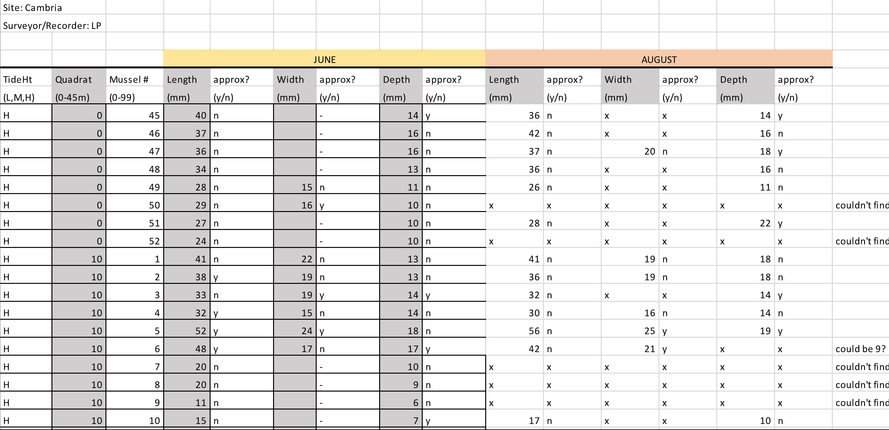

```{r setup, include=FALSE}
options(htmltools.dir.version = FALSE,htmltools.preserve.raw = FALSE)
```
<div style = "position:fixed; visibility: hidden">
$$\require{color}\definecolor{yellow}{rgb}{1, 0.8, 0.16078431372549}$$
$$\require{color}\definecolor{orange}{rgb}{0.96078431372549, 0.525490196078431, 0.203921568627451}$$
$$\require{color}\definecolor{green}{rgb}{0, 0.474509803921569, 0.396078431372549}$$
</div>

<script type="text/x-mathjax-config">
MathJax.Hub.Config({
  TeX: {
    Macros: {
      yellow: ["{\\color{yellow}{#1}}", 1],
      orange: ["{\\color{orange}{#1}}", 1],
      green: ["{\\color{green}{#1}}", 1]
    },
    loader: {load: ['[tex]/color']},
    tex: {packages: {'[+]': ['color']}}
  }
});
</script>

<style>
.yellow {color: #FFCC29;}
.orange {color: #F58634;}
.green {color: #007965;}
</style>


```{r flair_color, echo=FALSE}
library(flair)
yellow <- "#FFCC29"
orange <- "#F58634"
green <- "#007965"
```

---
# Outline of class

1. Data dimensions 

1. Metadata

1. Create a data sheet for the field/lab

1. Create a data sheet for data analysis

These are different, but equally important tools for transparent data. 


---

# What are the dimensions of your data?

--
 
 ### - Number of complete observations
-  A water sample

-  A mouse in a trial

--

### - Number of things measured per observation
- In the water I measured pH, nitrate, and salinity

- I measured the height and weight of the mouse

---
# Wide data

 ### One observation per row and all the different variables are columns


| Sample ID| Treatment   |      Nitrate      | Temp | Salinity | 
|----------|:-------------:|------:|----:|-----:|
| 1 | High|  1.2 | 7.2| 34.1|
| 2 | High|    3.0   | 7.8| 34.0|
| 3 | Low |2.4 | 8.0|34.2|
| 4 | Low |5.1| 8.0| 33.0|
| 5 | Low| 1.1| 7.9| 34.5|


---

# Long  data

 ### One unique measurement per row and all the info about that measurement in the same row


| Sample ID| Treatment   |      Measurement_Type      | Value | Units | 
|----------|:-------------:|------:|----:|
| 1 | High|  Nitrate | 1.2| uM_L|
| 1 | High|    Temp   | 7.2| deg_C |
| 1 | High |Salinity | 34.1|psu|
| 2 | High |Nitrate| 3.0| uM_L|
| 2 | High| Temp| 7.9| deg_C|
| 2 | High| Salinity| 34.0| psu|


--

There are pros and cons to both depending on the type of data you collect. These will become more evident as you code throughout the semester.

---
# Hybrid data

 ### A mix of everything....
 
 
 
 --
 
 .center[
 
 ]
 
---
# What is metadata?

Metadata is simply data about **data**. It means it is a description and context of the data. It helps to organize, find and understand data.

--
 ## Typical metadata
 
 - Title and description  
 - Tags and categories  
 - Who created or collected the data and when  
 - Who last modified and when  
 - Who can access or update   
 - Units of measurements for each parameter  
 - Notes associated with the collection  


.footnote[https://dataedo.com/kb/data-glossary/what-is-metadata]

---
# We use metadata in our everyday lives


.footnote[https://dataedo.com/kb/data-glossary/what-is-metadata]

---
# We use metadata in our everyday lives

.center[

]

.footnote[https://dataedo.com/kb/data-glossary/what-is-metadata]

---
# We use metadata in our everyday lives

.center[
]

.footnote[https://dataedo.com/kb/data-glossary/what-is-metadata]

---
# What do you think is important metadata for your research?

--

### Required metadata for different biological databases

 - BCO-DMO (oceanographic data: [Dataset metadata form](https://www.bco-dmo.org/files/bcodmo/DATASET.rtf) )
 - NCBI (Sequence data/GenBank: [GenBank metadata](https://www.ncbi.nlm.nih.gov/genbank/structuredcomment/))
 - EML (Ecological metadata: [EML Guide](https://nceas.github.io/oss-lessons/ecological-metadata/ecological-metadata.html))


---


# Creating a good data collecting sheet

1. How easy is it to read?

1. Are column and row definitions clear?

1. Is there metadata?

1. How similar is it to your data entry sheet?

1. Can you use it at 4am?


---
# Making a data sheet for the field/lab

Things to keep in mind when making a data sheet:
- Font size matters (will you be able to see it in the field easily?)

- Bolding can be helpful

- Have well defined lines

- Have a space to write down who took the data

- When were the data taken?

- Where were the data taken?

- Does your sheet fit on one piece of paper?

- Does it make more sense to have your sheet in landscape or portrait?

- Print and check out how your data sheet looks before it is finalized

- Do you have enough space to write your data into the boxes?

---

 

---


 

---
# NOT good field or lab data sheets?
.pull-left[

]

.pull-right[

]


 .center[
  ## Keep a hard/original copy of everything]

---
# Creating good spreadsheets for analysis
### Tips from Browman and Woo (2017)

--

.pull-left[
  1: Be consistent  
 ]
 
--

.pull-left[ 
2: Choose good names  
 ]
--
 
 .pull-left[ 
 3: Write dates as YYYY-MM-DD 
 ]
--
 .pull-left[ 
 4: No empty cells  
 ]
--
 
 .pull-left[ 
 5: Just put one thing in a cell 
 ]
 
--
 
 .pull-left[ 
 6: Make it a rectangle  
 ]
 
--
 
.pull-left[ 
 7: Create a data dictionary  
 ]
 
--
 
 .pull-left[ 
 8: No calculations in the raw data file  
 ]
 
--
 
 .pull-left[ 
 9: Do not use color or highlights  
 ]
--
 
 .pull-left[ 
 10: Make back-ups  
 ]
--
 
 .pull-left[ 
 11: Use data validation to avoid errors  
 ]
 
--
 
 .pull-left[ 
 12: Save as plain text  
 ]

---
# 1. Be consistent

--

Use consistent terminology throughout:
 - Do: male/female; m/f; Male/Female
 - Do not: Male/female; M/female, or change throughout the data sheet

--

Use consistent variable names:
- Do: High_treatment/Low_treatment; Glucose_6wk/Glucose_10wk
- Do not: High_treatment/Treatment_14C; Glucode_6wk/ Glucose 10 weeks

--

Be careful with spaces! (I always copy and paste instead of typing each cell)
- Do not: "Site A"; " Site A"; "Site A " 

--

Use consistent file names:
- Do: CondData_S32_011721.csv; CondData_S32_011821.csv  
- Do not: S32_CondSensor_011821; CondData_S32_011921.csv

---
# 2. Choose good names
.pull-left[
### Avoid spaces in names:
- **Site 1**: Site_1; Site.1; Site1 are all options, though **Site_1** is best
- Be careful about extra spaces at the beginning or end of a variable (e.g. "high", " high" will mean different things to R)
]
--

.pull-left[
### Do not use special characters:
- ($, @, %, #, &, *, (, ), !, /, etc.)
- These have different meanings in coding languages and can cause problems
]

--

Keep names *short, but meaningful*


---
# 2. Choose good names

.center[
### Never name a document as "final"... it is a curse.


]
---
# 3. Write dates in ISO 8601 format
- YYYY-MM-DD (2021-01-23)
- excel can make lots of mistakes with different date formats

.center[

]


---

# 3. Write dates in ISO 8601 format
- YYYY-MM-DD (2021-01-23)
- excel can make lots of mistakes with different date formats

.pull-left[]
.pull-right[]

---

# 4. No empty cells in your word doc

- Missing data and 0 mean very different things. An empty box makes that information unknown.
- If data are missing put **NA** 
- If there are 0 counts of something put a **0**
- Do not leave it blanks

--

# 5. Put only one thing in each cell

- Plate example: Instead of plate-well as "13-A01", have one column for plate and one column for well (13, A01)
- Don't put units in your cells (this will come back when we talk about data dictionaries). (e.g., "46 g" is just 46). If you really want, you can have one column for the value (46) and one column for the units (g)
- Don't put your notes with the data (e.g., "0 below detection"). Just put a 0 and have another column for your notes

---
# 6. Make your spreadsheet a rectangle

- Only have one row for your variable names on top.  Do not have multiple rows of headers
- Make every row an individual measurement (or subject or sample ID) and every column one variable

--

.center[
### Bad examples:
{width=50%}
]

---
# 6. Make your spreadsheet a rectangle
- It is ok to have multiple rectangles, just put them on different spreadsheets

.center[
### Good examples:


]

---
# 7 Make a data dictionary

### This will contain very important metadata for your datasheet
It should contain (at least):
- The exact variable name as in the data file  
- A version of the variable name that might be used in data
visualizations  (e.g. a "pretty name")  
- A longer explanation of what the variable means  
-  The measurement units  


.center[

]

---
# 8. **NO** calculations in your spreadsheets

### This is not transparent data analysis. Once your file is saved outside of excel (like a .csv), you may loose what those calculations are. 

 - This can lead to major errors in your data analysis that are not easily traceable 
 - All your calculations should be within your code for true transparency 
 
 .center[
 
]
---
# 9. Do not use highlight or colors in your spreadsheet
- You will lose that information

.center[
### Ex. where an outlier is highlighted (left). What you should do (right).

]

---
# 10. Make back-ups!!

### We will talk more about using an online repository called GitHub next week. 

Consider also using box, dropbox, or google drive.  Never have your data just on your hard drive.  Your future self will thank you.

.center[
This actually happened to me...


]

---
# 11. Use data validation feature to avoid errors

In excel:
- Select a column
- In the menu bar, choose Data→ Validation
- Choose appropriate validation criteria. For example,    
  – A whole number in some range
  – A decimal number insome range
  – A list of possible values
  – Text, but with a limit on length
  
An error will pop-up when typing if it is outside the range


---
# 12. Save data as plain text file

- Always save your spreadsheets as a .csv
- This is a non-proprietary format and can be opened in any spreadsheet program

.center[

]
---
# What is wrong with this data sheet?


---
# What is wrong with this data sheet?

 

---
# What about this one?


---

class: center, middle

# In lab today we will make a field/lab sheet, data sheet, and metadata (data dictionary).

But, first 10 minute break

---

class: center, middle

# Thanks!

Slides created via the R package [**xaringan**](https://github.com/yihui/xaringan).


