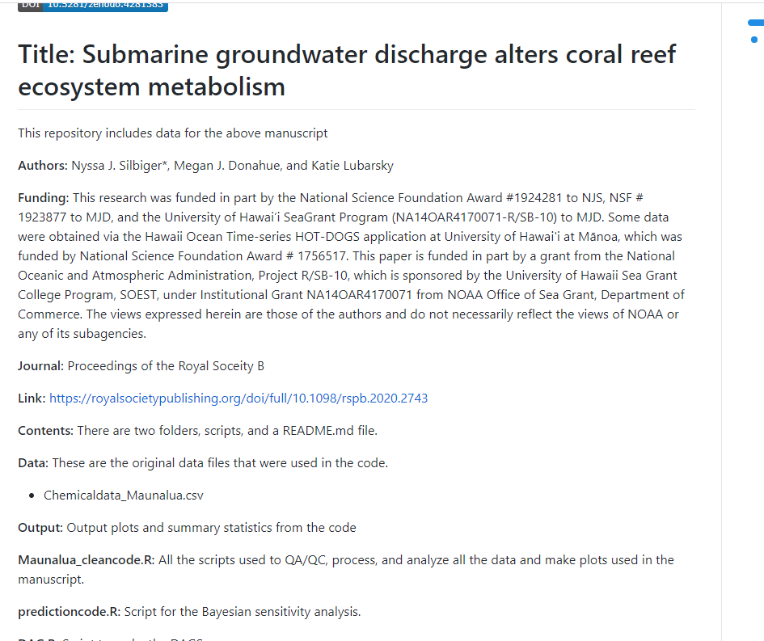
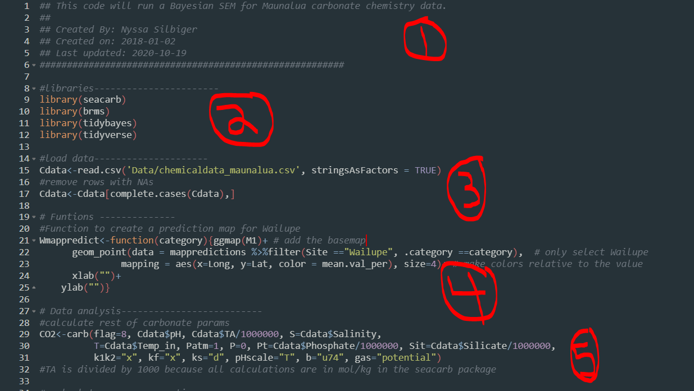
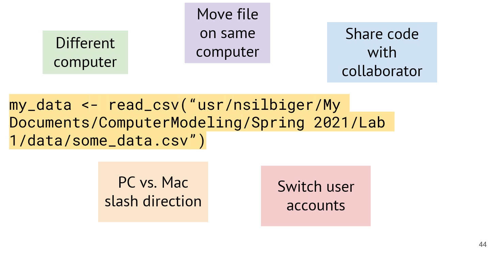
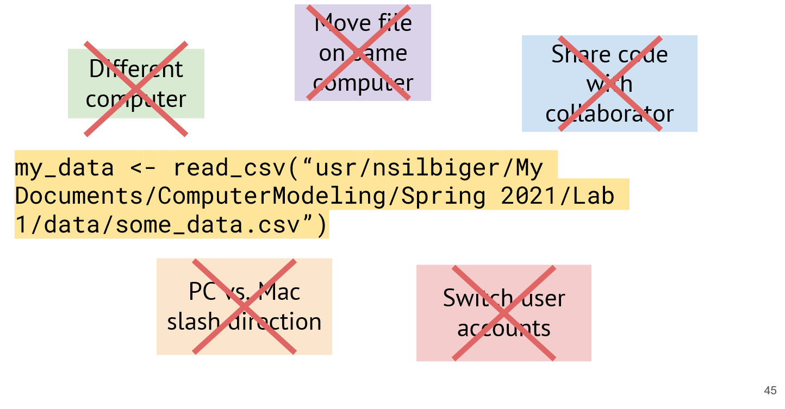
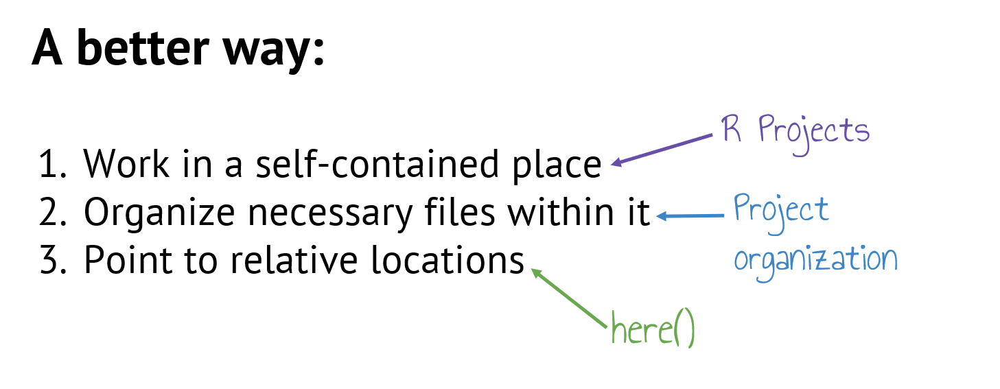
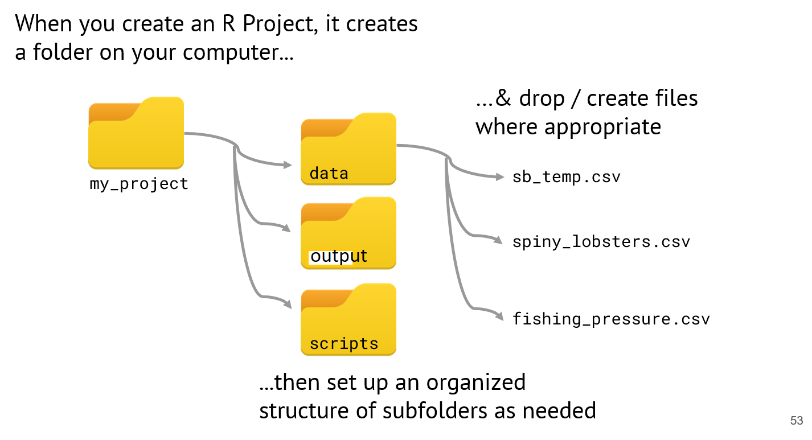
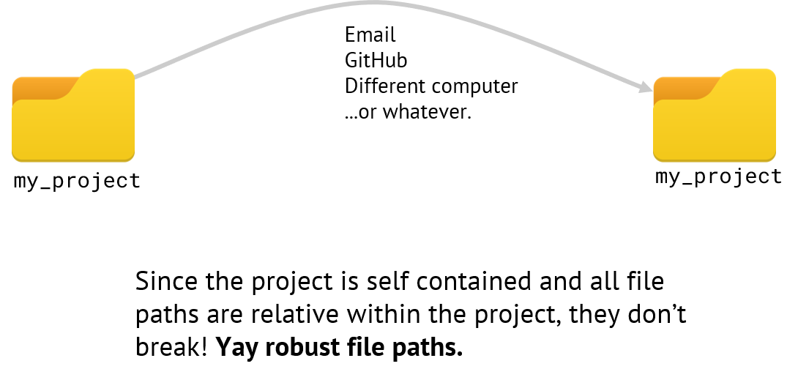

```{r setup, include=FALSE}
options(htmltools.dir.version = FALSE)
```

---
# Outline of class

1. Clone class repos

1. Proper file structure

1. Proper script structure

1. Reminder on R packages

1. Import Data
  
Lab 
1. Create file structure for class 

1. Basic markdown for Readme files


---

# Git Organizations

- Last class you learned how to create your own repo as an individual. Another cool thing about GitHub is you can be part of an **organization** where you can keep lots of repos from one group together.

- You have all been added to GitHub Organization **OCN-682-UH**. 
- You should have received an email asking you to accept (please do if you haven't already)


---
# Git Organizations
- Everything for our class will be in this organization.
- You will clone **two** repositories from our class organization today.

--

1. Fall-2024  
  - This is where all the information for the class will be.
  - You **DO NOT** have access to push to this repo so that you do not accidentally change the lecture slides. You can only **pull**
  - Every day before class use *git pull* to download all the class materials

--

2. Your Last Name  
  - This is where you will turn in all your assignments.  You, and currently only you, have access to **push** changes to your own repo.

--

I will show you an example now

---
# Working in git for this class

1.  Before class starts, navigate to "Fall-2024" in your projects (upper right-hand corner of RStudio) and **pull.**

--
1.   Next navigate to your personal repository and **pull**.  

### This is the repo you will work in during class.


---
 # Proper file structure
 
 This is a photo of one of my past working directories
 
 
 
 There is **NO** organization here.... It is impossible to find anything...
 
 
---
 # Don't be past me...
 In general, your repos should be set-up to have At least 3 subfolders: **Data**, **Scripts**, and **Output**.  
 
 Think of one repo as one project or publication or chapter.  Do not put everything you do in one single repo.
 
.center[ 
 
]

---
# File structure for this class...

In this class, we will have one more level of structure to keep everything tidy and easy to find.

1. Have one folder for every week

1. Within that weekly folder have a folder named *Data*, *Scripts*, and *Output*. 

It will look like this...

--

- Week_03
  - Data
  - Scripts
  - Output
  
- Week_04
  - Data
  - Scripts
  - Output

- so on....
---

# Adding folders to Git

You can add all the contents in a folder at once by adding the folder

- *git add Week_03/*  will add all the contents in the *Week_03* folder so that you do not have to do it one by one

- Note, git will **not** put an empty folder on GitHub (because there is nothing inside). So, do not worry if you go to add your folder now and don't see anything on GitHub. There is nothing for git to save. 

---
# Reproducible Projects require clear readme files.

Some examples:

- [Jennifer Fields](https://github.com/jenniferfields/EcoFunORTidepools)

- [Danielle Becker](https://github.com/daniellembecker/Nutrient_sediment_loading_affect_coral_functionality)


 
---
# Readme files

1. Give an overview of what the reader will find

2. List the contents of the repository

3. If this is for a **publication**, list authors, journal information, funding (if relevant), citation, and content.




 
---
# How to edit a readme file

### Intro to Markdown - "Markdown is a lightweight markup language with plain text formatting syntax."

--

Why write with Markdown when you can press buttons in an interface to format your text? 

1. Markdown can be used for everything. People use it to create websites, documents, notes, books, presentations, email messages, and technical documentation.

--

2. Markdown is portable. Files containing Markdown-formatted text can be opened using virtually any application. If you decide you don’t like the Markdown application you’re currently using, you can import your Markdown files into another Markdown application. That’s in stark contrast to word processing applications like Microsoft Word that lock your content into a proprietary file format.

--

3. Markdown is platform independent. You can create Markdown-formatted text on any device running any operating system.

---
### Intro to Markdown - "Markdown is a lightweight markup language with plain text formatting syntax."


4) Markdown is future proof. Even if the application you’re using stops working at some point in the future, you’ll still be able to read your Markdown-formatted text using a text editing application. 

--

5) Markdown is everywhere. Websites like Reddit and GitHub support Markdown, and lots of desktop and web-based applications support it.

--

## How to learn

- Markdown guides [Markdown Basics](https://www.markdownguide.org/basic-syntax/)
- Free online tutorials [Online tutorial](https://www.markdowntutorial.com/)
- Free online Markdown editor [dillinger](https://dillinger.io/)

You will practice using Markdown in lab today.

---
# Creating a transparent script

- Do your collaborators know what you did?
- Do **you** know what you did? Can you go back to the code in a year after a reviewer asked you to change your analysis?

--

Your script should be divided into 5 (ish) subsections (depending on what you are doing)

--

1. A short **intro** to the purpose of the code  

--

2. Loading the **libraries** that you use in the script  

--

3. A list of important **functions** (we won't use these until later in the semester)  

--

4. Read in your **data**  

--

5. Code for your **data analysis**  
  - This will be divided further based on your own personal analysis  


---
# Creating a transparent script




---
# Creating a transparent script

Section 1: Start with a short intro of what your intend to do with your script. Say who you are, the date you created it, and when you last edited it.

Section 2: Load the libraries. Here, I load all the libraries that I need for my code to run.

Section 3: Functions. If you will be creating your own functions it is best to put them all right up front so that they are available for the whole script. If I have lots of functions, sometimes I will put them in their own script and then source them in so that it is not so messy. More on that later.

Section 4: Load data. This is where you load all your data files.

Section 5 and beyond: All your analyses, which can also be subset into different sections.

***Probably the most important advice that I can give you is to comment, comment, comment, and comment some more on your code.***


---
# Let's create our first simple script

- Navigate to the project with your last name
- Create a folder titled "Week_02" and 3 subfolders titled "Scripts", "Data", and "Output"
  - You can do this directly in the folder on your computer, in RStudio by clicking "New folder", or in the terminal by typing *mkdir foldername*

--

### Before we make our script we are going to install two packages.

--

- A package is a library of canned functions. 
- You download and install them onto your local harddrive in order to use them.
- To install a package you type **in the console**:

```{r, warning=FALSE, error=FALSE, message=FALSE, eval=FALSE}
install.packages("PackageName")
```

- You **do not** need to put this in your script because you only ever do it once (unless you need to update the package). Think of it as installing a program. You only install it once. You do not need to install it again everytime you open it.

---
# Install packages 

.center[
### The {here} package helps us easily navigate around our projects.   
We will use this to make unbreakable file paths.

```{r, warning=FALSE, error=FALSE, message=FALSE, eval=FALSE}
install.packages("here")
```

]

---
# What do we mean by "unbreakable file paths"?

### **Consider**: an absolute file path

```{r, eval=FALSE}
my_data <- read_csv("usr/nsilbiger/My Documents/ComputerModeling/Fall 2024/Lab 1/data/some_data.csv”)

```

Note: the code to read in data is *read_csv("file path to data")*. The file name in this example is **some_data.csv**.  

In this example, we have named our new dataframe *my_data*.
--

### **How does it break?**
Let us count the ways...

---
class: center, middle



---
class: center, middle



---

---
# Let try an example with an appropriate R project, file structure, and {here}

.center[

]

---
### If I am working within my project, then to read in the sb_temp.csv file (which is in the data folder), I can use the **here::here()** function: 

(the left of the :: is the *package name* and to the right is the *function name*.  In this case, they are both *here*)

```{r, eval=FALSE}
my_data<-read_csv(here("data","sb_temp.csv"))
```

--
This code says "read the csv file named sb_temp.csv that is in the folder data." 

--
.center[

]

---
# Install Tidyverse 

.center[
### “The tidyverse is a coherent system of packages for data manipulation, exploration and visualization that share a common design philosophy.”]


.pull-left[]

.foot-note[Joseph Rickert  
[What is the tidyverse](https://rviews.rstudio.com/2017/06/08/what-is-the-tidyverse/?)  
RStudio Community Blog
]


.center[
```{r, warning=FALSE, error=FALSE, message=FALSE, eval=FALSE}
install.packages("tidyverse")
```
]
---
# Let's create our first simple script

- You should now have {here} and the {tidyverse} installed on your computer.  

- Today, we are just going to load some libraries and read in a simple .csv file.  

--

- Copy the **"weightdata.csv"** file from the Fall-2024 repo into your own private repo.  Put it in the **data** folder within **Week_02**.  

--

- Open a new script and save it in your **scripts** folder within **Week_02**. You can name it whatever you want. 

---
# Let's create our first simple script

The first thing we do is make a header

```{r, eval=FALSE}
### This is my first script.  I am learning how to import data
### Created by: Dr. Nyssa Silbiger
### Created on: 2023-02-02
###############################################

```

---
# Let's create our first simple script

Next, we want to load the libraries that we plan to use.  
Adding the extra hashtags after load libraries makes a new section (notice the little carrot that appears)

```{r}
### Load libraries ########## 
library(tidyverse)
library(here)
```
---
# Let's create our first simple script

Next, let's read in our data using the {here} package.
weightdata.csv is in folder data, which is in folder Week_2

```{r}
### Read in data ###
WeightData<-read_csv(here("Week_02","data","weightdata.csv"))

```

---
# Let's create our first simple script

Lastly, for today, some analysis.  
We will simply look at the data.

```{r}
### Data Analysis #####

head(WeightData) # Looks at the top 6 lines of the dataframe

```

---
# Let's create our first simple script

```{r}

tail(WeightData) # Looks at the bottom 6 lines of the dataframe


View(WeightData) # opens a new window to look at the entire dataframe

```


---
# For lab today you have three tasks

1. Push the Week 2 folder with your first script and associated data onto your personal GitHub repository

1. Complete the [Online Markdown tutorial](https://www.markdowntutorial.com/)

1. Edit your readme file to say something useful about your repository.

Complete all 3 before Tuesday at 1pm.  Feel free to ask your classmates for help

---
class: center, middle

# Thanks!

Slides created via the R package [**xaringan**](https://github.com/yihui/xaringan).

Some slides modified from Allison Horst, Jarret Byrnes


