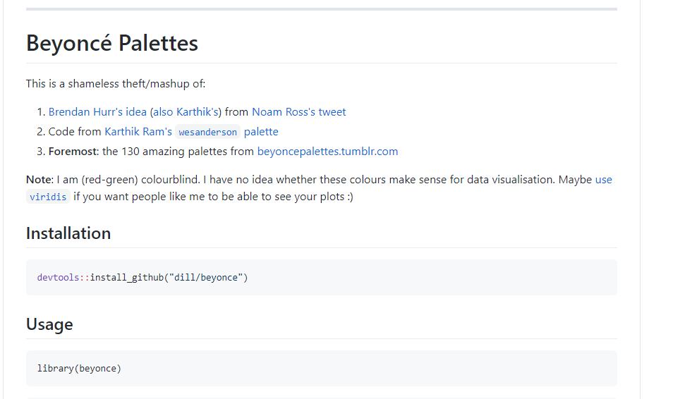
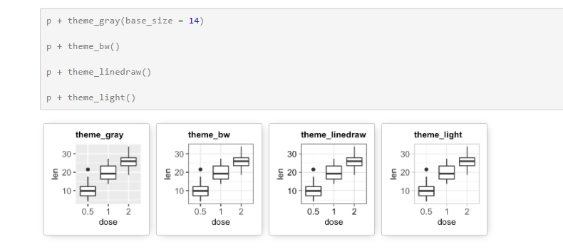
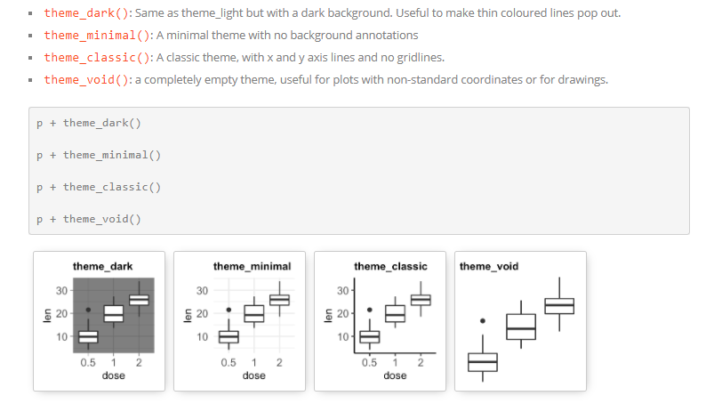

```{r setup, include=FALSE}
options(htmltools.dir.version = FALSE)
```
<div style = "position:fixed; visibility: hidden">
$$\require{color}\definecolor{yellow}{rgb}{1, 0.8, 0.16078431372549}$$
$$\require{color}\definecolor{orange}{rgb}{0.96078431372549, 0.525490196078431, 0.203921568627451}$$
$$\require{color}\definecolor{green}{rgb}{0, 0.474509803921569, 0.396078431372549}$$
</div>

<script type="text/x-mathjax-config">
MathJax.Hub.Config({
  TeX: {
    Macros: {
      yellow: ["{\\color{yellow}{#1}}", 1],
      orange: ["{\\color{orange}{#1}}", 1],
      green: ["{\\color{green}{#1}}", 1]
    },
    loader: {load: ['[tex]/color']},
    tex: {packages: {'[+]': ['color']}}
  }
});
</script>

<style>
.yellow {color: #FFCC29;}
.orange {color: #F58634;}
.green {color: #007965;}
</style>


```{r flair_color, echo=FALSE}
library(flair)
yellow <- "#FFCC29"
orange <- "#F58634"
green <- "#007965"
```

---
# Outline of class

1. Adding multiple geoms

1. Scales

1. Coordinates

1. Themes

1. Save your plots

1. ggplot extensions


  
Homework 
1. Make your own plot


---
# Review

What are some do's and don'ts for good visuals?

---
# Review: Grammar of graphics (ggplot2)
.green[ggplot2] is a data visualization package  

Structure of the plot can be summarized like this:

```{r, eval=FALSE}
ggplot(data = [dataset], 
       mapping = aes(x = [x-variable], 
                     y = [y-variable])) +
   geom_xxx() +
   other options
```

*aes()* means *aesthetics*  
*geom_xx* means *geometry*

--
  
    
    
### What is the difference between **mapping** and **setting**?

---
# Penguin data. Let's start our script

```{r, message=FALSE, warning=FALSE}
### Today we are going to plot penguin data ####
### Created by: Dr. Nyssa Silbiger #############
### Updated on: 2023-09-10 ####################


#### Load Libraries ######
library(palmerpenguins)
library(tidyverse)
library(here)


### Load data ######
# The data is part of the package and is called penguins
# How else besides glimpse can we inspect the data?
glimpse(penguins) 


```

---
# Make a simple plot
.pull-left[
```{r, plot-labela, eval=FALSE, warning=FALSE, message=FALSE}
ggplot(data=penguins, 
  mapping = aes(x = bill_depth_mm,
                y = bill_length_mm)) +
  geom_point()+
   labs(x = "Bill depth (mm)", 
        y = "Bill length (mm)"
        ) 

```
]

.pull-right[
```{r plot-labela-out, ref.label="plot-labela", echo=FALSE, warning = FALSE, message=FALSE}
```
]

---
# Add a best fit line
.pull-left[
```{r, plot-labelb, eval=FALSE, warning=FALSE, message=FALSE}
ggplot(data=penguins, 
  mapping = aes(x = bill_depth_mm,
                y = bill_length_mm)) +
  geom_point()+ 
  geom_smooth()+ #<<
   labs(x = "Bill depth (mm)", 
        y = "Bill length (mm)"
        ) 
```
Look up all the different methods  
?geom_smooth() 

]

.pull-right[
```{r plot-labelb-out, ref.label="plot-labelb", echo=FALSE, warning = FALSE, message=FALSE}
```
]

---
# Add a best fit line: .orange[Make it a linear model]

.pull-left[
```{r, plot-labelc, eval=FALSE, warning=FALSE, message=FALSE}
ggplot(data=penguins, 
  mapping = aes(x = bill_depth_mm,
                y = bill_length_mm)) +
  geom_point()+ 
  geom_smooth(method = "lm")+ #<<
   labs(x = "Bill depth (mm)", 
        y = "Bill length (mm)"
        ) 

# Note you can put any formula here to make it specific to your analysis

```

There are 3 different species in this data, how do you think we should view the model?
]

.pull-right[
```{r plot-labelc-out, ref.label="plot-labelc", echo=FALSE, warning = FALSE, message=FALSE}
```
]


---
# Add a best fit line. Make it a linear model. .orange[Group by species.]

.pull-left[
```{r, plot-labeld, eval=FALSE, warning=FALSE, message=FALSE}
ggplot(data=penguins, 
  mapping = aes(x = bill_depth_mm,
                y = bill_length_mm,
                group = species)) + #<<
  geom_point()+ 
  geom_smooth(method = "lm")+ 
   labs(x = "Bill depth (mm)", 
        y = "Bill length (mm)"
        ) 

# Note you can put any formula here to make it specific to your analysis

```

]

.pull-right[
```{r plot-labeld-out, ref.label="plot-labeld", echo=FALSE, warning = FALSE, message=FALSE}
```
]

---
# Add a best fit line. Make it a linear model. Group by species. .orange[Add some colors by species.]

.pull-left[
```{r, plot-labele, eval=FALSE, warning=FALSE, message=FALSE}
ggplot(data=penguins, 
  mapping = aes(x = bill_depth_mm,
                y = bill_length_mm,
                group = species,
                color = species)) + #<<
  geom_point()+ 
  geom_smooth(method = "lm")+ 
   labs(x = "Bill depth (mm)", 
        y = "Bill length (mm)"
        ) +
  scale_color_viridis_d() #<<

# Note you can put any formula here to make it specific to your analysis

```

]

.pull-right[
```{r plot-labele-out, ref.label="plot-labele", echo=FALSE, warning = FALSE, message=FALSE}
```
]

---
class: center, middle


---
# Aside....

### Celebrate your R victories with the *{praise}* package

```{r, eval=FALSE}
install.packages("praise")

```

```{r}
library(praise)
praise()
```

```{r}
praise()
```

```{r}
praise()
```
---
# Scales
# Back to penguins....

The naming scheme for *scale* has 3 parts:

1. scale  
1. The name of the primary aesthetic (e.g., color, shape, or x)
1. The name of the scale (e.g., continuous, discrete, manual).

--

If I want to change the scale of a continuous color it would be:
```{r, eval=FALSE}
scale_color_continuous()
```

--

If I want to change the scale of a continuous x-axis it would be:
```{r, eval=FALSE}
scale_x_continuous()
```

---
# Change scales. .orange[Change x scale limits (0,20).]

.pull-left[
```{r, plot-labelf, eval=FALSE, warning=FALSE, message=FALSE}
ggplot(data=penguins, 
  mapping = aes(x = bill_depth_mm,
                y = bill_length_mm,
                group = species,
                color = species)) + 
  geom_point()+ 
  geom_smooth(method = "lm")+ 
   labs(x = "Bill depth (mm)", 
        y = "Bill length (mm)"
        ) +
  scale_color_viridis_d()+
  scale_x_continuous(limits = c(0,20)) # set x limits from 0 to 20 #<<

# Note anytime you make a vector you need to put "c" which means "concatenate

```

]

.pull-right[
```{r plot-labelg-out, ref.label="plot-labelg", echo=FALSE, warning = FALSE, message=FALSE}
```
]

---
# Change scales. Change x scale limits (0,20). .orange[Change y scale limits (0,50).]  
Obviously, this is a terrible figure.... but this is how you change the limits

.pull-left[
```{r, plot-labelg, eval=FALSE, warning=FALSE, message=FALSE}
ggplot(data=penguins, 
  mapping = aes(x = bill_depth_mm,
                y = bill_length_mm,
                group = species,
                color = species)) + 
  geom_point()+ 
  geom_smooth(method = "lm")+ 
   labs(x = "Bill depth (mm)", 
        y = "Bill length (mm)"
        ) +
  scale_color_viridis_d()+
  scale_x_continuous(limits = c(0,20)) + # set x limits from 0 to 20 
  scale_y_continuous(limits = c(0,50))#<<

# Note anytime you make a vector you need to put "c" which means "concatenate

```

]

.pull-right[
```{r plot-labelg-out, ref.label="plot-labelg", echo=FALSE, warning = FALSE, message=FALSE}
```
]

---
# Change scales: .orange[Change x breaks.]

.pull-left[
```{r, plot-labelh, eval=FALSE, warning=FALSE, message=FALSE}
ggplot(data=penguins, 
  mapping = aes(x = bill_depth_mm,
                y = bill_length_mm,
                group = species,
                color = species)) + 
  geom_point()+ 
  geom_smooth(method = "lm")+ 
   labs(x = "Bill depth (mm)", 
        y = "Bill length (mm)"
        ) +
  scale_color_viridis_d()+
  scale_x_continuous(breaks = c(14, 17, 21)) #<<
 

# Note anytime you make a vector you need to put "c" which means "concatenate

```

]

.pull-right[
```{r plot-labelh-out, ref.label="plot-labelh", echo=FALSE, warning = FALSE, message=FALSE}
```
]

---

# Change scales: Change x breaks. .orange[Change x break labels]

.pull-left[
```{r, plot-labeli, eval=FALSE, warning=FALSE, message=FALSE}
ggplot(data=penguins, 
  mapping = aes(x = bill_depth_mm,
                y = bill_length_mm,
                group = species,
                color = species)) + 
  geom_point()+ 
  geom_smooth(method = "lm")+ 
   labs(x = "Bill depth (mm)", 
        y = "Bill length (mm)"
        ) +
  scale_color_viridis_d()+
  scale_x_continuous(breaks = c(14, 17, 21), 
                     labels = c("low", "medium", "high")) #<<
 

# Note anytime you make a vector you need to put "c" which means "concatenate

```

]

.pull-right[
```{r plot-labeli-out, ref.label="plot-labeli", echo=FALSE, warning = FALSE, message=FALSE}
```
]

---
# Change scales: .orange[Manually change color scale.]

.pull-left[
```{r, plot-labelj, eval=FALSE, warning=FALSE, message=FALSE}
ggplot(data=penguins, 
  mapping = aes(x = bill_depth_mm,
                y = bill_length_mm,
                group = species,
                color = species)) + 
  geom_point()+ 
  geom_smooth(method = "lm")+ 
   labs(x = "Bill depth (mm)", 
        y = "Bill length (mm)"
        ) +
  #scale_color_viridis_d() #<<
  scale_color_manual(values = c("orange", "purple", "green")) #<<
 

# Note anytime you make a vector you need to put "c" which means "concatenate

```

]

.pull-right[
```{r plot-labelj-out, ref.label="plot-labelj", echo=FALSE, warning = FALSE, message=FALSE}
```
]

---
# Custom color scales

### There are .orange[**so many**] custom color palettes to play with.

[Most popular color palettes](https://www.datanovia.com/en/blog/top-r-color-palettes-to-know-for-great-data-visualization/) [Beyonce - tumblr!!!](https://beyoncepalettes.tumblr.com/)  
[Beyonce - color palette](https://github.com/dill/beyonce)  
[Colors of California](https://github.com/an-bui/calecopal)                     
[Colors of the Pacific Northwest](https://github.com/jakelawlor/PNWColors)    

---

### Aside on downloading packages that are *in development*.
There are several packages on GitHub that are not yet published and are still being developed.  You can still use them, but you need to install them directly from github.  

First, you need to install the *{devtools}* package (Development tools) 

```{r, eval=FALSE}
install.packages('devtools')
```

--

Instead of using *install.packages("PackageName")*, we use *install_github("username/packagename")*.

--

Let's download the beyonce color palette.

1. Ask google where the "Beyonce color palette in R" is. 
1. Go to the [github page](https://github.com/dill/beyonce) and follow the directions

.center[
]


---
### Aside on downloading packages that are *in development*.
There are several packages on GitHub that are not yet published and are still being developed.  You can still use them, but you need to install them directly from github.  

First, you need to install the *{devtools}* package (Development tools) 

```{r, eval=FALSE}
install.packages('devtools')
```


Instead of using *install.packages("PackageName")*, we use *install_github("username/packagename")*.


Let's download the beyonce color palette.

1. Ask google where the "Beyonce color palette in R" is. 
1. Go to the [github page](https://github.com/dill/beyonce) and follow the directions
1. In your **console** (not your script): copy and paste:

```{r, eval=FALSE}
devtools::install_github("dill/beyonce")
```

---
### Aside on downloading packages that are *in development*.
There are several packages on GitHub that are not yet published and are still being developed.  You can still use them, but you need to install them directly from github.  

First, you need to install the *{devtools}* package (Development tools) 

```{r, eval=FALSE}
install.packages('devtools')
```


Instead of using *install.packages("PackageName")*, we use *install_github("username/packagename")*.


Let's download the beyonce color palette.

1. Ask google where the "Beyonce color palette in R" is. 
1. Go to the [github page](https://github.com/dill/beyonce) and follow the directions
1. In your **console** (not your script): copy and paste:
1. In the **libraries section of your script**: copy and paste

```{r}
library(beyonce)
```

---
# Change scales: .orange[Use one of the Beyonce color palettes.]

.pull-left[
```{r, plot-labelk, eval=FALSE, warning=FALSE, message=FALSE}
ggplot(data=penguins, 
  mapping = aes(x = bill_depth_mm,
                y = bill_length_mm,
                group = species,
                color = species)) + 
  geom_point()+ 
  geom_smooth(method = "lm")+ 
   labs(x = "Bill depth (mm)", 
        y = "Bill length (mm)"
        ) +
  scale_color_manual(values = beyonce_palette(2)) #<<


```

]

.pull-right[
```{r plot-labelk-out, ref.label="plot-labelk", echo=FALSE, warning = FALSE, message=FALSE}
```
]


---
# Change scales: .orange[Use one of the Beyonce color palettes.]

.pull-left[
```{r, plot-labell, eval=FALSE, warning=FALSE, message=FALSE}
ggplot(data=penguins, 
  mapping = aes(x = bill_depth_mm,
                y = bill_length_mm,
                group = species,
                color = species)) + 
  geom_point()+ 
  geom_smooth(method = "lm")+ 
   labs(x = "Bill depth (mm)", 
        y = "Bill length (mm)"
        ) +
  scale_color_manual(values = beyonce_palette(10)) #<<


```

]

.pull-right[
```{r plot-labell-out, ref.label="plot-labell", echo=FALSE, warning = FALSE, message=FALSE}
```
]

---
# Coordinates

The default coordinates for ggplot is *cartesian*, where the 2D position of an element is given by the x and y position in *aes()*.

We can manipulate the coordinates system in a few different ways.

We will run through the following examples

- coord_flip(): Cartesian coordinate system with x and y axes flipped.

- coord_fixed(): Cartesian coordinate system with a fixed aspect ratio.

- coord_trans(): Apply arbitrary transformations to x and y positions, after the data has been processed by the stat.

- coord_polar(): Polar coordinates.

Later when we learn how to make a map  

- coord_map()/coord_quickmap()/coord_sf(): Map projections.

---
# Change coordinates: .orange[Flip the axes.]

.pull-left[
```{r, plot-labelm, eval=FALSE, warning=FALSE, message=FALSE}
ggplot(data=penguins, 
  mapping = aes(x = bill_depth_mm,
                y = bill_length_mm,
                group = species,
                color = species)) + 
  geom_point()+ 
  geom_smooth(method = "lm")+ 
   labs(x = "Bill depth (mm)", 
        y = "Bill length (mm)"
        ) +
  scale_color_manual(values = beyonce_palette(10)) +
  coord_flip() # flip x and y axes #<<


```

]

.pull-right[
```{r plot-labelm-out, ref.label="plot-labelm", echo=FALSE, warning = FALSE, message=FALSE}
```
]

---
# Change coordinates: .orange[Fix the axes.]

.pull-left[
```{r, plot-labeln, eval=FALSE, warning=FALSE, message=FALSE}
ggplot(data=penguins, 
  mapping = aes(x = bill_depth_mm,
                y = bill_length_mm,
                group = species,
                color = species)) + 
  geom_point()+ 
  geom_smooth(method = "lm")+ 
   labs(x = "Bill depth (mm)", 
        y = "Bill length (mm)"
        ) +
  scale_color_manual(values = beyonce_palette(10)) +
  coord_fixed() # fix axes #<<


```

]

.pull-right[
```{r plot-labeln-out, ref.label="plot-labeln", echo=FALSE, warning = FALSE, message=FALSE}
```
]

---
# Change coordinates: .orange[Transform the x and y-axis (log10)]

I am going to use a different example with exponential data so it shows more clearly

.pull-left[
```{r, fig.height=4}
ggplot(diamonds, aes(carat, price)) +
  geom_point() 
```
]

.pull-right[
```{r, fig.height=4}
ggplot(diamonds, aes(carat, price)) +
  geom_point() +
  coord_trans(x = "log10", y = "log10")
```
]
---
# Change coordinates: .orange[make them polar]

.pull-left[
```{r, plot-labelo, eval=FALSE, warning=FALSE, message=FALSE}
ggplot(data=penguins, 
  mapping = aes(x = bill_depth_mm,
                y = bill_length_mm,
                group = species,
                color = species)) + 
  geom_point()+ 
  geom_smooth(method = "lm")+ 
   labs(x = "Bill depth (mm)", 
        y = "Bill length (mm)"
        ) +
  scale_color_manual(values = beyonce_palette(10)) +
  coord_polar("x") # make the polar #<<


```

]

.pull-right[
```{r plot-labelo-out, ref.label="plot-labelo", echo=FALSE, warning = FALSE, message=FALSE}
```
]

---

# Themes
The theming system is composed of four main components:

--

- Theme **elements** specify the non-data elements that you can control. For example, the plot.title element controls the appearance of the plot title; axis.ticks.x, the ticks on the x axis; legend.key.height, the height of the keys in the legend.

--

- Each element is associated with an **element function**, which describes the visual properties of the element. For example, element_text() sets the font size, color and face of text elements like plot.title.

--

- The theme() function which allows you to override the default theme elements by calling element functions, like theme(plot.title = element_text(color = "red")). This will make the plot title red

--

- **Complete themes**, like theme_grey() set all of the theme elements to values designed to work together harmoniously. These are nicely packaged themes where you do not have to change much to make it look good.

---
# Complete themes



[https://www.datanovia.com/en/blog/ggplot-themes-gallery/](https://www.datanovia.com/en/blog/ggplot-themes-gallery/)
---
# Complete themes



[https://www.datanovia.com/en/blog/ggplot-themes-gallery/](https://www.datanovia.com/en/blog/ggplot-themes-gallery/)

---
# Change theme: .orange[Make it theme_classic()]

.pull-left[
```{r, plot-labelp, eval=FALSE, warning=FALSE, message=FALSE}
ggplot(data=penguins, 
  mapping = aes(x = bill_depth_mm,
                y = bill_length_mm,
                group = species,
                color = species)) + 
  geom_point()+ 
  geom_smooth(method = "lm")+ 
   labs(x = "Bill depth (mm)", 
        y = "Bill length (mm)"
        ) +
  scale_color_manual(values = beyonce_palette(10)) +
  theme_classic()  #<<

```
]

.pull-right[
```{r plot-labelp-out, ref.label="plot-labelp", echo=FALSE, warning = FALSE, message=FALSE}
```
]
---
# Change theme: .orange[Make it theme_bw()]

.pull-left[
```{r, plot-labelq, eval=FALSE, warning=FALSE, message=FALSE}
ggplot(data=penguins, 
  mapping = aes(x = bill_depth_mm,
                y = bill_length_mm,
                group = species,
                color = species)) + 
  geom_point()+ 
  geom_smooth(method = "lm")+ 
   labs(x = "Bill depth (mm)", 
        y = "Bill length (mm)"
        ) +
  scale_color_manual(values = beyonce_palette(10)) +
  theme_bw()  #<<
```
]

.pull-right[
```{r plot-labelq-out, ref.label="plot-labelq", echo=FALSE, warning = FALSE, message=FALSE}
```
]

---
# Custom themes

```{r, eval = FALSE}
install.packages("ggthemes") # do this in the console

# put the code below in the libraries section of your script
library(ggthemes)
```

[See here for ggthemes](https://yutannihilation.github.io/allYourFigureAreBelongToUs/ggthemes/)


---
# Themes: You can customize your theme further
#### .orange[Change the font size for the axis labels]

.pull-left[
```{r, plot-labelr, eval=FALSE, warning=FALSE, message=FALSE}
ggplot(data=penguins, 
  mapping = aes(x = bill_depth_mm,
                y = bill_length_mm,
                group = species,
                color = species)) + 
  geom_point()+ 
  geom_smooth(method = "lm")+ 
   labs(x = "Bill depth (mm)", 
        y = "Bill length (mm)"
        ) +
  scale_color_manual(values = beyonce_palette(10)) +
  theme_bw() +
  theme(axis.title = element_text(size = 20))#<<
```
]

.pull-right[
```{r plot-labelr-out, ref.label="plot-labelr", echo=FALSE, warning = FALSE, message=FALSE}
```
]

---
# Themes: You can customize your theme further
#### Change the font size for the axis labels. .orange[Change the color of the axis labels.]

.pull-left[
```{r, plot-labels, eval=FALSE, warning=FALSE, message=FALSE}
ggplot(data=penguins, 
  mapping = aes(x = bill_depth_mm,
                y = bill_length_mm,
                group = species,
                color = species)) + 
  geom_point()+ 
  geom_smooth(method = "lm")+ 
   labs(x = "Bill depth (mm)", 
        y = "Bill length (mm)"
        ) +
  scale_color_manual(values = beyonce_palette(10)) +
  theme_bw() +
  theme(axis.title = element_text(size = 20,
                                  color = "red"))#<<
```
]

.pull-right[
```{r plot-labels-out, ref.label="plot-labels", echo=FALSE, warning = FALSE, message=FALSE}
```
]

---
# Themes: You can customize your theme further
#### Change the font size for the axis labels. Change the color of the axis labels. .orange[Change the background color.]

.pull-left[
```{r, plot-labelt, eval=FALSE, warning=FALSE, message=FALSE}
ggplot(data=penguins, 
  mapping = aes(x = bill_depth_mm,
                y = bill_length_mm,
                group = species,
                color = species)) + 
  geom_point()+ 
  geom_smooth(method = "lm")+ 
   labs(x = "Bill depth (mm)", 
        y = "Bill length (mm)"
        ) +
  scale_color_manual(values = beyonce_palette(10)) +
  theme_bw() +
  theme(axis.title = element_text(size = 20,
                                  color = "red"),
        panel.background = element_rect(fill = "linen"))#<<
```
]

.pull-right[
```{r plot-labelt-out, ref.label="plot-labelt", echo=FALSE, warning = FALSE, message=FALSE}
```
]

---
class: center, middle

Type ?theme() to see all the different elements that you can change.

Play around with your plot for ~ 2 minutes and change the theme in a way that you want.
---
# Save your plot
.pull-left[
```{r, plot-labelu, eval=FALSE, warning=FALSE, message=FALSE}
ggplot(data=penguins, 
  mapping = aes(x = bill_depth_mm,
                y = bill_length_mm,
                group = species,
                color = species)) + 
  geom_point()+ 
  geom_smooth(method = "lm")+ 
   labs(x = "Bill depth (mm)", 
        y = "Bill length (mm)"
        ) +
  scale_color_manual(values = beyonce_palette(2)) +
  theme_bw() +
  theme(axis.title = element_text(size = 20),
        panel.background = element_rect(fill = "linen")) 

  ggsave(here("Week_03","output","penguin.png"))#<<
```
]

.pull-right[
```{r plot-labelu-out, ref.label="plot-labelu", echo=FALSE, warning = FALSE, message=FALSE}
```
]

---
# Save your plot: .orange[change the width and height]
.pull-left[
```{r, plot-labelw, eval=FALSE, warning=FALSE, message=FALSE}
ggplot(data=penguins, 
  mapping = aes(x = bill_depth_mm,
                y = bill_length_mm,
                group = species,
                color = species)) + 
  geom_point()+ 
  geom_smooth(method = "lm")+ 
   labs(x = "Bill depth (mm)", 
        y = "Bill length (mm)"
        ) +
  scale_color_manual(values = beyonce_palette(2)) +
  theme_bw() +
  theme(axis.title = element_text(size = 20),
        panel.background = element_rect(fill = "linen")) 

  ggsave(here("Week_03","output","penguin.png"),
         width = 7, height = 5) # in inches #<<
```
]

.pull-right[
```{r plot-labelw-out, ref.label="plot-labelw", echo=FALSE, warning = FALSE, message=FALSE}
```
]
---
# Save your plot as an object
This allows you to modify the plot further later.

.pull-left[
```{r, plot-labelv, eval=FALSE, warning=FALSE, message=FALSE}
plot1<-ggplot(data=penguins, #<<
  mapping = aes(x = bill_depth_mm,
                y = bill_length_mm,
                group = species,
                color = species)) + 
  geom_point()+ 
  geom_smooth(method = "lm")+ 
   labs(x = "Bill depth (mm)", 
        y = "Bill length (mm)"
        ) +
  scale_color_manual(values = beyonce_palette(2)) +
  theme_bw() +
  theme(axis.title = element_text(size = 20),
        panel.background = element_rect(fill = "linen")) 

```
]
.pull-right[
```{r warning = FALSE, message=FALSE, eval=FALSE}

plot1 # you need to type it out to view it now
```
```{r plot-labelv-out, ref.label="plot-labelv", echo=FALSE, warning = FALSE, message=FALSE}
```
]

---
# ggplot2 extensions

.center[
[There are over 100 ggplot2 extentions](https://exts.ggplot2.tidyverse.org/gallery/)  
[Great resource for ggploting](https://ggplot2-book.org/index.html)
]


---
# Tidy Tuesday

[Link for data](https://github.com/rfordatascience/tidytuesday)

Tidy Tuesday is an international community of R enthusiasts that create visuals from the same dataset.  The **goal** is the practice plotting and learn something new every week. It is amazing to see how many different ways you can visualize the same data.

- You must complete **8** tidy tuesday submissions by the end of the semester (there are 12 weeks left).  
- You do not have to submit it on Tuesday (although most people do). I will be checking for weekly submissions at the end of each week.
- For full credit you must:
  - Create a new repo to submit all your tidy tuesday plots. [Here is mine as a example.](https://github.com/njsilbiger/TidyTuesday_CSUN)
  - You must have proper script structure and file structure.
  - You must save your visual in the output folder.  
  - Only spend 2 hours working in your visuals. It does not have to be perfect every time.  Try to learn a new thing each week.

You *should* (but are not required to) post to Twitter under #TidyTuesday and #TidyDors 
If you do you will learn **so much** from the R community. They are very kind and helpful. 

  
---
# Lab/homework

I will put you in breakout groups and your team will come up with the best possible plot with the penguin data that you can in **1 hour**.  

- It CANNOT be the same plot that we just made. Look through the data and make a new visual.
- Make something other than a scatter plot. Look at the other possible geoms from the resources I have given you over the past two classes.  
- Your script must be formatted correctly (according to the lecture on transparent scripts).  
- Comment your code appropriately
- Push to github in the appropriate folders (you will only need a scripts and output folder for this week).  
  ------------------------------------
- In an hour you will show the class your plot and step us through your code.

- **Due on github by Tuesday at 1pm.**


  


---
class: center, middle

# Thanks!

Slides created via the R package [**xaringan**](https://github.com/yihui/xaringan).

Some slides modified from [ggplot2-book](https://ggplot2-book.org/polishing.html)


