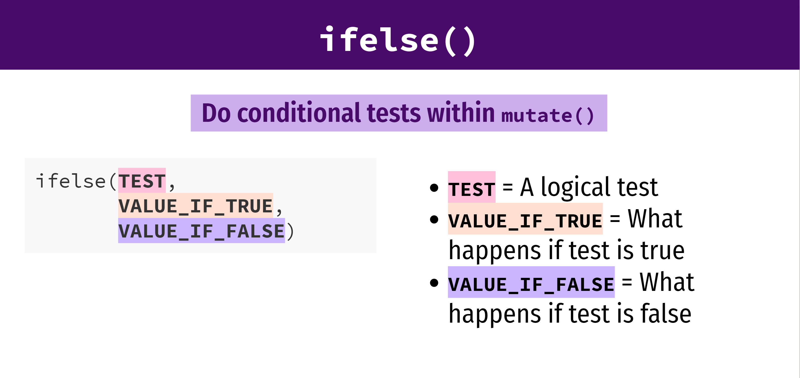

```{r setup, include=FALSE}
options(htmltools.dir.version = FALSE)
```
<div style = "position:fixed; visibility: hidden">
$$\require{color}\definecolor{yellow}{rgb}{1, 0.8, 0.16078431372549}$$
$$\require{color}\definecolor{orange}{rgb}{0.96078431372549, 0.525490196078431, 0.203921568627451}$$
$$\require{color}\definecolor{green}{rgb}{0, 0.474509803921569, 0.396078431372549}$$
</div>

<script type="text/x-mathjax-config">
MathJax.Hub.Config({
  TeX: {
    Macros: {
      yellow: ["{\\color{yellow}{#1}}", 1],
      orange: ["{\\color{orange}{#1}}", 1],
      green: ["{\\color{green}{#1}}", 1]
    },
    loader: {load: ['[tex]/color']},
    tex: {packages: {'[+]': ['color']}}
  }
});
</script>

<style>
.yellow {color: #FFCC29;}
.orange {color: #F58634;}
.green {color: #007965;}
</style>


```{r flair_color, echo=FALSE}
library(flair)
yellow <- "#FFCC29"
orange <- "#F58634"
green <- "#007965"
```

---
# Outline of class

1. Intro to {dplyr}
 - a set of verbs for manipulating data:
  - filtering rows, selecting columns, grouping by objects, getting summary statistics, mutating columns, removing NAs

Homework 
1. Practice with dplyr

[dplyr cheat sheet.](https://raw.githubusercontent.com/rstudio/cheatsheets/main/data-transformation.pdf) Download this now to use as a resource.


---
# Review

1. Where do I change the font size of my x and y labels?

1. How do I save my plot?
---
# Intro to the {dplyr} package (part of the TidyVerse)

.center[

]

Illustrations from the Openscapes blog [Tidy Data for reproducibility, efficiency](https://www.openscapes.org/blog/2020/10/12/tidy-data/), and collaboration by Julia Lowndes and Allison Horst
---
# dplyr: verbs for manipulating data

---
# Penguin data again.

```{r, message=FALSE, warning=FALSE}
### Today we are going to plot penguin data ####
### Created by: Dr. Nyssa Silbiger #############
### Updated on: 2024-09-17 ####################


#### Load Libraries ######
library(palmerpenguins)
library(tidyverse)
library(here)


### Load data ######
# The data is part of the package and is called penguins
glimpse(penguins) 


```

---
# Filter


---
#Filter 
### Extract rows that meet some critera

.pull-left[
```{r, eval = FALSE}
filter(.data = DATA, ...)
```
]

.pull-right[
- .orange[DATA] = Data frame to transform  

- .orange[...] = One or more criteria  
filter() returns each row for which the criteria is TRUE
]

---
# filter only the female penguins
### As always, exact spelling and capitalization matters

Before filtering
```{r}
head(penguins)
```

---
# filter only the female penguins
### As always, exact spelling and capitalization matters

After filtering
```{r}
filter(.data = penguins, sex == "female" )
```

---
# filter

.pull-left[

```{r, eval=FALSE}
filter(.data = penguins, 
       sex == "female" ) #<<
```
]

.pull-right[
One .green[=] sets an argument in the function  

Two .green[==] reads as "is exactly equal to." It is a question that returns a TRUE or FALSE.  Here, filter keeps every TRUE
]

---
# A list of logical expressions 


---
# How would I use filter to...

1. Penguins measured in the year 2008?

1. Penguins that have a body mass greater than 5000

--

# Think, pair, share.  

Spend 2 minutes to *think* about it. Spend 2 minutes *paired* with a neighbor to discuss your answers. *Share* with the class.

---
# Common mistakes

.pull-left[
## Using .orange[=] instead of .orange[==]

```{r example-model,  eval=FALSE, results="hide", error = TRUE, warning=FALSE}
filter(.data = penguins,
  sex = "females")

filter(.data = penguins, 
       sex == "females")
```

]  

--
.pull-right[

## Forgetting quotes  

```{r, eval=FALSE}
filter(.data == penguins, 
        sex == females) #<<

filter(.data = penguins, 
       sex == "females")
```


]

---

# Filter with multiple conditions

Select .orange[females] that are also .green[greater than 5000 g]

```{r}
filter(.data = penguins, sex == "female", body_mass_g >5000)

```

---


---
# Default for filter is **&**

These do the same exact thing

```{r, eval=FALSE}
filter(.data = penguins, sex == "female", body_mass_g >5000)

filter(.data = penguins, sex == "female" & body_mass_g >5000)

```

---

# Think, pair, share

Use filter and boolean logical to show:

1. Penguins that were collected in *either* 2008 *or* 2009

1. Penguins that *are not* from the island Dream

1. Penguins in the species Adelie and Gentoo

---
# Common mistakes

.pull-left[
### Collapsing multiple tests into one 
penguins between 3000 and 5000 g
```{r, eval  = FALSE}
#Wrong
filter(.data = penguins,
       3000 < body_mass_g <5000) #<<

#Right
filter(.data = penguins, 
       body_mass_g <5000, #<<
       body_mass_g >3000 #<<

```
]

--

.pull-right[
### Using multiple tests instead of %in%
penguins in dream and biscoe

```{r, eval=FALSE}
# Wrong
filter(.data = penguins,
       island == "Dream", #<<
       island == "Biscoe") #<<

# Right
filter(.data = penguins,
       island %in% c("Dream","Biscoe")) #<<

```

]

---


---
# mutate: add new columns

.center[

]

---
# mutate


---
# mutate

Add a new column converting body mass in g to kg and save the new dataframe

```{r}
data2<-mutate(.data = penguins, 
       body_mass_kg = body_mass_g/1000) #<<

View(data2)

```

--

### Change multiple columns at once
```{r}
data2<-mutate(.data = penguins, 
       body_mass_kg = body_mass_g/1000, #<<
       bill_length_depth = bill_length_mm/bill_depth_mm) #<<

# convert mass to kg 
# calculate the ratio of bill length to depth

View(data2)

```
---
## Mutating multiple columns at once based on some criteron (i.e. mutate all the numeric columns in one line)?

On your own, look up *mutate_if()*, *mutate_at()*, *mutate_all()*

[Some examples here](https://dplyr.tidyverse.org/reference/mutate_all.html)

---


---
# mutate with ifelse

```{r}
data2<- mutate(.data = penguins,
               after_2008 = ifelse(year>2008, "After 2008", "Before 2008"))

View(data2)
```


---
# Think, pair, share

1. Use mutate to create a new column to add flipper length and body mass together

1. Use mutate and ifelse to create a new column where body mass greater than 4000 is labeled as big and everything else is small 

---
# What if you have multiple verbs that you want to do to the same dataframe?

--

.center[
.orange[# The pipe  
# %>%]
]

## The "pipe" says "and then do"

Dataframe %>%  # select the dataframe **and then** 
> verb1() %>%  # do verb 1 **and then** 

>verb2()      # do verb 2

---
# %>%

```{r, eval = FALSE}
me %>%
  wake_up(time = "6:00") %>%
  music(turn = "on", to = "Beyonce") %>%
  shower(wash_hair = TRUE) %>%
  get_dressed(pants = TRUE, shirt = TRUE) %>%
  leave_house(car = TRUE)

```

---
# What about this new *native* pipe that I keep seeing on stack exchange?

.center[
.orange[# %>%   
# vs  
# |>]
]

**magrittr** (from the tidyverse) vs **native** (new pipe that comes with base R so you don't need to load any libraries) 

In this class I stick with %>%, but you are welcome to learn and use |>, with the understanding that there will be some minor differences in the code.

[Please Read Here!](https://r4ds.hadley.nz/data-transform#sec-the-pipe)
---
# %>%

Filter only female penguins and add a new column that calculates the log body mass  
When you use %>% the dataframe carries over so you don't need to write it out anymore


```{r}
penguins %>% # use penguin dataframe
  filter(sex == "female") %>% #select females
  mutate(log_mass = log(body_mass_g)) #calculate log biomass

```

---
# Select

Use select() to select certain columns to remain in the dataframe

```{r}
penguins %>% # use penguin dataframe
  filter(sex == "female") %>% #select females
  mutate(log_mass = log(body_mass_g)) %>% #calculate log biomass
  select(species, island, sex, log_mass)

```

---
# Select

You can also use select() to rename columns.  
Here, we are renaming species to have a capital S

```{r}
penguins %>% # use penguin dataframe
  filter(sex == "female") %>% #select females
  mutate(log_mass = log(body_mass_g)) %>% #calculate log biomass
  select(Species = species, island, sex, log_mass)

```
---
# Summarize 
 Computer a table of summarized data  
  Calculate the mean flipper length (and exclude any NAs)
 
```{r}
 penguins %>% # 
  summarise(mean_flipper = mean(flipper_length_mm, na.rm=TRUE)) #<<
```

--

Calculate mean and mean flipper length
 
```{r}
 penguins %>% # 
  summarise(mean_flipper = mean(flipper_length_mm, na.rm=TRUE), #<<
            min_flipper = min(flipper_length_mm, na.rm=TRUE))   #<<
```

---
# group_by
You can summarize values by certain groups.  
group_by() by itself doesn't do anything, but it is powerful when put before summarize.


Let's calculate the mean and max bill length by island

```{r}
penguins %>%
  group_by(island) %>% #<<
  summarise(mean_bill_length = mean(bill_length_mm, na.rm = TRUE),
            max_bill_length = max(bill_length_mm, na.rm=TRUE))
```

---
# group by

Group by both island **and** sex

```{r}
penguins %>%
  group_by(island, sex) %>% #<<
  summarise(mean_bill_length = mean(bill_length_mm, na.rm = TRUE),
            max_bill_length = max(bill_length_mm, na.rm=TRUE))
```


---
# remove NAs

drop_na() 
  - drops rows with NAs from a specific column

drop all the rows that are missing data on sex
```{r}
penguins %>%
  drop_na(sex) #<<

```
---
# remove NAs

drop_na() 
  - drops rows with NAs from a specific column

drop all the rows that are missing data on sex
calculate mean bill length by sex

```{r}
penguins %>%
  drop_na(sex) %>%
  group_by(island, sex) %>% #<<
  summarise(mean_bill_length = mean(bill_length_mm, na.rm = TRUE))

```
---
# Pipe into a ggplot
You can connect your *data wrangling* to a ggplot with the pipe (you won't need to call the dataframe in ggplot if you pipe to it).

Drop NAs from sex, and then plot boxplots of flipper length by sex

```{r, fig.height=4}
penguins %>%
  drop_na(sex) %>%
  ggplot(aes(x = sex, y = flipper_length_mm)) + #<<
  geom_boxplot()

```

---
# Before homeworks... "Totally Awesome R package of the day"

```{r, eval=FALSE}
library(devtools) # load the development tools library
devtools::install_github("jhollist/dadjoke")
```

```{r}
library(dadjoke)
dadjoke()
```

---
# Homework

Write a script that:

1. calculates the mean and variance of body mass by species, island, and sex without any NAs

1. filters out (i.e. excludes) male penguins, then calculates the log body mass, then selects only the columns for species, island, sex, and log body mass, then use these data to make any plot. Make sure the plot has clean and clear labels and follows best practices. Save the plot in the correct output folder.

Include both part 1 and part 2 in your script and push it to github in the appropriate folders.

---
class: center, middle

# Thanks!

Slides created via the R package [**xaringan**](https://github.com/yihui/xaringan).

Some slides modified from [Andrew Wheiss ](https://evalsp21.classes.andrewheiss.com/projects/01_lab/slides/01_lab.html#73)


