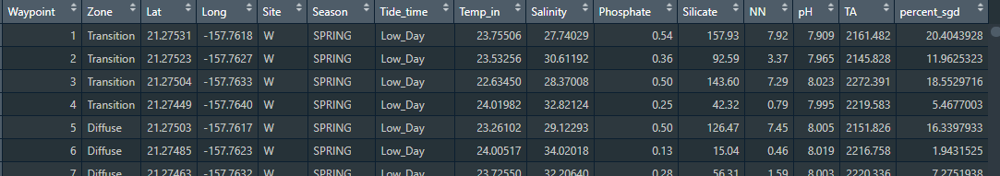
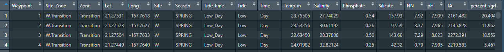
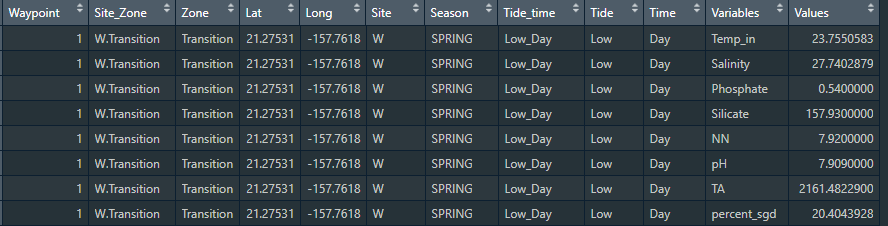
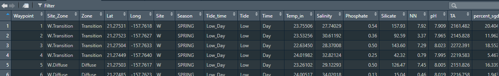

```{r setup, include=FALSE}
options(htmltools.dir.version = FALSE)
```
<div style = "position:fixed; visibility: hidden">
$$\require{color}\definecolor{yellow}{rgb}{1, 0.8, 0.16078431372549}$$
$$\require{color}\definecolor{orange}{rgb}{0.96078431372549, 0.525490196078431, 0.203921568627451}$$
$$\require{color}\definecolor{green}{rgb}{0, 0.474509803921569, 0.396078431372549}$$
</div>

<script type="text/x-mathjax-config">
MathJax.Hub.Config({
  TeX: {
    Macros: {
      yellow: ["{\\color{yellow}{#1}}", 1],
      orange: ["{\\color{orange}{#1}}", 1],
      green: ["{\\color{green}{#1}}", 1]
    },
    loader: {load: ['[tex]/color']},
    tex: {packages: {'[+]': ['color']}}
  }
});
</script>

<style>
.yellow {color: #FFCC29;}
.orange {color: #F58634;}
.green {color: #007965;}
</style>


```{r flair_color, echo=FALSE}
library(flair)
yellow <- "#FFCC29"
orange <- "#F58634"
green <- "#007965"
```

---
# Outline of class

1. Intro to {tidyr}
  - Separate and unite columns
  - Pivot data between long and wide formats

1. Export csv with summary statistics


Homework 
1. Practice with tidyr


---
# Review

1. What function do you use to subset rows by some criterion?  

1. How do I add a new column to my data frame?
---
# Intro to the {tidyr} package (part of the TidyVerse)

.center[

]

---
# New dataset!

We are going to use a subset of data from Silbiger et al. 2020 Proceedings of the Royal Society: B.

In the data folder for this week in Fall-2024, you will see two .csv files:

1. chemicaldata_manualua.csv
1. chem_data_dictionary.csv

Move both of them to the data folder of YOUR repo.

Explore the data dictionary to understand what you will be working with.

Basics: I collected biogeochemistry data at sites in Hawai'i with submarine groundwater discharge (fresh groundwater that flows into coastal oceans through cracks in the reef plate). We have data on nutrient and carbonate chemistry from two sites, two seasons, high and low tide, and during the day and night.

---
# Set up your script for today
```{r, message=FALSE, warning=FALSE}
### Today we are going to practice tidy with biogeochemistry data from Hawaii ####
### Created by: Dr. Nyssa Silbiger #############
### Updated on: 2024-09-19 ####################


#### Load Libraries ######
library(tidyverse)
library(here)


### Load data ######
ChemData<-read_csv(here("Week_04","data", "chemicaldata_maunalua.csv"))
View(ChemData)
glimpse(ChemData)

```
---
# Another way to remove all the NAs

There are several ways we can remove all the NAs in a data set

```{r}
ChemData_clean<-ChemData %>%
  filter(complete.cases(.)) #filters out everything that is not a complete row

View(ChemData_clean)  

```


---
# Separate function

We notice a silly column named Tide_time, which has tide (low/high) paired with time of day (day/night).  

Nyssa did NOT follow directions for tidy data from the first week of class... Now we have to fix it.

.center[

]

---
# Separate function

Notice that I have two bits of information: Low_Day is low tide during the day.  It would be way easier to plot and analyze the data if we separate those into separate columns.

hit ?separate to see all the things you can do, but the simplest use is:  

separate(  
  data = [data frame you are using],  
  col = [column that you want to separate],  
  into = [name of the new columns],  
  sep = [what are you separating by?])  

---
# Separate

Let's continue to build off our data frame
```{r}
ChemData_clean<-ChemData %>%
  drop_na() %>% #filters out everything that is not a complete row
  separate(col = Tide_time, # choose the tide time col #<<
           into = c("Tide","Time"), # separate it into two columns Tide and time #<<
           sep = "_" ) # separate by _ #<<

head(ChemData_clean)  

```

---
# Separate

Notice this deletes the original column.  If we wanted to keep it we would add *remove = FALSE*.

---
# Separate

Let's continue to build off our data frame
```{r}
ChemData_clean<-ChemData %>%
  drop_na() %>% #filters out everything that is not a complete row
  separate(col = Tide_time, # choose the tide time col
           into = c("Tide","Time"), # separate it into two columns Tide and time
           sep = "_", # separate by _
           remove = FALSE) # keep the original tide_time column #<<

head(ChemData_clean)  

```

Notice this deletes the original column.  If we wanted to keep it we would add *remove = FALSE*.

---
# Unite
What if we have the opposite problem and what to *unite* two columns into one? 

Let's say we want a new column that *unites* site with zone.  We use the unite() function which has the same arguments as separate() 

--

```{r}
ChemData_clean<-ChemData %>%
  drop_na() %>% #filters out everything that is not a complete row
  separate(col = Tide_time, # choose the tide time col
           into = c("Tide","Time"), # separate it into two columns Tide and time
           sep = "_", # separate by _
           remove = FALSE) %>% # keep the original tide_time column
  unite(col = "Site_Zone", # the name of the NEW col #<<
         c(Site,Zone), # the columns to unite #<<
        sep = ".", # lets put a . in the middle #<<
        remove = FALSE) # keep the original #<<

head(ChemData_clean)
```

---
# Pivoting the dataset between wide and long

### Review

--
# Wide data

 ### One observation per row and all the different variables are columns


| Sample ID| Treatment   |      Nitrate      | Temp | Salinity | 
|----------|:-------------:|------:|----:|-----:|
| 1 | High|  1.2 | 7.2| 34.1|
| 2 | High|    3.0   | 7.8| 34.0|
| 3 | Low |2.4 | 8.0|34.2|
| 4 | Low |5.1| 8.0| 33.0|
| 5 | Low| 1.1| 7.9| 34.5|


---

# Long  data

 ### One unique measurement per row and all the info about that measurement in the same row


| Sample ID| Treatment   |      Measurement_Type      | Value | Units | 
|----------|:-------------:|------:|----:|
| 1 | High|  Nitrate | 1.2| uM_L|
| 1 | High|    Temp   | 7.2| deg_C |
| 1 | High |Salinity | 34.1|psu|
| 2 | High |Nitrate| 3.0| uM_L|
| 2 | High| Temp| 7.9| deg_C|
| 2 | High| Salinity| 34.0| psu|

---
# Pivoting between long and wide in R

- Wide to long: pivot_longer()
- Long to wide: pivot_wider()

.center[

]
---
# Is our data wide or long?



--

## Let's *pivot* our data so that it is in long format.

- We want one column with all the names of the biogeochemical parameters (i.e., NN, P, Si, etc)
- Paired with one column with all the values associated with those variables
- We want all the metadata (lat, long, tide, etc.) to be preserved in the correct order

--

## Why is long format helpful?

- Easier to summarize using group_by(). You would only need to group by the variable name to get all summary statistics for every variable
- Easier to facet_wrap() by each variable if all the plots are going to be identical instead of making 10 individual plots

---
# Pivot_longer()

Start with our ChemData_clean dataframe (note, you can also just pipe what we are about to do to your existing lines of code as well)

```{r}
ChemData_long <-ChemData_clean %>%
  pivot_longer(cols = Temp_in:percent_sgd, # the cols you want to pivot. This says select the temp to percent SGD cols  #<<
               names_to = "Variables", # the names of the new cols with all the column names #<<
               values_to = "Values") # names of the new column with all the values #<<

```
```{r, eval=FALSE}
View(ChemData_long)
```

--



---
# What can we do with the long data set?

Let's calculate the mean and variance for all variables at each site

```{r}
ChemData_long %>%
  group_by(Variables, Site) %>% # group by everything we want #<<
  summarise(Param_means = mean(Values, na.rm = TRUE), # get mean #<<
            Param_vars = var(Values, na.rm = TRUE)) # get variance #<<

```
---
# Think, Pair, Share

Calculate **mean, variance, and standard deviation** for all variables by **site, zone, and tide**  

Here is your starter code:

```{r, eval = FALSE}
ChemData_long %>%
  group_by(Variables, Site) %>% # group by everything we want 
  summarise(Param_means = mean(Values, na.rm = TRUE), # get mean 
            Param_vars = var(Values, na.rm = TRUE)) # get variance 

```
---
# Example using facet_wrap with long data

Create boxplots of every parameter by site

```{r}
ChemData_long %>%
  ggplot(aes(x = Site, y = Values))+ #<<
  geom_boxplot()+ #<<
  facet_wrap(~Variables) #<<
  

```

---
Create boxplots of every parameter by site, .orange[fix the axes.]

scales = "free" releases both the x and y axes

```{r}
ChemData_long %>%
  ggplot(aes(x = Site, y = Values))+ 
  geom_boxplot()+ 
  facet_wrap(~Variables, scales = "free") #<<
  

```

---
# Let's say we got data in long format and need to convert it to wide

We use pivot_wider()

```{r}
ChemData_wide<-ChemData_long %>%
  pivot_wider(names_from = Variables, # column with the names for the new columns #<<
              values_from = Values) # column with the values #<<
```
```{r, eval=FALSE}
View(ChemData_wide)

```

--



---
# Let's calculate some summary statistics and export the csv file

Start from the beginning and work through our entire flow again, ending with data export.  
.orange[Remove all NAs.]


```{r, eval=FALSE}
ChemData_clean<-ChemData %>%
  drop_na()  #filters out everything that is not a complete row #<<
 
View(ChemData_clean)
```

---

# Let's calculate some summary statistics and export the csv file
.orange[Separate Tide_time into two columns.]


```{r, eval=FALSE}
ChemData_clean<-ChemData %>%
  drop_na() %>% #filters out everything that is not a complete row
  separate(col = Tide_time, # choose the tide time col #<<
           into = c("Tide","Time"), # separate it into two columns Tide and time #<<
           sep = "_", # separate by _ #<<
           remove = FALSE) #<<

View(ChemData_clean)
```

---

# Let's calculate some summary statistics and export the csv file
.orange[Pivot the data longer.]


```{r, eval = FALSE}
ChemData_clean<-ChemData %>%
  drop_na() %>% #filters out everything that is not a complete row
  separate(col = Tide_time, # choose the tide time col
           into = c("Tide","Time"), # separate it into two columns Tide and time
           sep = "_", # separate by _
           remove = FALSE) %>%
  pivot_longer(cols = Temp_in:percent_sgd, # the cols you want to pivot. This says select the temp to percent SGD cols  #<<
               names_to = "Variables", # the names of the new cols with all the column names #<<
               values_to = "Values") # names of the new column with all the values #<<

View(ChemData_clean)

```
---

# Let's calculate some summary statistics and export the csv file
.orange[Group by Variable, Site, Time and calculate means.]


```{r, eval = FALSE}
ChemData_clean<-ChemData %>%
  drop_na() %>% #filters out everything that is not a complete row
  separate(col = Tide_time, # choose the tide time col
           into = c("Tide","Time"), # separate it into two columns Tide and time
           sep = "_", # separate by _
           remove = FALSE) %>%
  pivot_longer(cols = Temp_in:percent_sgd, # the cols you want to pivot. This says select the temp to percent SGD cols  
               names_to = "Variables", # the names of the new cols with all the column names 
               values_to = "Values") %>% # names of the new column with all the values 
  group_by(Variables, Site, Time) %>% #<<
  summarise(mean_vals = mean(Values, na.rm = TRUE)) #<<

View(ChemData_clean)

```
---
# Let's calculate some summary statistics and export the csv file
.orange[Convert back to wide]


```{r, eval = FALSE}
ChemData_clean<-ChemData %>%
  drop_na() %>% #filters out everything that is not a complete row
  separate(col = Tide_time, # choose the tide time col
           into = c("Tide","Time"), # separate it into two columns Tide and time
           sep = "_", # separate by _
           remove = FALSE) %>%
  pivot_longer(cols = Temp_in:percent_sgd, # the cols you want to pivot. This says select the temp to percent SGD cols  
               names_to = "Variables", # the names of the new cols with all the column names 
               values_to = "Values") %>% # names of the new column with all the values 
  group_by(Variables, Site, Time) %>% 
  summarise(mean_vals = mean(Values, na.rm = TRUE)) %>%
  pivot_wider(names_from = Variables, #<<
              values_from = mean_vals) # notice it is now mean_vals as the col name #<<

View(ChemData_clean)

```
---
# Let's calculate some summary statistics and export the csv file
.orange[Export the csv file of your summary statistics using write_csv().]


```{r}
ChemData_clean<-ChemData %>%
  drop_na() %>% #filters out everything that is not a complete row
  separate(col = Tide_time, # choose the tide time col
           into = c("Tide","Time"), # separate it into two columns Tide and time
           sep = "_", # separate by _
           remove = FALSE) %>%
  pivot_longer(cols = Temp_in:percent_sgd, # the cols you want to pivot. This says select the temp to percent SGD cols  
               names_to = "Variables", # the names of the new cols with all the column names 
               values_to = "Values") %>% # names of the new column with all the values 
  group_by(Variables, Site, Time) %>% 
  summarise(mean_vals = mean(Values, na.rm = TRUE)) %>%
  pivot_wider(names_from = Variables, 
              values_from = mean_vals) %>% # notice it is now mean_vals as the col name
  write_csv(here("Week_04","output","summary.csv"))  # export as a csv to the right folder #<<


```
---
# Today's totally awesome R package

### Put a Bernie on it


```{r, eval=FALSE, message = FALSE}
devtools::install_github("R-CoderDotCom/ggbernie@main")

```

```{r, message=FALSE, warning=FALSE, fig.height=4, fig.width=5}
library(ggbernie)

ggplot(ChemData) +
  geom_bernie(aes(x = Salinity, y = NN), bernie = "sitting")
```
---
class: center, middle

# Update on final independent project.
See rubric under "Syllabus_and_Schedule" folder.

---
# Homework

Using the chemistry data:
- Create a new clean script
- Remove all the NAs
- Separate the Tide_time column into appropriate columns for analysis
- Filter out a subset of data (your choice)
- use either pivot_longer or pivot_wider at least once
- Calculate some summary statistics (can be anything) and export the csv file into the output folder
- Make any kind of plot (it cannot be a boxplot) and export it into the output folder
- Make sure you comment your code and your data, outputs, and script are in the appropriate folders


---
class: center, middle

# Thanks!

Slides created via the R package [**xaringan**](https://github.com/yihui/xaringan).

Some slides modified from [Andrew Wheiss ](https://evalsp21.classes.andrewheiss.com/projects/01_lab/slides/01_lab.html#73)


