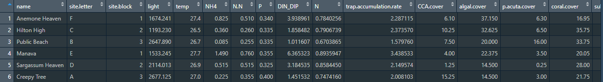
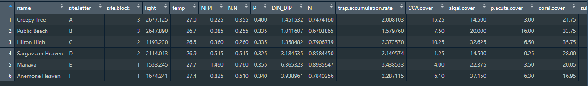

```{r setup, include=FALSE}
options(htmltools.dir.version = FALSE)
```
<div style = "position:fixed; visibility: hidden">
$$\require{color}\definecolor{yellow}{rgb}{1, 0.8, 0.16078431372549}$$
$$\require{color}\definecolor{orange}{rgb}{0.96078431372549, 0.525490196078431, 0.203921568627451}$$
$$\require{color}\definecolor{green}{rgb}{0, 0.474509803921569, 0.396078431372549}$$
</div>

<script type="text/x-mathjax-config">
MathJax.Hub.Config({
  TeX: {
    Macros: {
      yellow: ["{\\color{yellow}{#1}}", 1],
      orange: ["{\\color{orange}{#1}}", 1],
      green: ["{\\color{green}{#1}}", 1]
    },
    loader: {load: ['[tex]/color']},
    tex: {packages: {'[+]': ['color']}}
  }
});
</script>

<style>
.yellow {color: #FFCC29;}
.orange {color: #F58634;}
.green {color: #007965;}
</style>


```{r flair_color, echo=FALSE}
library(flair)
yellow <- "#FFCC29"
orange <- "#F58634"
green <- "#007965"
```

---
# Outline of class

1. Quiz!
1. Review of tidyr
1. Independent Project update
1. Learning joins (part of the {dplyr} package)
  - left_join() -- with real data

1. Learn to make a tibble

1. Back to joins (with made up data as examples)
  - right_join() 
  - inner_join()
  - full_join()
  - semi_join()
  - anti_join()
  
Homework 
1. Practice with joins


---
# Review

1. What function do you use to split up one column into multiple columns?  

1. What function do you use to transition a wide data frame into a long data frame?
---
# Independent project update

Rubric and directions are in your syllabus and schedule folder on github.  Let's look at it together now

---
# Intro to different types of join

Let's say you have multiple hierarchies of data and you want to join them into one big data set. Join functions are the way you would do it.

.pull-left[## Data1

| Site_number| Treatment   |      Nitrate      | Temp | 
|----------|:-------------:|------:|----:|
| 1 | High|  1.2 | 7.2| 
| 2 | High|    3.0   | 7.8| 
| 3 | Low |2.4 | 8.0|
| 4 | Low |5.1| 8.0| 
| 5 | Low| 1.1| 7.9| 
]

.pull-right[## Data2

| Site_Number| Sample_number  |      Biomass    |  
|----------|:-------------:|------:|
| 1 | 1| 12.2 | 
| 1 | 2| 14.0 | 
| 1 | 3 |11.9 |
| 1 | 4 |10.0|  

]

---
# Intro to different types of join

Let's say you have multiple hierarchies of data and you want to join them into one big data set. Join functions are the way you would do it.

.pull-left[## Data1

| Site_Number| Treatment   |      Nitrate      | Temp | 
|----------|:-------------:|------:|----:|
|.orange[ 1] | .orange[ High]|  .orange[ 1.2]| .orange[ 7.2]| 
| 2 | High|    3.0   | 7.8| 
| 3 | Low |2.4 | 8.0|
| 4 | Low |5.1| 8.0| 
| 5 | Low| 1.1| 7.9| 
]

.pull-right[## Data2

| Site_Number| Sample_number  |      Biomass    |  
|----------|:-------------:|------:|
| .orange[1 ]| .orange[1]|  .orange[12.2] | 
| .orange[ 1]| .orange[2]|    .orange[14.0]   | 
| .orange[ 1]| .orange[3] |.orange[11.9] |
| .orange[ 1]| .orange[4] |.orange[10.0]|  

]
---
# What we want

| Site_Number| Sample_number  |      Biomass    |  Treatment   |      Nitrate      | Temp | 
|----------|:-------------:|------:|
| 1 | 1| 12.2 | .orange[ High]|  .orange[ 1.2]| .orange[ 7.2]| 
| 1 | 2| 14.0 | .orange[ High]|  .orange[ 1.2]| .orange[ 7.2]| 
| 1 | 3 |11.9 |.orange[ High]|  .orange[ 1.2]| .orange[ 7.2]| 
| 1 | 4 |10.0|  .orange[ High]|  .orange[ 1.2]| .orange[ 7.2]|  


  
**What is the column name that stayed consistent between Data1 and Data2 (i.e. what is the key/unique identifier here)?**

--

Whenever you are collecting data make sure to include a unique ID for every sample. This will be extremely helpful when you need to connect multiple data sets together. 

---
# A more complicated example from your required reading


---
# New dataset!

We are going to use a subset of data from **Becker and Silbiger (2020) Journal of Experimental Biology**.

In the data folder for this week in Fall-2024, you will see three .csv files:

1. site.characteristics.data.csv
1. Topt_data.csv
1. Data_dictionary.csv

Move both of them to the data folder of YOUR repo.

Explore the data dictionary to understand what you will be working with.

Basics: Danielle tested how nutrient loading and sedimentation affected thermal performance metrics of corals in Mo'orea, French Polynesia. She collected 10 corals from six sites with wide range in nutrients/sedimentation. Each coral underwent a heat ramping experiment to calculate thermal performance measures for respiration, photosynthesis, and calcification. She also measured several environmental characteristics at each site (nutrients, temperature, light, reef cover, sedimentation rate, etc.).
---
# Set up your script for today
```{r, message=FALSE, warning=FALSE}
### Today we are going to practice joins with data from Becker and Silbiger (2020) ####
### Created by: Dr. Nyssa Silbiger #############
### Updated on: 2024-09-24 ####################


#### Load Libraries ######
library(tidyverse)
library(here)


### Load data ######
# Environmental data from each site
EnviroData<-read_csv(here("Week_05","data", "site.characteristics.data.csv"))

#Thermal performance data
TPCData<-read_csv(here("Week_05","data","Topt_data.csv"))
```

```{r, eval=FALSE}
glimpse(EnviroData)
glimpse(TPCData)
# also use View()

```
---
```{r, echo=FALSE}
glimpse(EnviroData)
glimpse(TPCData)

```
---
# Pivot the data

We notice that the TPCData is in wide format and the EnviroData is in long format.  Let's convert the EnviroData to wide so that they are both in the same format

```{r}
EnviroData_wide <- EnviroData %>% 
  pivot_wider(names_from = parameter.measured,
              values_from = values)

```

```{r, eval=FALSE}
View(EnviroData_wide)
```


---
# Sort the data

Are you OCD like me? Does it bother you that the sites are not in order? If so, you can use the arrange() function to sort the dataframe by site.


```{r}
EnviroData_wide <- EnviroData %>% 
  pivot_wider(names_from = parameter.measured, # pivot the data wider
              values_from = values) %>%
  arrange(site.letter) # arrange the dataframe by site

```

```{r, eval=FALSE}
View(EnviroData_wide)
```

--



.center[

]
---
# left_join()

Let's say we want to look at the relationship between nutrient loading from the site and different thermal performance metrics.  I can use *left_join()* to bring the two data frames together into one single data frame. 

.center[

]

---
# left_join()

For left_join() to work you need a *key* that is identical in both dataframes (spelling, capitalization, everything). In this case, Danielle has site.letter present in both data frames. This is the variable that will be used to pair both datasets together. 

In our case, there is no missing data. However, if there was an extra site in the *right-hand* data frame it would be excluded from the new dataset. 

```{r}

FullData_left<- left_join(TPCData, EnviroData_wide)

head(FullData_left)

```

---
# relocate

Does it also bother you that the columns are not in a particular order? I like viewing all the character metadata on the left and all the collected numeric data on the right. Here is how to do it.

```{r}

FullData_left<- left_join(TPCData, EnviroData_wide) %>%
   relocate(where(is.numeric), .after = where(is.character)) # relocate all the numeric data after the character data

head(FullData_left)

```
---
# Think, pair, share

We now have our full data set. In your group, take your data set and calculate the **mean and variance of all collected (TPC and environmental) data by site**. (Hint: you can either use one of the summarise_at() functions or pivot the data longer to do this in less code)

.center[

]
---
# So many joins

There are **lots** of different ways to join data together. To demonstrate, we will make up some datasets so that it is easier to highlight what is happening. 

We will also learn:
  - right_join() 
  - inner_join()
  - full_join()
  - semi_join()
  - anti_join()
  
---
# Creating your own tibble

What is a tibble? It is a data frame, but simpler. It is what the tidyverse uses as a data frame.

To create a tibble we use *tibble()*

.pull-left[
```{r}
# Make 1 tibble
T1 <- tibble(Site.ID = c("A", "B", "C", "D"), 
             Temperature = c(14.1, 16.7, 15.3, 12.8))

T1
```
]

--

.pull-right[
```{r}
# make another tibble
T2 <-tibble(Site.ID = c("A", "B", "D", "E"), 
            pH = c(7.3, 7.8, 8.1, 7.9))

T2

```
]

---
# left_join vs right_join

The only difference is which dataframe is being used as the base.

left_join(T1, T2) - joins to T1  
right_join(T1, T2) - joins to T2

.center[

]

---
# left_join vs right_join

.pull-left[
```{r}
left_join(T1, T2)

```
]

.pull-right[
```{r}
right_join(T1, T2)

```
]

Notice where the missing value is for each data set
---
# inner_join vs full_join

Inner join only keeps the data that is complete in both data sets.

.center[

]

---
# inner_join vs full_join

Full join keeps everything.

.center[

]


---
# inner_join vs full_join

.pull-left[
```{r}
inner_join(T1, T2)

```
]

.pull-right[
```{r}
full_join(T1, T2)

```
]

---
# semi_join vs anti_join

semi_join keeps all rows from the first data set where there are matching values in the second data set, keeping just columns from the first data set.

.center[

]


---
# semi_join vs anti_join

Saves all rows in the first data set that do not match anything in the second data set. This can help you find possible missing data across datasets.

.center[

]

How would I find the extra data in y, in this example?
---
# semi_join vs anti_join

.pull-left[
```{r}
semi_join(T1, T2)

```
]

.pull-right[
```{r}
anti_join(T1, T2)

```
]

---
# Today's totally awesome R package: {cowsay}

Have you every wanted an animal to talk to you?  Well now you can.

```{r, eval = FALSE}
install.packages("cowsay")
```

```{r, out}
library(cowsay)
```

---

```{r}
# I want a shark to say hello

say("hello", by = "shark")

```


---

```{r}
# I want a cat to say I want pets

say("I want pets", by = "cat")

```

---
Lab

Practice joins on your own.  You do not have to turn anything in for this lab. 

Reminder: We are starting RMarkdown next week. If you have not yet completed the markdown lab from week 2, do it now. I will expect that you know the basics from that lab assignment **before** class on Tuesday.  

---
class: center, middle

# Thanks!

Slides created via the R package [**xaringan**](https://github.com/yihui/xaringan).

Some slides modified from [Tidy Explain ](https://github.com/gadenbuie/tidyexplain#:~:text=A%20mutating%20join%20allows%20you,one%20table%20to%20the%20other.)


