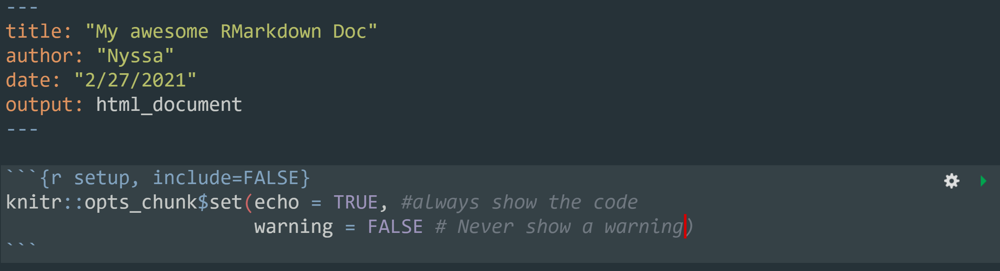

```{r setup, include=FALSE}
options(htmltools.dir.version = FALSE)
```
<div style = "position:fixed; visibility: hidden">
$$\require{color}\definecolor{yellow}{rgb}{1, 0.8, 0.16078431372549}$$
$$\require{color}\definecolor{orange}{rgb}{0.96078431372549, 0.525490196078431, 0.203921568627451}$$
$$\require{color}\definecolor{green}{rgb}{0, 0.474509803921569, 0.396078431372549}$$
</div>

<script type="text/x-mathjax-config">
MathJax.Hub.Config({
  TeX: {
    Macros: {
      yellow: ["{\\color{yellow}{#1}}", 1],
      orange: ["{\\color{orange}{#1}}", 1],
      green: ["{\\color{green}{#1}}", 1]
    },
    loader: {load: ['[tex]/color']},
    tex: {packages: {'[+]': ['color']}}
  }
});
</script>

<style>
.yellow {color: #FFCC29;}
.orange {color: #F58634;}
.green {color: #007965;}
</style>


```{r flair_color, echo=FALSE}
library(flair)
yellow <- "#FFCC29"
orange <- "#F58634"
green <- "#007965"
```

---
# Outline of class


.pull-left[
Working with RMarkdown today

1. Quiz! 

1. What is RMarkdown?

1. RMarkdown metadata and outputs

1. Basic Markdown text

1. Using code chunks


Homework 
1. Practice with RMarkdown
]

.pull-right[
Next Time
1. Working with figures

1. Working with tables

1. Themes

1. Advanced outputs
]

.center[
[cheatsheet](https://rmarkdown.rstudio.com/lesson-15.html)

[The RMarkdown Definitive Guide](https://bookdown.org/yihui/rmarkdown/)

[RMarkdown RStudio Guide](https://rmarkdown.rstudio.com/)
]

[Quart Guide - The NEW markdown presentation](https://r4ds.hadley.nz/quarto.html)
---
# Review

1. If I want to convert Feb 28 2021 10:05:50 to a date, what function do I use?
---
# What is R Markdown?
   
 
---
 
 # What is R Markdown?
 
1.  "An authoring framework for data science." 

--

1. A document format (.Rmd). 

--

1. An R package named rmarkdown. 

--

1. "A file format for making dynamic documents with R." 

--

1. "A tool for integrating text, code, and results." 

--

1. "A computational document." 

--

1. Wizardry. (🧙‍️)


---
# Change your mental mode

.pull-left[
### Source to Output

]

.pull-right[
### Source to Output


]

.center[
**Take your notes in the same place as your code**]

---
# What is inside

.center[

]
---
# What is inside

.pull-left[
RMarkdown is broken into 4 major parts:
- Metadata
- Text
- Code
- Output
]

.pull-right[

]

--

Before we code together I will walk you through some of the features. Then I will have you install the package and work with me

---
# Metadata: YAML

### YAML - *yet another markup language*

```{r, eval=FALSE}
---
key: value
---

```

This goes at the top of your RMarkdown document, includes the metadata, style, and type of output for your document.

You only need two pieces for it to work, but there is lots more to add to make it beautiful.

--

```{r, eval = FALSE}
---
title: "My Awesome Markdown File"
output: html_document
---
```

*title* is the title of your markdown document  
*output* is the format that it will be saved as


---
# Example YAML


---

<video controls>
  <source src="libs/images/urchinvid.mp4" type="video/mp4">
</video>


---
# Example YAML


---


<video controls>
  <source src="libs/images/urchinvid2.mp4" type="video/mp4">
</video>


---
# Example YAML


---
# Example YAML


---
# Let's get started

Create a **week 6** folder and install rmarkdown on your computer

```{r, eval = FALSE}
install.packages("rmarkdown")
install.packages('tinytex') # this will be helpful if you want a PDF doc

```

.center[

]
---
# Start a new RMarkdown document

File -> New File -> RMarkdown


---
# Another way...


---
# Enter in some metadata and save the rmd doc in your scripts folder


---
# You create the html document by hitting *knit*


---
# Text

The text is written in the markdown language.  You have already done a lab on markdown and this is the exact language that you use for your readme files.  This is a short review.

---
# Headers

.pull-left[
```{r, eval = FALSE}
# HEADER 1
## HEADER 2
### HEADER 3
#### HEADER 4
##### HEADER 5
###### HEADER 6
```
]

.pull-right[
# HEADER 1
## HEADER 2
### HEADER 3
#### HEADER 4
##### HEADER 5
###### HEADER 6
]

---
# Text

## Bold
.pull-left[
```{r, eval=FALSE}
I **love** RMarkdown.
```
]

.pull-right[
I **love** RMarkdown.
]

--

## Italics
.pull-left[
```{r, eval=FALSE}
I *love* RMarkdown.
```
]

.pull-right[
I *love* RMarkdown.
]

---
# Text

## Add a new line
You need to hit the space bar twice after a line if you want the following text to be on a new line.  

--

## Lists

.pull-left[
```{r, eval = FALSE}
- item 1
- item 2
- item 3
```

]

.pull-right[
- item 1
- item 2
- item 3
]

.pull-left[
```{r, eval = FALSE}
1. item 1
1. item 2
1. item 3
```

]

.pull-right[
1. item 1
1. item 2
1. item 3
]

---
# Images

.pull-left[
```{r, eval = FALSE}

```
]

.pull-right[


]

--

## Links
.pull-left[
```{r, eval = FALSE}
[Click here](https://silbigerlab.com)
```
]

.pull-right[
[Click here](https://silbigerlab.com)
]
---
# Code chunks

You can add a code chunk by pressing  
- the keyboard shortcut **Ctrl + Alt + I** (OS X: **Cmd + Option + I**)
- Click **Code** at the top of RStudio then **insert chunk**.


---
# Code chunks

You can control what you want printed in the html within the code chunks.


[RMarkdown Reference Guide](https://rmarkdown.rstudio.com/)

---
# Code Chunks

Let's say we want to set options for the entire markdown file.




---
# Total awesome R package

Play a sound!

```{r, eval =FALSE}
install.packages("beepr")

```

```{r}
library(beepr)

beep(5)
beep(9)
```

---

# Let's Rmarkdown!
 We will work together on our first basic RMarkdown doc with Palmer Penguins

---
class: center, middle

# Thanks!

Slides created via the R package [**xaringan**](https://github.com/yihui/xaringan).  
Some slides modified from many lectures by [Allison Hill](https://alison.rbind.io/post/2020-05-28-how-i-teach-r-markdown/)


