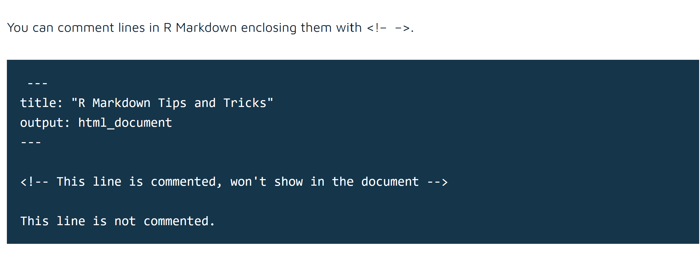
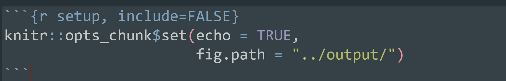

```{r setup, include=FALSE}
options(htmltools.dir.version = FALSE)
```
<div style = "position:fixed; visibility: hidden">
$$\require{color}\definecolor{yellow}{rgb}{1, 0.8, 0.16078431372549}$$
$$\require{color}\definecolor{orange}{rgb}{0.96078431372549, 0.525490196078431, 0.203921568627451}$$
$$\require{color}\definecolor{green}{rgb}{0, 0.474509803921569, 0.396078431372549}$$
</div>

<script type="text/x-mathjax-config">
MathJax.Hub.Config({
  TeX: {
    Macros: {
      yellow: ["{\\color{yellow}{#1}}", 1],
      orange: ["{\\color{orange}{#1}}", 1],
      green: ["{\\color{green}{#1}}", 1]
    },
    loader: {load: ['[tex]/color']},
    tex: {packages: {'[+]': ['color']}}
  }
});
</script>

<style>
.yellow {color: #FFCC29;}
.orange {color: #F58634;}
.green {color: #007965;}
</style>


```{r flair_color, echo=FALSE}
library(flair)
yellow <- "#FFCC29"
orange <- "#F58634"
green <- "#007965"
```

---
# Outline of class


Working with RMarkdown today


1. Working with figures

1. Working with tables

1. Themes

1. Advanced outputs


Homework 
1. Practice with RMarkdown


.center[
[Download this cheatsheet on RMarkdown](https://rmarkdown.rstudio.com/lesson-15.html)

[The RMarkdown Definitive Guide](https://bookdown.org/yihui/rmarkdown/)

[RMarkdown RStudio Guide](https://rmarkdown.rstudio.com/)
]
---
# Review

1. What is the short cut to add a code chunk to an RMarkdown document?

--
 ### Can you add comments in markdown? 
 
 YES!
 
 
 <!-- This line is commented, won't show in the document -->
---
# Working with figures

We can change lots of aspects of the figure right in our markdown document:

- change size
- change resolution
- change "device" (i.e. is it a .png. .pdf, etc.)
- save it in a specific folder

---
# Start a document

- Open a new .rmd file and set it up.  
- Load the appropriate libraries that you need 
- Make a very simple plot with the penguin package of anything (don't overthink it this is just for practice)

---
# Change size

Some options:

- out.width="70%"  (makes it 70% of the width)
- fig.width=3  (makes the width 3 inches)
- fig.height=4 (makes the width 4 inches) 
- fig.asp=1.2 (changes the aspect ratio to 1.2)
- fig.align="center"

We will walk through each of these examples together

{r, out.width="70%"}

[See here for details on figures in rmarkdown.](https://r4ds.had.co.nz/graphics-for-communication.html#figure-sizing)

---
# Save your figure in rmarkdown

You CAN still use ggsave, but there are also more automated ways to export your figures in rmarkdown

set the file path for your figure using:  
- fig.path (you can put this in a global option to send all your figures there)
- name your code chunk (this will be the name of the figure)  

Place between curly braces -- label is the name of your output (plot, table, code chunk, etc.)  
- {r label}

Separated options with commas  
- {r label, option1=value}

---

--

#### IMPORTANT - R automatically saves everything to the *file* directory, NOT the *project* directory.  
This is really important when exporting your figures automatically in markdown, as opposed to ggsave()

---
#### IMPORTANT - R automatically saves everything to the *file* directory, NOT the *project* directory.  
This is really important when exporting your figures automatically in markdown, as opposed to ggsave()

Automatically save all your figures to your output folder  
The "../" means "go up a directory". So this is saying, go out of the scripts folder (assuming that is where your script is saved) and then go to your output folder (spelled the way YOU have it)


---
# Save your figure in rmarkdown

Set a figure caption  
- fig.cap="This is a boxplot of penguins"

If you just want the plot and not the code then set .orange[echo=FALSE]  

Save figure as a pdf instead of png  
- dev="pdf"

---
# Tables

Type out tables by hand

.pull-left[
```{r, eval = FALSE}
| Time  | Session | Topic    |
|:------|:-------:|---------:|
| _left_ | _center_| _right_ |
| 01:00  | 1       | Anatomy |
| 01:50  |         | *Break* |
| 02:00  | 2       | Tables  |
| 02:45  |         | *Break* |
```
]

.pull-right[
| Time          | Session | Topic    |
|:--------------|:-------:|---------:|
| _left_        | _center_| _right_  |
| 01:00  | 1       | Anatomy  |
| 01:50  |         | *Break*  |
| 02:00  | 2       | Tables   |
| 02:45  |         | *Break*  |
]

---
# Tables with kable

```{r, eval = FALSE}
install.packages("kableExtra")
```
```{r,warning=FALSE, message=FALSE}
library(kableExtra)
library(palmerpenguins)
library(tidyverse)

penguins %>%
  group_by(species) %>%
  summarise(billmean = mean(bill_length_mm, na.rm = TRUE)) %>%
  kbl()  # make it a kable table

```
---
# Tables with kable

add some style

```{r, warning=FALSE, message=FALSE}

penguins %>%
  group_by(species) %>%
  summarise(billmean = mean(bill_length_mm, na.rm = TRUE)) %>%
  kbl() %>% # make it a kable table
  kable_classic()%>% #<<
  row_spec(2, bold = T, color = "white", background = "red") #<<
```

Look up the kable package for all the things you can do with it
---
# Tables with kable

add some style

```{r, warning=FALSE, message=FALSE}

penguins %>%
  group_by(species) %>%
  summarise(billmean = mean(bill_length_mm, na.rm = TRUE)) %>%
  kbl() %>% # make it a kable table
  kable_classic()%>% 
  row_spec(2, bold = T, color = "white", background = "red") %>%
  kable_styling(full_width = FALSE) #<<
```

Look up the kable package for all the things you can do with it
---
# Tables

There are **tons** of packages that make cool and beautiful tables in rmarkdown.  

Check out this blog with lots of examples [here](https://rfortherestofus.com/2019/11/how-to-make-beautiful-tables-in-r/).  

I also really like the gt and gtExtras packages

---
# Themes

There are lots of cool packages themes that you can use to change to aesthetics of your output.

[https://www.datadreaming.org/posts/2018-04-11-r-markdown-theme-gallery/2018-04-11-r-markdown-theme-gallery](https://www.datadreaming.org/posts/2018-04-11-r-markdown-theme-gallery/2018-04-11-r-markdown-theme-gallery)

---
# Outputs

There are also **tons** of outputs.  
One of my favorites is [github_document](https://rmarkdown.rstudio.com/github_document_format.html).  This makes a file that is easy to view on github. 

Importantly, every file type has different limitations for the YAML. For example, there are several settings that only work in an html file that will need to be removed when using a github_document or a pdf_document. 

[Here is a list of different types of outputs.](https://rmarkdown.rstudio.com/lesson-9.html)

---
# Help with YAML

Check out the {ymlthis} package which has a GUI for writing yml code.

```{r, eval = FALSE}
install.packages("ymlthis")
```

Click **Tools** and then **Addins** then scroll to "write new RMarkdown or YAML file"

---
# Today's totally awesome R package

Make a meme in R!

```{r, eval = FALSE}
devtools::install_github("sctyner/memer")
```

```{r, out.width="50%"}
library(memer)

meme_get("DistractedBf") %>% 
  meme_text_distbf("Silly R package", "OCN 682 students", "actual coding")
```

---
# Today's totally awesome R package

Make a meme in R!
```{r, out.width="25%"}
library(memer)

meme_get("DosEquisMan") %>% 
  meme_text_top("I don't always like coding", size = 28) %>% 
  meme_text_bottom("But when I do\nIt's always today's totally awesome R package", size = 18)
  
```

---
# Homework

- Take any of the data sheets you have already worked with in class and create **at least one table and one figure in an Rmarkdown file**.
- Create the most beautiful RMarkdown output you can in either an html, github doc, or pdf format.  
- Make sure you have headings with clear explanations of what you are doing.  
- Practice using markdown formatting with bold, italics, and lists (use each of these at least once).  
- Make sure your outputs and scripts are saved in the appropriate folders. Keep proper coding etiquette (figures need to be pub quality as usual and you need to comment your code).

---
class: center, middle

# Thanks!

Slides created via the R package [**xaringan**](https://github.com/yihui/xaringan).  
Some slides modified from many lectures by [Allison Hill](https://alison.rbind.io/post/2020-05-28-how-i-teach-r-markdown/)


