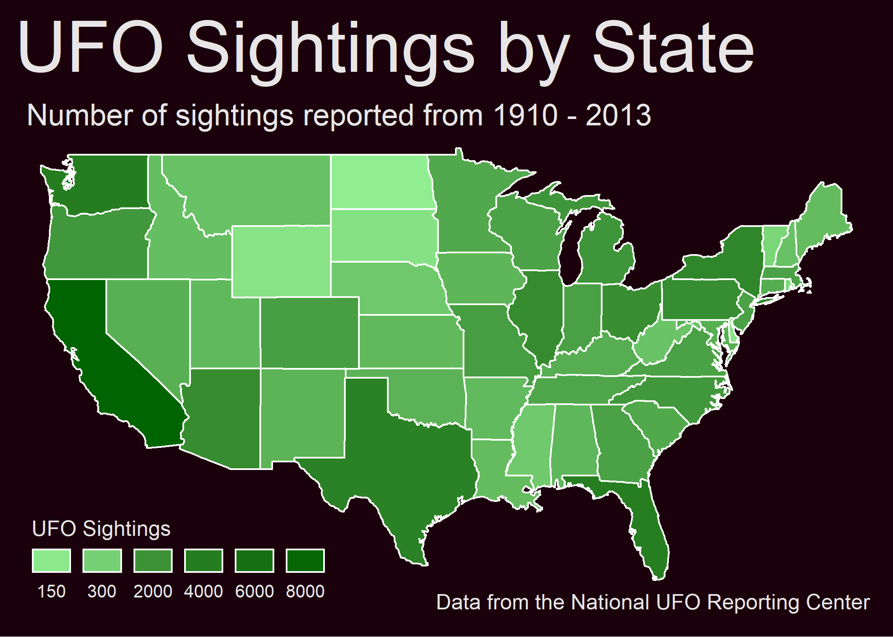

```{r setup, include=FALSE}
options(htmltools.dir.version = FALSE)
```
<div style = "position:fixed; visibility: hidden">
$$\require{color}\definecolor{yellow}{rgb}{1, 0.8, 0.16078431372549}$$
$$\require{color}\definecolor{orange}{rgb}{0.96078431372549, 0.525490196078431, 0.203921568627451}$$
$$\require{color}\definecolor{green}{rgb}{0, 0.474509803921569, 0.396078431372549}$$
</div>

<script type="text/x-mathjax-config">
MathJax.Hub.Config({
  TeX: {
    Macros: {
      yellow: ["{\\color{yellow}{#1}}", 1],
      orange: ["{\\color{orange}{#1}}", 1],
      green: ["{\\color{green}{#1}}", 1]
    },
    loader: {load: ['[tex]/color']},
    tex: {packages: {'[+]': ['color']}}
  }
});
</script>

<style>
.yellow {color: #FFCC29;}
.orange {color: #F58634;}
.green {color: #007965;}
</style>


```{r flair_color, echo=FALSE}
library(flair)
yellow <- "#FFCC29"
orange <- "#F58634"
green <- "#007965"
```

---
# Outline of class


Working with Maps


1. Quiz! 

1. Highlight some various spatial packages

1. Simple mapping using the {maps} package with ggplot


Homework 
1. Make a map

.foot-note[I am NOT a GIS person. Please refer to references on spatial analysis for theory. Today I am going to teach you how to code a simple map.]
---
# Show me your markdown files!  

Also, a hack reminder! [raw.githack.com](raw.githack.com)


---
# Map packages

There are a **ton** of different map packages.  

Today, install the following:

```{r, eval = FALSE}
install.packages(c("maps", "mapproj", "mapdata"))
```

Other very helpful packages:
- **sf** (This is for the serious GIS people. If you want to do actual spatial analyses this is the package to use)
- **ggmap** (Uses the google maps API to make maps. Really easy to use, but requires a credit card for the API...)
- **tmap** (static and interactive maps)
- **leaflet** (interactive html maps-- Awesome to use with rmakrdown files)

Helpful references:
1. The required reading for today
1. [Advanced maps](https://geocompr.robinlovelace.net/adv-map.html)
1. [Bathymetry example](http://ben-williams.github.io/updated_ggplot_figures.html#maps)
1. [Earth Lab](https://www.earthdatascience.org/courses/earth-analytics/spatial-data-r/understand-epsg-wkt-and-other-crs-definition-file-types/) 


---

# Start your script or rmarkdown file

```{r, warning = FALSE, message = FALSE}
# Load libraries
library(tidyverse)
library(here)
library(maps)
library(mapdata)
library(mapproj)

```

--

# Today's data

```{r, message=FALSE, warning=FALSE}
# Read in data on population in California by county
popdata<-read_csv(here("Week_07","data","CApopdata.csv"))

#read in data on number of seastars at different field sites
stars<-read_csv(here("Week_07","data","stars.csv"))
```

**Take a minute to explore the data**

---
# {maps} package

The {maps} package is a combination of functions that pair well with ggplot and base layers for maps (i.e. polygons of regions of interest).

map_data("location") is the function used to pull out whatever base layer that you want. 

--

```{r}
# get data for the entire world
world<-map_data("world") #<<

head(world)
```

---
# {maps} package

You can extract polygons for different .orange[countries].

```{r}
# get data for the USA
usa<-map_data("usa") #<<

head(usa)
```
---
# {maps} package

You can extract polygons for different .orange[countries].

```{r}
# get data for italy
italy<-map_data("italy") #<<

head(italy)
```
---
# {maps} package

You can also extract data and different resolutions.  For example for data that also has polygons for each state in the US use:

```{r}
# get data for states
states<-map_data("state") #<<

head(states)
```
---
# {maps} package

You can also extract data and different resolutions.  For example for data that also has polygons for each county in the US use:

```{r}
# get data for counties
counties<-map_data("county") #<<

head(counties)
```

---
# Structure of the data

- **long** is longitude. Things to the west of the prime meridian are negative.

--

- **lat** is latitude.

--

- **order**. This just shows in which order ggplot should “connect the dots”

--

- **region and subregion** tell what region or subregion a set of points surrounds.

--

- **group**. *This is very important!* ggplot2’s functions can take a group argument which controls (amongst other things) whether adjacent points should be connected by lines. If they are in the same group, then they get connected, but if they are in different groups then they don’t.
Essentially, having to points in different groups means that ggplot “lifts the pen” when going between them.

---
# Make a map of the world

```{r}
ggplot()+
  geom_polygon(data = world, aes(x = long, y = lat, group = group)) #<<

```
---
# Make a map of the world

What happens if I forget **group = group**?
```{r}
ggplot()+
  geom_polygon(data = world, aes(x = long, y = lat)) #<<

```

---

# Make a map of the world
.orange[Add color to the lines and fill.]

.pull-left[
```{r plot1, eval=FALSE, warning=FALSE, message=FALSE}
ggplot()+
  geom_polygon(data = world, 
               aes(x = long, y = lat, group = group),
               color = "black") #<<

```
]

.pull-right[
```{r plot1-out, ref.label="plot1", echo=FALSE, warning = FALSE}
```
]

---
# Make a map of the world
.orange[Add color to the lines and fill.]

.pull-left[
```{r plot1a, eval=FALSE, warning=FALSE, message=FALSE}
ggplot()+
  geom_polygon(data = world, 
               aes(x = long, 
                   y = lat, 
                   group = group, 
                   fill = region),#<<
               color = "black") +
  guides(fill = FALSE)

```
]

.pull-right[
```{r plot1a-out, ref.label="plot1a", echo=FALSE, warning = FALSE}
```
]
---
# Change the visuals
.orange[Change the theme.]

.pull-left[
```{r plot2, eval=FALSE, warning=FALSE, message=FALSE}
ggplot()+
  geom_polygon(data = world, 
               aes(x = long, 
                   y = lat,
                   group = group,
                   fill = region),
               color = "black")+
  guides(fill = FALSE)+
  theme_minimal()#<<

```
]

.pull-right[
```{r plot2-out, ref.label="plot2", echo=FALSE, warning = FALSE}
```
]
---
# Change the visuals
.orange[Make the ocean blue.]

.pull-left[
```{r plot3, eval=FALSE, warning=FALSE, message=FALSE}
ggplot()+
  geom_polygon(data = world, 
               aes(x = long, 
                   y = lat, 
                   group = group,
                   fill = region),
               color = "black")+
  theme_minimal()+
  guides(fill = FALSE)+
  theme(panel.background = element_rect(fill = "lightblue"))#<<

```
]
.pull-right[
```{r plot3-out, ref.label="plot3", echo=FALSE, warning = FALSE}
```
]
---
# Change the map projection

The earth is NOT flat, but we are attempting to visualize this map in 2D. There are a lot of different projections that you can use. See [here](https://rdrr.io/cran/mapproj/man/mapproject.html) for the different projections included in the {mapproj} package


.orange[Use a mercator projection]

.pull-left[
```{r plot4, eval=FALSE, warning=FALSE, message=FALSE}
ggplot()+
  geom_polygon(data = world, 
               aes(x = long, 
                   y = lat, 
                   group = group,
                   fill = region),
               color = "black")+
  theme_minimal()+
  guides(fill = FALSE)+
  theme(panel.background = element_rect(fill = "lightblue"))+
  coord_map(projection = "mercator", #<<
            xlim = c(-180,180))#<<

```
]
.pull-right[
```{r plot4-out, ref.label="plot4", echo=FALSE, warning = FALSE}
```
]

---

# Change the map projection

.orange[Use a sinusoidal projection.]

.pull-left[
```{r plot5, eval=FALSE, warning=FALSE, message=FALSE}
ggplot()+
  geom_polygon(data = world, 
               aes(x = long,
                   y = lat,
                   group = group, 
                   fill = region),
               color = "black")+
  theme_minimal()+
  guides(fill = FALSE)+
  theme(panel.background = element_rect(fill = "lightblue"))+
  coord_map(projection = "sinusoidal", #<<
            xlim = c(-180,180))#<<

```
]
.pull-right[
```{r plot5-out, ref.label="plot5", echo=FALSE, warning = FALSE}
```
]

---
# Let's make a map of just California

```{r}
# Use the states dataset
head(states)

```

---
# Let's make a map of just California
.orange[Filter out just the California data.]
```{r}
# Use the states dataset
CA_data<-states %>%
  filter(region == "california")
```

--

# Think, pair, share

Make a simple map of just California using what you just learned. Do not cheat!!


---
# Map of California

.pull-left[
```{r plot6, eval=FALSE, warning=FALSE, message=FALSE}
ggplot()+
geom_polygon(data = CA_data, 
             aes(x = long, 
                 y = lat, 
                 group = group), 
             color = "black")+
  coord_map()+
  theme_void() #<<
```
]

.pull-right[
```{r plot6-out, ref.label="plot6", echo=FALSE, warning = FALSE}
```
]

---
## Adding multiple layers of data
.orange[Plot the population of every county in California.]

- First, we need to get the county level data and join it with our dataset on population (How do I do it?)

```{r}
# Look at the county data
head(counties)[1:3,] # only showing the first 3 rows for space
```


```{r}
# Look at the county data
head(popdata)
```

---
## Adding multiple layers of data
.orange[Wrangle the data. Make the column names the same to join the two datasets.]


```{r}
CApop_county<-popdata %>%
  select("subregion" = County, Population)  %>% # rename the county col
  inner_join(counties) %>%
  filter(region == "california") # some counties have same names in other states

```

--

```{r}

head(CApop_county)
```

---
# Map of CA population by county
.pull-left[
```{r plot7, eval=FALSE, warning=FALSE, message=FALSE}
ggplot()+
geom_polygon(data = CApop_county, 
             aes(x = long, 
                 y = lat, 
                 group = group,
                 fill = Population), #<< 
             color = "black")+
  coord_map()+
  theme_void() 
```
]

.pull-right[
```{r plot7-out, ref.label="plot7", echo=FALSE, warning = FALSE}
```
]

---
# Map of CA population by county
.orange[Make it log scale for easier interpretation.]
.pull-left[
```{r plot8, eval=FALSE, warning=FALSE, message=FALSE}
ggplot()+
geom_polygon(data = CApop_county, 
             aes(x = long, 
                 y = lat, 
                 group = group,
                 fill = Population),  
             color = "black")+
  coord_map()+
  theme_void() +
  scale_fill_gradient(trans = "log10")#<<
```
]
.pull-right[
```{r plot8-out, ref.label="plot8", echo=FALSE, warning = FALSE}
```
]

---
# Add a layer of points

Look at the stars dataset. This has the number of seastars per/m2 at different sites in California.

```{r}
head(stars)

```

---
# Map of CA population by county with seastars
.orange[Add a geom_point layer.]
.pull-left[
```{r plot9, eval=FALSE, warning=FALSE, message=FALSE}
ggplot()+
geom_polygon(data = CApop_county, 
             aes(x = long, 
                 y = lat, 
                 group = group,
                 fill = Population),  
             color = "black")+
  geom_point(data = stars, # add a point at all my sites #<<
             aes(x = long, #<<
                 y = lat))+ #<<
  coord_map()+
  theme_void() +
  scale_fill_gradient(trans = "log10")
```
]
.pull-right[
```{r plot9-out, ref.label="plot9", echo=FALSE, warning = FALSE}
```
]
---
# Map of CA population by county with seastars
.orange[Make points proportional to number of stars.]
.pull-left[
```{r plot10, eval=FALSE, warning=FALSE, message=FALSE}
ggplot()+
geom_polygon(data = CApop_county, 
             aes(x = long, 
                 y = lat, 
                 group = group,
                 fill = Population),  
             color = "black")+
  geom_point(data = stars, # add a point at all my sites 
             aes(x = long, 
                 y = lat,
                 size = star_no))+ #<<
  coord_map()+
  theme_void() +
  scale_fill_gradient(trans = "log10")
```
]
.pull-right[
```{r plot10-out, ref.label="plot10", echo=FALSE, warning = FALSE}
```
]

---
# Map of CA population by county with seastars
.orange[Make a better legend label.]
.pull-left[
```{r plot11, eval=FALSE, warning=FALSE, message=FALSE}
ggplot()+
geom_polygon(data = CApop_county, 
             aes(x = long, 
                 y = lat, 
                 group = group,
                 fill = Population),  
             color = "black")+
  geom_point(data = stars, # add a point at all my sites 
             aes(x = long, 
                 y = lat,
                 size = star_no))+ 
  coord_map()+
  theme_void() +
  scale_fill_gradient(trans = "log10")+
  labs(size = "# stars/m2") #<<
```
]
.pull-right[
```{r plot11-out, ref.label="plot11", echo=FALSE, warning = FALSE}
```
]
---
# Map of CA population by county with seastars
.orange[Save it.]
.pull-left[
```{r plot12, eval=FALSE, warning=FALSE, message=FALSE}
ggplot()+
geom_polygon(data = CApop_county, 
             aes(x = long, 
                 y = lat, 
                 group = group,
                 fill = Population),  
             color = "black")+
  geom_point(data = stars, # add a point at all my sites 
             aes(x = long, 
                 y = lat,
                 size = star_no))+ 
  coord_map()+
  theme_void() +
  scale_fill_gradient(trans = "log10")+
  labs(size = "# stars/m2") 
  ggsave(here("Week_07","output","CApop.pdf"))#<<
```
]
.pull-right[
```{r plot12-out, ref.label="plot12", echo=FALSE, warning = FALSE}
```
]

---
# Total Awesome R package

```{r, eval = FALSE}
remotes::install_github("R-CoderDotCom/ggdogs@main")
```

```{r, warning=FALSE, message=FALSE}
library(ggdogs)
ggplot(mtcars) +
  geom_dog(aes(mpg, wt), dog = "pug", size = 5)
```
---
# Homework
You need to make a map **using RMarkdown** with one of the following datasets from past Tidy Tuesdays. Make sure, as usual, that you scripts and output are saved appropriately.

[Plastic pollution](https://github.com/rfordatascience/tidytuesday/blob/master/data/2021/2021-01-26/readme.md)

[Cats on the move!](https://github.com/rfordatascience/tidytuesday/blob/master/data/2023/2023-01-31/readme.md)

[Where is Bigfoot!](https://github.com/rfordatascience/tidytuesday/tree/master/data/2022/2022-09-13)

[Meteorites](https://github.com/rfordatascience/tidytuesday/tree/master/data/2019/2019-06-11)

## Set up and test your google API key **BEFORE** online class.  
You cannot follow along in class without the google API key. It requires a credit card, but you need to make 10,000 maps before you get charged (i.e. unless you are a developer you will never get charged). Follow the directions starting at ["Enable Google static map service for ggmap"](https://www.littlemissdata.com/blog/maps). If you don't feel comfortable doing this then you can just follow along in class online. Also, important, you **need to use a gmail account to set up your google API.**  

You will also need a **Stadia Maps** API key.  This one does not require a credit card.  Follow directions [here](https://docs.stadiamaps.com/tutorials/getting-started-in-r-with-ggmap/)


---
# Good plot Bad plot lab - competition
**Due October 29**

Your homework is to create two version of similar plots, using any dataset you choose. You must create the plots using ggplot2, post-processing with Adobe Illustrator or similar is not allowed. **This homework is a contest, and the winner will win a prize to be disclosed.**  

--

Please submit your homework by posting a markdown document containing the plots, the code you used to create them, and your discussion of the plot within the markdown doc to github. Data also needs to be submitted.   

--

The first plot should be as bad as possible. Your reading from  Claus Wilke’s and Healy's textbook describe the many ways that a plot can become misleading, difficult to interpret, or or just plain ugly, and you should use all of the tools that you can. Please try to make me, a person who cares a great deal about high-quality data visualization, cry.  

--

You should explain in text all of the ways in which the bad plot is bad. Bullet points are fine, but clearly articulate each principle of data visualization that you have broken.  

--

The second plot should be based on the same or similar data to the first plot, but it should be good. Write briefly about why this is a successful plot.

---

# Badplot rules:  
- All plots must be made in ggplot2, with code visible in the Rmarkdown document.  
- The data must be visible.  
- The good plot and the bad plot should be based on the same, or similar, data. 
- I will post the results on **Social Media**. Please notify me if you would prefer not to have your plots posted publicly. That is fine, but I need to know.  

---

# Example bad plot winner

.pull-left[
]  

.pull-right[
]

---
# Example bad plot winner

.pull-left[
]  

.pull-right[
]


---
class: center, middle

# Thanks!

Slides created via the R package [**xaringan**](https://github.com/yihui/xaringan).  
Some slides modified from [Making maps with R](https://eriqande.github.io/rep-res-web/lectures/making-maps-with-R.html/)


