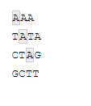
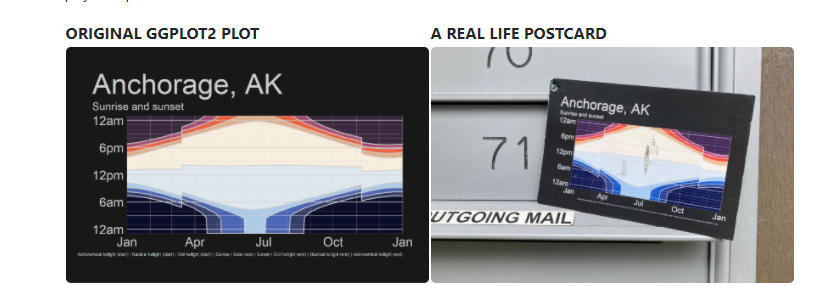

```{r setup, include=FALSE}
options(htmltools.dir.version = FALSE, htmltools.preserve.raw = FALSE)
library(anicon)
```
<div style = "position:fixed; visibility: hidden">
$$\require{color}\definecolor{yellow}{rgb}{1, 0.8, 0.16078431372549}$$
$$\require{color}\definecolor{orange}{rgb}{0.96078431372549, 0.525490196078431, 0.203921568627451}$$
$$\require{color}\definecolor{green}{rgb}{0, 0.474509803921569, 0.396078431372549}$$
</div>

<script type="text/x-mathjax-config">
MathJax.Hub.Config({
  TeX: {
    Macros: {
      yellow: ["{\\color{yellow}{#1}}", 1],
      orange: ["{\\color{orange}{#1}}", 1],
      green: ["{\\color{green}{#1}}", 1]
    },
    loader: {load: ['[tex]/color']},
    tex: {packages: {'[+]': ['color']}}
  }
});
</script>

<style>
.yellow {color: #FFCC29;}
.orange {color: #F58634;}
.green {color: #007965;}
</style>


```{r flair_color, echo=FALSE}
library(flair)
yellow <- "#FFCC29"
orange <- "#F58634"
green <- "#007965"
```

---
# Outline of class

Working with words

1. Using {stringr} to clean up strings  (part of tidyverse)
2. Intro to regex (regular expressions)  
3. Using {tidytext} for text mining/analysis  
4. Make a wordcloud  


.pull-left[

]
.pull-right[

]

---
# Set-up your script

New packages to install
```{r, eval=FALSE}
install.packages('tidytext')
install.packages('wordcloud2')
install.packages('janeaustenr')
install.packages('stopwords')
```

Libraries to load
```{r, message=FALSE, warning=FALSE}
library(here)
library(tidyverse)
library(tidytext)
library(wordcloud2)
library(janeaustenr)
```
---
# Intro to {stringr}

### What is a string?

--

A string and a character are the same thing. You can tell something is a string by the presence of quotations. For example:


```{r}
words<-"This is a string"
words
```


--
You can also have several strings in a vector.  

```{r}
words_vector<-c("Apples", "Bananas","Oranges")
words_vector
```

---
# Intro to {stringr}

There are 4 basic families of functions in the {stringr} package:
1.  **Manipulation**: these functions allow you to manipulate individual characters within the strings in character vectors.  
2. **Whitespace tools** to add, remove, and manipulate whitespace.  
3. **Locale sensitive operations** whose operations will vary from locale to locale.  
4. **Pattern matching functions.** These recognize four engines of pattern description. The most common is regular expressions, but there are three other tools.  

.center[

]

---
# Manipulation

Paste words together.  This can be useful if say you have a two columns of treatments and you want to combine them into one (e.g., high temp, low temp and high pH, low pH).

Examples:

```{r}
paste("High temp", "Low pH")
```
--
Add a dash in between the words
```{r}
paste("High temp", "Low pH", sep = "-")
```

--
Remove the space in between the words

```{r}
paste0("High temp", "Low pH")
```
---
# Manipulation

Working with vectors  

```{r}
shapes <- c("Square", "Circle", "Triangle")
paste("My favorite shape is a", shapes)
```

--

```{r}
two_cities <- c("best", "worst")
paste("It was the", two_cities, "of times.")
```

This is very useful when making labels for your plots
---
# Manipulation: individual characters

Let's say you want to know how long a string is:

```{r}
shapes # vector of shapes
str_length(shapes) # how many letters are in each word?
```
--

Let's say you want to extract specific characters.  Do you work with sequence data? This could be super useful to exact specific bases in a sequence.

```{r}
seq_data<-c("ATCCCGTC")

str_sub(seq_data, start = 2, end = 4) # extract the 2nd to 4th AA
```

---
# Manipulation

You can also modify strings

```{r}
str_sub(seq_data, start = 3, end = 3) <- "A" # add an A in the 3rd position
seq_data
```

--

You can also duplicate patterns in your strings. Here I am duplicating it 2 and 3 times

```{r}
str_dup(seq_data, times = c(2, 3)) # times is the number of times to duplicate each string
```


---
# Whitespace

Say you have a column and you did not copy and paste your treatments like you learned in the first week of class.  You now have some words with extra white spaces and R thinks its an entirely new word.  Here is how to deal with that...

```{r}
badtreatments<-c("High", " High", "High ", "Low", "Low")
badtreatments
```

--

Remove white space

```{r}
str_trim(badtreatments) # this removes both 
```

--

You can also just remove from one side or the other  
```{r}
str_trim(badtreatments, side = "left") # this removes left 
```

---
# Whitespace

The opposite of str_trim is str_pad, to add white space to either side

```{r}
str_pad(badtreatments, 5, side = "right") # add a white space to the right side after the 5th character
```

--
add a character instead of white space
```{r}
str_pad(badtreatments, 5, side = "right", pad = "1") # add a 1 to the right side after the 5th character
```


---
# Locale sensitive

Important, these will perform differently in different places in the world/with different languages. The default is English, but you can set the language setting.

Make everything upper case

```{r}
x<-"I love R!"

str_to_upper(x)
```

--

Make it lower case

```{r}
str_to_lower(x)
```

--
Make it title case (Cap first letter of each word)
```{r}
str_to_title(x)
```

---
# Pattern matching

{stringr} has functions to view, detect, locate, extract, match, replace, and split strings based on specific patterns. 

View a specific pattern in a vector of strings.

```{r}
data<-c("AAA", "TATA", "CTAG", "GCTT")
```

```{r, eval = FALSE}
# find all the strings with an A
str_view(data, pattern = "A")
```



---
# Pattern matching

{stringr} has functions to view, detect, locate, extract, match, replace, and split strings based on specific patterns. 

Detect a specific pattern

```{r}
str_detect(data, pattern = "A")
```

```{r}
str_detect(data, pattern = "AT")
```

--
Locate a pattern
```{r}
str_locate(data, pattern = "AT")
```
---
# regex: regular expressions

But, what if we want to search for something more complicated than that... like find all the numbers, letters, or special characters.

[First, a cheat sheet.](http://edrub.in/CheatSheets/cheatSheetStringr.pdf)

--

**Regular expressions** are hard and a pain in the butt... but, are very helpful to learn.

Actual image of my trying to use regex...  
.center[

]

---
# regex: regular expressions

There are several types of regular expressions:
  - Metacharacters
  - Sequences
  - Quantifiers
  - Character classes
  - POSIX character classes (Portable Operating System Interface)

--

### Metacharacters

Metacharacters: The simplest form of regular expressions are those that match a single character. Most characters, including all letters and digits, are regular expressions that match themselves. For a language like R, there are some special characters that have reserved meaning and they are referred to as ‘Metacharacters”. The metacharacters in Extended Regular Expressions (EREs) are:

. \ | ( ) [ { $ * + ?

---
# Metacharacters


Let's say that you have the following set of strings...

```{r}
vals<-c("a.b", "b.c","c.d")
```

--
And you want to replace all the "." with a space. Here is how you would do it:

```{r}
#string, pattern, replace
str_replace(vals, "\\.", " ")
```

---
# Aside about the functions

Each function in {stringr} has two forms a basic form that searches for the first instance of a character and a *_all that searches for all instances. For example:

--

Let's say we had multiple "." in our character vector
```{r}
vals<-c("a.b.c", "b.c.d","c.d.e")
#string, pattern, replace
str_replace(vals, "\\.", " ")
```

str_replace only replaces the **first instance**.  Let's try str_replace_all()

--

```{r}
#string, pattern, replace
str_replace_all(vals, "\\.", " ")
```

---
# Sequences

**Sequences**, as the name suggests refers to the sequences of characters which can match. We have shorthand versions (or anchors) for commonly used sequences in R: 

.center[

]

--
Let's **subset** the vector to only keep strings with digits

```{r}
val2<-c("test 123", "test 456", "test")

str_subset(val2, "\\d")
```

---
# Character class

A **character class** or character set is a list of characters enclosed by square brackets [ ]. Character sets are used to match only one of the different characters. For example, the regex character class [aA] matches any lower case letter a or any upper case letter A. 

.center[

]

--
Let's **count** the number of lowercase vowels in each string

```{r}
str_count(val2, "[aeiou]")
# count any digit
str_count(val2, "[0-9]")
```

---
# Quantifiers
| symbol| Meaning|
|---|----|  
|^	|Beginning of String|  
|$	|End of String|
|\n	|Newline|
|+	|One or More of Previous|
|*	|Zero or More of Previous|
|?	|Zero or One of Previous|
|{5}|	Exactly 5 of Previous|
|{2, 5}|	Between 2 and 5 or Previous|
|{2, }	|More than 2 of Previous|

---
# Example: find the phone numbers

```{r}
strings<-c("550-153-7578",
         "banana",
         "435.114.7586",
         "home: 672-442-6739")
```

Make a regex that finds all the strings that contain a phone number.  We know there is a specific pattern (3 numbers, 3 numbers, 4 numbers and it can have either a "." or "-" to separate them). Let's also say we know that the first number cannot be a 1

--

```{r}
phone <- "([2-9][0-9]{2})[- .]([0-9]{3})[- .]([0-9]{4})"
```

--
```{r}
# Which strings contain phone numbers?
str_detect(strings, phone)
```

---
# Example: find the phone numbers

```{r}
# subset only the strings with phone numbers
test<-str_subset(strings, phone)
test
```

--
# Think, pair, share

Let's clean it up.  Lets replace all the "." with "-" and extract only the numbers (leaving the letters behind). Remove any extra white space. You can use a sequence of pipes.

---
# Think, pair, share

```{r}
test %>%
  str_replace_all(pattern = "\\.", replacement = "-") %>% # replace periods with -
  str_replace_all(pattern = "[a-zA-Z]|\\:", replacement = "") %>% # remove all the things we don't want
  str_trim() # trim the white space
```

---
# tidytext

Package for text mining and making text tidy.  This is very helpful for social sciences or anyone that uses survey data. Also, really helpful for text mining abstracts to write a review paper on a topic.

--

Let's analyze a books by Jane Austen.  

The function to get all of the text from all of Jane Austen's books is austen_books()

```{r}
# explore it
head(austen_books())
tail(austen_books())
```


---
# tidytext

Let's clean it up and add a column for line and chapter
```{r}
original_books <- austen_books() %>% # get all of Jane Austen's books
  group_by(book) %>%
  mutate(line = row_number(), # find every line
         chapter = cumsum(str_detect(text, regex("^chapter [\\divxlc]", # count the chapters (starts with the word chapter followed by a digit or roman numeral)
                                                 ignore_case = TRUE)))) %>% #ignore lower or uppercase
  ungroup() # ungroup it so we have a dataframe again

# don't try to view the entire thing... its >73000 lines...
head(original_books)
```
---
# tidytext

Because we are interest in text mining, we will want to clean this so that there is only one word per row so its **tidy**. In tidytext each word is refered to as a *token*.  The function to unnest the data so that its only one word per row is unnest_tokens().

```{r}
tidy_books <- original_books %>%
  unnest_tokens(output = word, input = text) # add a column named word, with the input as the text column

head(tidy_books) # there are now >725,000 rows. Don't view the entire thing!
```

---
# tidytext

OK so we now have >735,000 rows of words.... but, some of these words are kind of useless.  Words that are common and don't really have important meaning (e.g. "and","by","therefore"...).  These are called stopwords.  We can use the function "get_stopwords()" to essentially remove these words from our dataframe. (This function is essentially just a dataframe of unnecessary words)

```{r}
#see an example of all the stopwords
head(get_stopwords())
```

---
# tidytext

Use what we know from joins to remove all the stopwords


```{r}
cleaned_books <- tidy_books %>%
  anti_join(get_stopwords()) # dataframe without the stopwords

head(cleaned_books)
```

---
# tidytext

Let's count the most common words across all her books

```{r}
cleaned_books %>%
  count(word, sort = TRUE) 
```

How would we modify this code to count the most popular words by book? What about by each chapter within a book? 
---
# sentiment analysis

There are many ways that we can now analyze this tidy dataset of text. One example is we could do a sentiment analysis (how many positive and negative words) using get_sentiments(). An important note: I was not an English major and I know there are many different lexicons, but I know nothing about them.  Look at the help files if you want to go deeper into this...

```{r, message=FALSE, warning=FALSE}
sent_word_counts <- tidy_books %>%
  inner_join(get_sentiments()) %>% # only keep pos or negative words
  count(word, sentiment, sort = TRUE) # count them

head(sent_word_counts)[1:3,]
```

--

Now, think about how we could do this with science? Instead of get_sentiments(), you could use an inner_join with a vector of keywords that you are searching for.  

---
# Let's plot it.

We can now use ggplot to visualize counts of positive and negative words in the books

```{r, eval=FALSE}
sent_word_counts %>%
  filter(n > 150) %>% # take only if there are over 150 instances of it
  mutate(n = ifelse(sentiment == "negative", -n, n)) %>% # add a column where if the word is negative make the count negative
  mutate(word = reorder(word, n)) %>% # sort it so it gows from largest to smallest
  ggplot(aes(word, n, fill = sentiment)) +
  geom_col() +
  coord_flip() +
  labs(y = "Contribution to sentiment")
```


---
```{r, echo=FALSE}
sent_word_counts %>%
  filter(n > 150) %>% # take only if there are over 150 instances of it
  mutate(n = ifelse(sentiment == "negative", -n, n)) %>% # add a column where if the word is negative make the count negative
  mutate(word = reorder(word, n)) %>% # sort it so it gows from largest to smallest
  ggplot(aes(word, n, fill = sentiment)) +
  geom_col() +
  coord_flip() +
  labs(y = "Contribution to sentiment")
```
---
# Make a wordcloud
Use the {wordcloud} package to make an interactive word cloud 

```{r, out.width="50%"}
words<-cleaned_books %>%
  count(word) %>% # count all the words
  arrange(desc(n))%>% # sort the words
  slice(1:100) #take the top 100

wordcloud2(words, shape = 'triangle', size=0.3) # make a wordcloud out of the top 100 words
```

---
# Today's totally awesome R package

### {ggirl} (gg in real life)

Have you ever made a plot that you love so much and thought, "I want to send this to someone!" Well, now you can! Turn your ggplots into a postcard.  
(*Note, I wouldn't be mad if random postcards of ggplot showed up in my mailbox...*)

[Check out ggirl here](https://jnolis.com/blog/introducing_ggirl/) `r anicon::faa("trophy",animate = "tada", colour = "blue")`


---
# No Homework Today!

Work on your goodplot/badplot

---
class: center, middle

# Thanks!

Slides created via the R package [**xaringan**](https://github.com/yihui/xaringan).  
Many slides modified from the following resources:  
[CRAN stringr](https://cran.r-project.org/web/packages/stringr/vignettes/regular-expressions.html)  
[Mastering software development in R](https://bookdown.org/rdpeng/RProgDA/text-processing-and-regular-expressions.html#regular-expressions)   

[stringr vingette](https://cran.r-project.org/web/packages/stringr/vignettes/stringr.html)  

[modern, consistent string processing](https://journal.r-project.org/archive/2010-2/RJournal_2010-2_Wickham.pdf)  

[Intro to tidytext](https://cran.r-project.org/web/packages/tidytext/vignettes/tidytext.html)  

