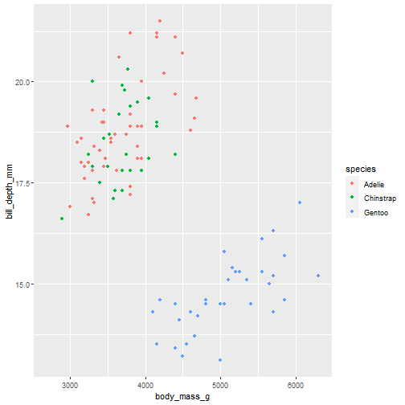
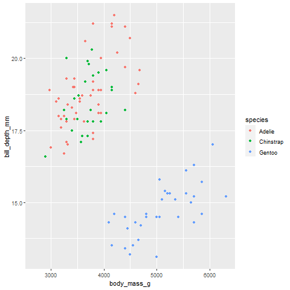
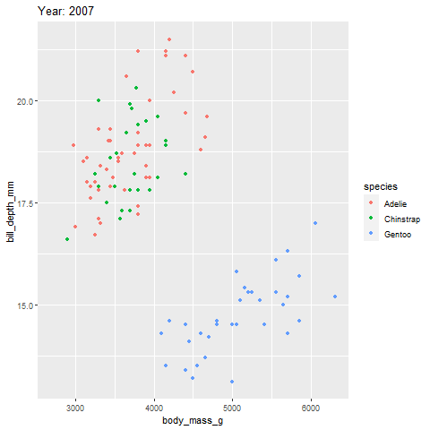

```{r setup, include=FALSE}
options(htmltools.dir.version = FALSE)
```
<div style = "position:fixed; visibility: hidden">
$$\require{color}\definecolor{yellow}{rgb}{1, 0.8, 0.16078431372549}$$
$$\require{color}\definecolor{orange}{rgb}{0.96078431372549, 0.525490196078431, 0.203921568627451}$$
$$\require{color}\definecolor{green}{rgb}{0, 0.474509803921569, 0.396078431372549}$$
</div>

<script type="text/x-mathjax-config">
MathJax.Hub.Config({
  TeX: {
    Macros: {
      yellow: ["{\\color{yellow}{#1}}", 1],
      orange: ["{\\color{orange}{#1}}", 1],
      green: ["{\\color{green}{#1}}", 1]
    },
    loader: {load: ['[tex]/color']},
    tex: {packages: {'[+]': ['color']}}
  }
});
</script>

<style>
.yellow {color: #FFCC29;}
.orange {color: #F58634;}
.green {color: #007965;}
</style>


```{r flair_color, echo=FALSE}
library(flair)
yellow <- "#FFCC29"
orange <- "#F58634"
green <- "#007965"
```

---
# Outline of class


Advanced plotting


1. {patchwork} - bringing plots together
2. {ggrepel} - repel your labels on your plots
3. {gganimate} - add some animations to your plots
4. {magick} - photo processing


I am just going to give you a little taste of what each of these packages can do.  Please check out the documentation for each to delve deeper.

Lab 
1. Work on your good plot/Bad plot lab presentations!
  

---
# Install new packages

```{r, eval=FALSE}
install.packages("patchwork") # for bringing plots together
install.packages("ggrepel") # for repelling labels
install.packages("gganimate") # animations
install.packages("magick") # for images

```

```{r, warning=FALSE, message=FALSE}
library(tidyverse)
library(here)
library(patchwork)
library(ggrepel)
library(gganimate)
library(magick)
library(palmerpenguins)
```
---
# Patchwork

Easily bring your plots together  


---
# Patchwork

.orange[Let's start with two simple plots from the Palmer penguin dataset.]

.pull-left[
```{r, message=FALSE, warning=FALSE, out.width='60%', fig.align='center'}
# plot 1
p1<-penguins %>%
  ggplot(aes(x = body_mass_g, 
             y = bill_length_mm, 
             color = species))+
  geom_point()

p1
```
]

.pull-right[
```{r, message=FALSE, warning=FALSE, out.width='60%', fig.align='center'}
# plot 2
p2<-penguins %>%
  ggplot(aes(x = sex, 
             y = body_mass_g, 
             color = species))+
  geom_jitter(width = 0.2)


p2
```
]

---
# Patchwork
.orange[Bring the plots together using simple operations.]

```{r, message=FALSE, warning=FALSE, fig.asp=.5, fig.align='center', out.width='80%'}
p1+p2 #<<
```

---
# Patchwork
.orange[Group the legends.]

```{r, message=FALSE, warning=FALSE, fig.asp=.5, fig.align='center', out.width='80%'}
p1+p2 +
  plot_layout(guides = 'collect')#<<
```

---

# Patchwork
.orange[Add labels (A,B).]

```{r, message=FALSE, warning=FALSE, fig.asp=.5, fig.align='center', out.width='80%'}
p1+p2 +
  plot_layout(guides = 'collect')+
  plot_annotation(tag_levels = 'A')#<<
```
---
# Patchwork
.orange[Put one plot on top of the other.]
.pull-left[
```{r plot1, message=FALSE, warning=FALSE, fig.asp=.5, fig.align='center', out.width='80%', eval=FALSE}
p1/p2 + #<<
  plot_layout(guides = 'collect')+
  plot_annotation(tag_levels = 'A')
```
]
.pull-right[
```{r plot1-out, ref.label="plot1", echo=FALSE, warning = FALSE}

```
]
---
# Patchwork

So many cool ways to bring together and modify plots.  For more info see the many [vignettes here](https://patchwork.data-imaginist.com/articles/patchwork.html).

.center[

]

---
# ggrepel
Easy and clear labels for plots.

.center[

]

---
# ggrepel
 Use the mtcars dataset that comes with it.  It is data on cars.
 
```{r, eval = FALSE, warning=FALSE, message=FALSE}
View(mtcars)
```

--

.pull-left[
```{r plot2, eval=FALSE}
ggplot(mtcars, aes(x = wt, 
                   y = mpg, 
                   label = rownames(mtcars))) +
  geom_text() + # creates a text label
  geom_point(color = 'red') 
```
]

.pull-right[
```{r plot2-out, ref.label="plot2", echo=FALSE, warning = FALSE}

```
]
---
# ggrepel
 .orange[Repel the labels.]

.pull-left[
```{r plot3, eval=FALSE}
ggplot(mtcars, aes(x = wt, 
                   y = mpg, 
                   label = rownames(mtcars))) +
  geom_text_repel() + # repel them
  geom_point(color = 'red') 
```
]

.pull-right[
```{r plot3-out, ref.label="plot3", echo=FALSE, warning = FALSE}

```
]

---
# ggrepel
 .orange[Use the label function.]

.pull-left[
```{r plot4, eval=FALSE}
ggplot(mtcars, aes(x = wt, 
                   y = mpg, 
                   label = rownames(mtcars))) +
  geom_label_repel() + # repel them
  geom_point(color = 'red') 
```
]

.pull-right[
```{r plot4-out, ref.label="plot4", echo=FALSE, warning = FALSE}

```
]
---
# ggrepel

For more cool things you can do with [ggrepel see here](https://ggrepel.slowkow.com/articles/examples.html).
---
# gganimate
Make your figure an animation!

.center[

]

---
# gganimate
Let's go back to our penguin plot, but animate the figure by year. .orange[Our static plot.]

.pull-left[
```{r plot5, warning=FALSE, message=FALSE, eval = FALSE}
penguins %>%
ggplot(aes(x = body_mass_g, 
            y = bill_depth_mm, 
            color = species)) +
  geom_point() 
```
]

.pull-right[
```{r plot5-out, ref.label="plot5", echo=FALSE, warning = FALSE}

```
]

---
# gganimiate
.orange[Add a transition.]


.pull-left[
```{r warning=FALSE, message=FALSE, eval = FALSE}
penguins %>%
ggplot(aes(x = body_mass_g, 
            y = bill_depth_mm, 
            color = species)) +
  geom_point() +
  transition_states( #<<
     year, # what are we animating by #<<
     transition_length = 2, #The relative length of the transition. #<<
     state_length = 1 # The length of the pause between transitions  #<<
   ) #<<
```
]

.pull-right[

]
---
# gganimate
.orange[Change the **ease** aesthetics.]


.pull-left[
```{r warning=FALSE, message=FALSE, eval = FALSE}
penguins %>%
ggplot(aes(x = body_mass_g, 
            y = bill_depth_mm, 
            color = species)) +
  geom_point() +
  transition_states(
     year, # what are we animating by
     transition_length = 2, #The relative length of the transition.
     state_length = 1 # The length of the pause between transitions
   )+
  ease_aes("bounce-in-out") #<<
```

A few examples:
- linear (default)
- bounce
- sine
- circular
- many more...
]


.pull-right[
]

---
# gganimate
.orange[Add a transition title.]


.pull-left[
```{r warning=FALSE, message=FALSE, eval = FALSE}
penguins %>%
ggplot(aes(x = body_mass_g, 
            y = bill_depth_mm, 
            color = species)) +
  geom_point() +
  transition_states(
     year, # what are we animating by
     transition_length = 2, #The relative length of the transition.
     state_length = 1 # The length of the pause between transitions
   )+
  ease_aes("sine-in-out") +
  ggtitle('Year: {closest_state}') #<<
```
]

.pull-right[

]
---
.orange[Save it as a .gif.]


.pull-left[
```{r warning=FALSE, message=FALSE, eval = FALSE}
penguins %>%
ggplot(aes(x = body_mass_g, 
            y = bill_depth_mm, 
            color = species)) +
  geom_point() +
  transition_states(
     year, # what are we animating by
     transition_length = 2, #The relative length of the transition.
     state_length = 1 # The length of the pause between transitions
   )+
  ease_aes("sine-in-out") +
  ggtitle('Year: {closest_state}') +
  anim_save(here("Week_08","output","mypengiungif.gif"))#<<
```
]

.pull-right[
]

---
# gganimate

For more things to do [see here](https://gganimate.com/index.html).

.center[

]

---
# magick
Advanced image processing.

.center[

]


---
# Magick
.orange[Put a penguin in it.]  
Read in an image of a pengiun (can be on your computer or the internet).


```{r}
penguin<-image_read("https://pngimg.com/uploads/penguin/pinguin_PNG9.png")

penguin
```
 Getting a weird error? [Follow this](https://stackoverflow.com/questions/64147821/error-running-weathercan-package-fatal-ssl-tls-alert-e-g-handshake-failed)

---
# Magick
To put it on a plot you first need to save your plot as an image.

```{r, warning = FALSE, message=FALSE,out.width='30%', fig.align='center'}
penguins %>%
ggplot(aes(x = body_mass_g, 
            y = bill_depth_mm, 
            color = species)) +
  geom_point() 
  ggsave(here("Week_08","output","penguinplot.png"))
```


---
# Magick
Read in the plot as a magick image and make a composite plot
```{r, warning = FALSE, message=FALSE, fig.align='center', out.width='40%'}
penplot<-image_read(here("Week_08","output","penguinplot.png"))
out <- image_composite(penplot, penguin, offset = "+70+30")
out
```
---
# Magick
You can do this with gifs too.

```{r, warning=FALSE, message=FALSE, out.width='40%', fig.align='center'}
# Read in a penguin gif
pengif<-image_read("https://media3.giphy.com/media/H4uE6w9G1uK4M/giphy.gif")
outgif <- image_composite(penplot, pengif, gravity = "center")
animation <- image_animate(outgif, fps = 10, optimize = TRUE)
animation
```
---
# Magick

For more magick plotting [see here](https://cran.r-project.org/web/packages/magick/vignettes/intro.html).

.center[

]
---
# Today's totally awesome R package

Sourdough recipes in R!


```{r, eval=FALSE}
remotes::install_github("andrewheiss/sourrr")
```

```{r}
library(sourrr)

build_recipe(final_weight = 900, hydration = 0.75)
```

---
# Thanks!

Slides created via the R package [**xaringan**](https://github.com/yihui/xaringan).