```{r setup, include=FALSE}
options(htmltools.dir.version = FALSE)

def.chunk.hook  <- knitr::knit_hooks$get("chunk")
knitr::knit_hooks$set(chunk = function(x, options) {
  x <- def.chunk.hook(x, options)
  ifelse(options$size != "normalsize", paste0("\n \\", options$size,"\n\n", x, "\n\n \\normalsize"), x)
})
```
<div style = "position:fixed; visibility: hidden">
$$\require{color}\definecolor{yellow}{rgb}{1, 0.8, 0.16078431372549}$$
$$\require{color}\definecolor{orange}{rgb}{0.96078431372549, 0.525490196078431, 0.203921568627451}$$
$$\require{color}\definecolor{green}{rgb}{0, 0.474509803921569, 0.396078431372549}$$
</div>

<script type="text/x-mathjax-config">
MathJax.Hub.Config({
  TeX: {
    Macros: {
      yellow: ["{\\color{yellow}{#1}}", 1],
      orange: ["{\\color{orange}{#1}}", 1],
      green: ["{\\color{green}{#1}}", 1]
    },
    loader: {load: ['[tex]/color']},
    tex: {packages: {'[+]': ['color']}}
  }
});
</script>

<style>
.yellow {color: #FFCC29;}
.orange {color: #F58634;}
.green {color: #007965;}
</style>


```{r flair_color, echo=FALSE}
library(flair)
yellow <- "#FFCC29"
orange <- "#F58634"
green <- "#007965"
```

---
# Intro to Shiny Apps

1. What is Shiny and why use it?
2. Basics of user interface 
3. Basics of the server
4. Reactive objects
5. Resources for Shiny Themes, dashboard, publishing your app
  


.center[

]

[Cheatsheet](https://shiny.posit.co/r/articles/start/cheatsheet/)

---
# What is Shiny?


---

# When is Shiny useful?

When we want to make R code accessible outside of an R or RStudio environment. For example,

--

- teaching a package

--

- showing data visualizations to non-experts

--

- streamlining certain code-intensive things (like database queries or visualizing bulky simulation outputs)

---
# Examples

- Teaching population growth models  
[Population Dynamics Lab](https://nsilbiger.shinyapps.io/PopulationDynamicsLab/)

--

- Visualize model projections  
[Marine Mammal Bycatch model](https://msiple.shinyapps.io/mmrefpoints/)  
Siple et al. (2022) Journal of Open Source Software

--
- To have fun  

.center[]

---
# Starting a new Shiny app

Note: your Shiny app needs to be in its own folder and the foldername is the name of the app. It is really best for it to be its own standalone repo, but for today create your own folder in your lastname repo

Install **shiny**: if you have the most recent RStudio it should already be installed
--
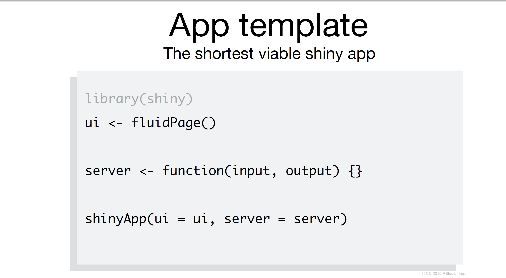

---
# Each Shiny app has two components

The **`ui`** (user interface) object dictates the appearance of the app. UI functions write HTML. For something to appear in your app, it needs to be in the UI.

--

***

The **`server()`** function contains rendering expressions that create the objects to display. 


The server function and UI object are passed to the `shinyApp()` function to create a Shiny app object.

--

***

When saving the script in your app, create a folder with the name of your app and then save the script as **'app.R'**. You MUST save the script with this name for it to work.  Also, all files associted with your app must be in this folder.

---
# Add elements to your app as arguments to fluid page

```{r, eval=FALSE}
library(shiny)

ui<-fluidPage('Hello World')

server<-function(input,output){}

shinyApp(ui = ui, server = server)
```

### Not a very exciting app, but an app no less!

---
# Start an app in RStudio

From The RStudio IDE, pick `New File -> Shiny Web App`

You can choose between single (**app.R**) or multiple files (**ui.R** and **server.R**)

*Does it matter which one you choose?*
>Not really. Some people like the organization of having multiple files. But it really doesn't make a difference!

This has a lot of helpful start code, but we are going to start from scratch today

---
# Build app around inputs/outputs

.center[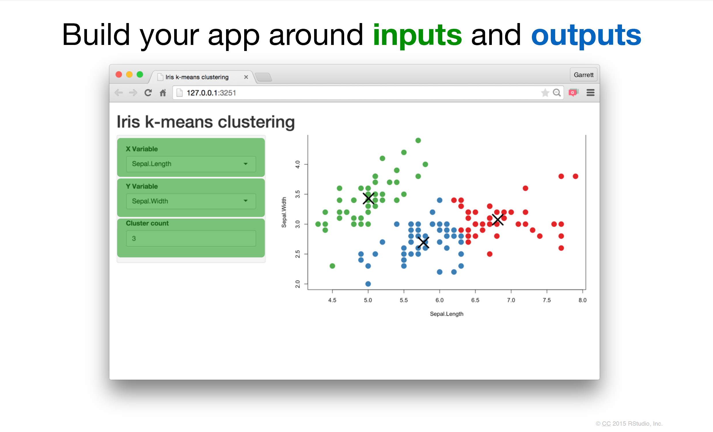]


---
# Build app around inputs/outputs

.center[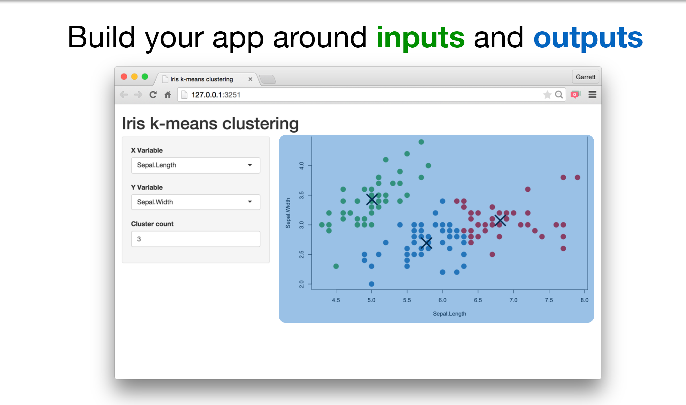]

---
# Add elements to your app using fluidPage()

```{r, eval = FALSE}

ui<-fluidPage(
   # Inputs functions, #<<
   # Outputs functions #<<
)

```

---
# Create an input with a *Input function

There are many types of inputs and the syntax for all of them is *type*Input. To make a slider we use `sliderInput()`.  

These inputs make a bunch of html code behind the scene.

--

```{r, eval=FALSE}
sliderInput(inputId = "num", # ID name for the input
            label = "Choose a number", # Label above the input
            value = 25, min = 1, max = 100 # values for the slider
            )

```

Creates this code behind the scenes
```{html, eval=FALSE}
<div class="form-group shiny-input-container">
<label class="control-label" for="num">Choose a number</label>
<input class="js-range-slider" id="num" data-min="1" data-max="100"
data-from="25" data-step="1" data-grid="true" data-grid-num="9.9"
data-grid-snap="false" data-prettify-separator="," data-keyboard="true"
data-keyboard-step="1.01010101010101"/>
</div>
```

---
# Let's create an input with our input function

Start with our blank app. Then we add our slider into the user interface  
```{r, eval=FALSE}
library(shiny)

ui<-fluidPage()

server<-function(input,output){}

shinyApp(ui = ui, server = server)
```

---
# Let's create an input with our input function

Start with our blank app. Then we add our slider into the user interface  
```{r, eval=FALSE}
library(shiny)

ui<-fluidPage(
  sliderInput(inputId = "num", # ID name for the input
            label = "Choose a number", # Label above the input
            value = 25, min = 1, max = 100 # values for the slider
            )
)

server<-function(input,output){}

shinyApp(ui = ui, server = server)
```
--
.center[ 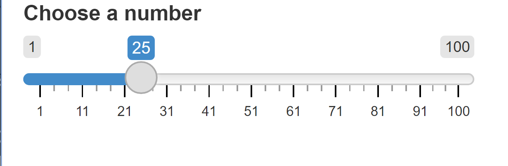{width=50px}]

We have a beautiful slider. It doesn't do anything yet, but we made it!

---
# So many shiny widget options for inputs

[Shiny Widgets with code](https://shiny.rstudio.com/gallery/widget-gallery.html)  

--

## Even more options!

[Shiny widgets package](https://dreamrs.github.io/shinyWidgets/)

---
# Syntax

.center[
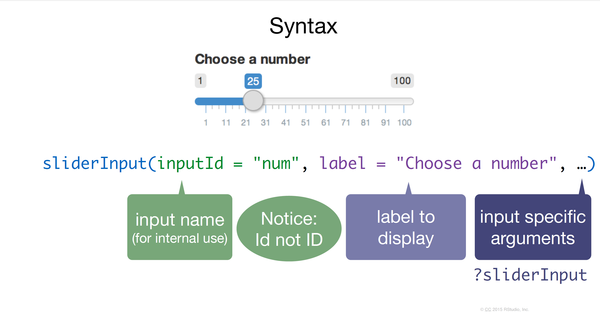
]

---
# Outputs

.center[]
---
# Outputs

.center[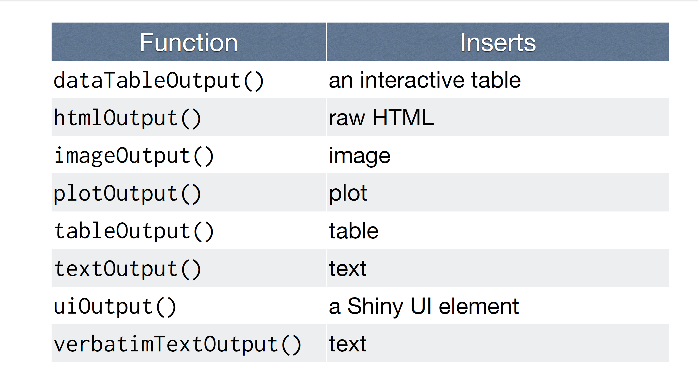]

---
# *Output()

### To display an output add it to `fluidPage()` with an *Output() function

.center[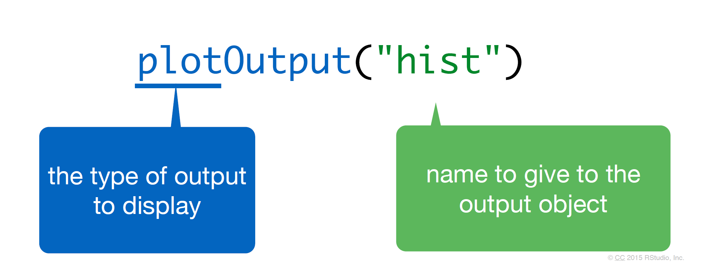]

---
# Let's add it to our UI

**Note, you must add a comma between objects**

```{r, eval=FALSE}
library(shiny)

ui<-fluidPage(
  sliderInput(inputId = "num", # ID name for the input
            label = "Choose a number", # Label above the input
            value = 25, min = 1, max = 100 # values for the slider
            ), #<<
  plotOutput("hist") #creates space for a plot called hist  #<<
)

server<-function(input,output){}

shinyApp(ui = ui, server = server)
```

This code creates the space for a new plot, but nothing happens yet
---
# The Server

What is the server? Mostly, R code.  This is where the vegan meat of your app is located.

--

## Use **3 rules** to write the server function

```{r, eval=FALSE}
server<-function(input,output){
  
  
  
}
```

---
# 1. Save objects to display to output$

```{r, eval=FALSE}
server<-function(input,output){
  output$hist <- # code #<<
  
  
}
```

--
 Look back to the ui, `hist` is spelled identically to the name in the plotOutput() function
 
 .center[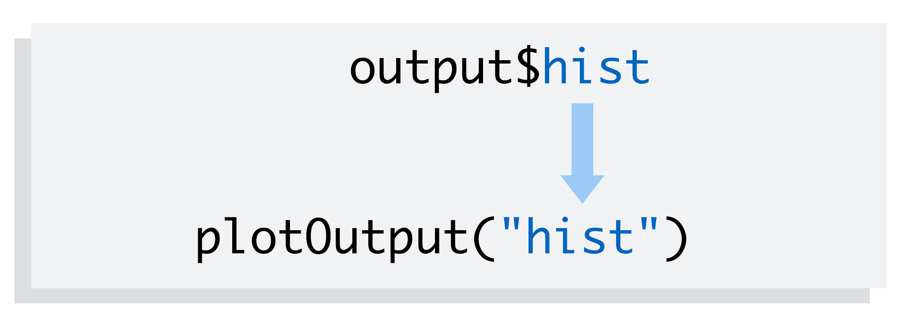]

---
# 2. Build objects to display with render*({})

```{r, eval=FALSE}
server<-function(input,output){
  output$hist <- renderPlot({
    
    # R code to make the hist output goes here
  })
  
  
}
```

---
# Many types of renders

.center[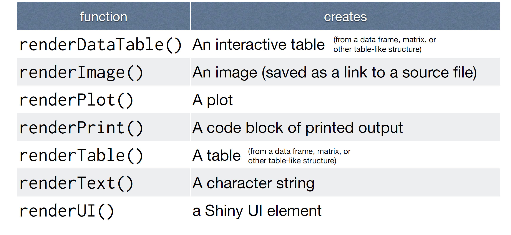]
---
# Render a plot

This will create a static plot first. Also we are using ggplot so add in the tidyverse

```{r, eval=FALSE}
library(shiny)
library(tidyverse) #<<

ui<-fluidPage(
  sliderInput(inputId = "num", # ID name for the input
            label = "Choose a number", # Label above the input
            value = 25, min = 1, max = 100 # values for the slider
            ),
  plotOutput("hist") #creates space for a plot called hist  
)

server<-function(input,output){
  
   output$hist <- renderPlot({
    
     # {} allows us to put all our R code in one nice chunck
    data<-tibble(x = rnorm(100)) # 100 random normal points #<<
    
    ggplot(data, aes(x = x))+ # make a histogram #<<
      geom_histogram() #<<
     
  })
}

shinyApp(ui = ui, server = server)
```

---
# Rule 3. Access the **input** values with input$

We are going to replace `100` with `input$num`. Notice, that `num` comes from what we put in our inputID. Exact same spelling.  

```{r, eval=FALSE}
library(shiny)
library(tidyverse) 

ui<-fluidPage(
  sliderInput(inputId = "num", # ID name for the input #<<
            label = "Choose a number", # Label above the input
            value = 25, min = 1, max = 100 # values for the slider
            ),
  plotOutput("hist") #creates space for a plot called hist  
)

server<-function(input,output){
  
   output$hist <- renderPlot({
    
     # {} allows us to put all our R code in one nice chunck
    data<-tibble(x = rnorm(input$num)) # 100 random normal points #<<
    
    ggplot(data, aes(x = x))+ # make a histogram 
      geom_histogram() 
     
  })
}

shinyApp(ui = ui, server = server)
```

---
# You made your first app!

.center[]

---
# Let's add two types of inputs

Let's say we want to write an input where the user can create whatever title they want by typing it into a box. Let's update our ui to have a textInput.

```{r, eval = FALSE}
ui<-fluidPage(
  sliderInput(inputId = "num", # ID name for the input 
            label = "Choose a number", # Label above the input
            value = 25, min = 1, max = 100 # values for the slider
            ),
  textInput(inputId = "title", # new Id is title #<<
          label = "Write a title", #<<
          value = "Histogram of Random Normal Values"), # starting title #<<
  plotOutput("hist") #creates space for a plot called hist  
)
```

---
# Now let's update the server to change the title of the plot

```{r, eval = FALSE}
server<-function(input,output){
  
   output$hist <- renderPlot({
    
     # {} allows us to put all our R code in one nice chunck
    data<-tibble(x = rnorm(input$num)) # 100 random normal points 
    
    ggplot(data, aes(x = x))+ # make a histogram 
      geom_histogram() +
      labs(title = input$title) #Add a new title #<<
     
  })
}

```

---
# Create two *outputs*

Let's say we want to add a data table below the histogram that has all the summary statistics. We need to add another ui that creates a place to put the table. We will use `verbatimTextOutput()`

```{r, eval = FALSE}
ui<-fluidPage(
  sliderInput(inputId = "num", # ID name for the input 
            label = "Choose a number", # Label above the input
            value = 25, min = 1, max = 100 # values for the slider
            ),
  textInput(inputId = "title", # new Id is title 
          label = "Write a title",
          value = "Histogram of Random Normal Values"), # starting title 
  plotOutput("hist"), #creates space for a plot called hist  #<<
  verbatimTextOutput("stats") # create a space for stats #<<
  
)
```

---

# Now update the server to calculate the summary stats

Here, we will use renderPrint()

```{r, eval = FALSE}
server<-function(input,output){
  
   output$hist <- renderPlot({
    
     # {} allows us to put all our R code in one nice chunck
    data<-tibble(x = rnorm(input$num)) # 100 random normal points 
    
    ggplot(data, aes(x = x))+ # make a histogram 
      geom_histogram() +
      labs(title = input$title) #Add a new title #<<
     
  })
   output$stats <- renderPrint({
     summary(rnorm(input$num)) # calculate summary stats based on the numbers#<<
     })
   
}

```

---
# Cleaning the code

Here, we used input$num twice: once in the plot and once in the summary stats. This actually created two separate random distributions and the stats actually are not directly related to the plots. We need to build a *reactive* object so the same dataframe is being used throughout all the code.

.center[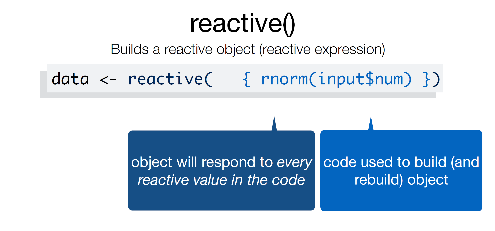]

---
# A reactive object is special in two ways

1. You call a reactive object like a function

```{r, eval = FALSE}
data()
```

---
# Reactive object

.small[
```{r, eval = FALSE}
library(shiny)
library(tidyverse)

ui<-fluidPage(
  sliderInput(inputId = "num", # ID name for the input
              label = "Choose a number", # Label above the input
              value = 25, min = 1, max = 100 # values for the slider
  ), 
  textInput(inputId = "title", # new Id is title
            label = "Write a title", #
            value = "Histogram of Random Normal Values"), # starting title
  plotOutput("hist"), #creates space for a plot called hist  
  verbatimTextOutput("stats") # create a space for stats
)

server<-function(input,output){
  output$hist <- renderPlot({
    
    # {} 
    data<-tibble(x = rnorm(input$num)) # 100 random normal points #<<
    
    ggplot(data, aes(x = x))+ # make a histogram
      geom_histogram()+
      labs(title = input$title) #Add a new title
    
  })
  output$stats <- renderPrint({
    summary(rnorm(input$num)) # calculate summary stats based on the numbers
  })
}
shinyApp(ui = ui, server = server)
```
]
---
# Reactive object

```{r, eval = FALSE}
library(shiny)
library(tidyverse)

ui<-fluidPage(
  sliderInput(inputId = "num", # ID name for the input
              label = "Choose a number", # Label above the input
              value = 25, min = 1, max = 100 # values for the slider
  ), 
  textInput(inputId = "title", # new Id is title
            label = "Write a title", #
            value = "Histogram of Random Normal Values"), # starting title
  plotOutput("hist"), #creates space for a plot called hist  
  verbatimTextOutput("stats") # create a space for stats
)

server<-function(input,output){
  
  data<-reactive({ #<<
     tibble(x = rnorm(input$num)) # 100 random normal points #<<
  }) #<<
  
  output$hist <- renderPlot({
    ggplot(data, aes(x = x))+ # make a histogram
      geom_histogram()+
      labs(title = input$title) #Add a new title
    
  })
  output$stats <- renderPrint({
    summary(rnorm(input$num)) # calculate summary stats based on the numbers
  })
}
shinyApp(ui = ui, server = server)
```

---
# Reactive object: Use data()

```{r, eval = FALSE}

server<-function(input,output){
  
  data<-reactive({ 
     tibble(x = rnorm(input$num)) # 100 random normal points #<<
  }) 
  
  output$hist <- renderPlot({
    ggplot(data(), aes(x = x))+ # make a histogram #<<
      geom_histogram()+
      labs(title = input$title) #Add a new title
    
  })
  output$stats <- renderPrint({
    summary(data()) # calculate summary stats based on the numbers #<<
  })
}
shinyApp(ui = ui, server = server)
```

---
# A reactive object is special in two ways

1. You call a reactive object like a function  

```{r, eval = FALSE}
data()
```

2. Reactive expressions cache their values making your app run much faster  
---

# How to publish your shiny app for FREE

[Check out this step by step user guide](https://docs.posit.co/shinyapps.io/guide/getting_started/)
[Other options for publishing your app](https://shiny.posit.co/r/getstarted/shiny-basics/lesson7/)

1. Make an account on [ShinyApps.io](ShinyApps.io)
.center[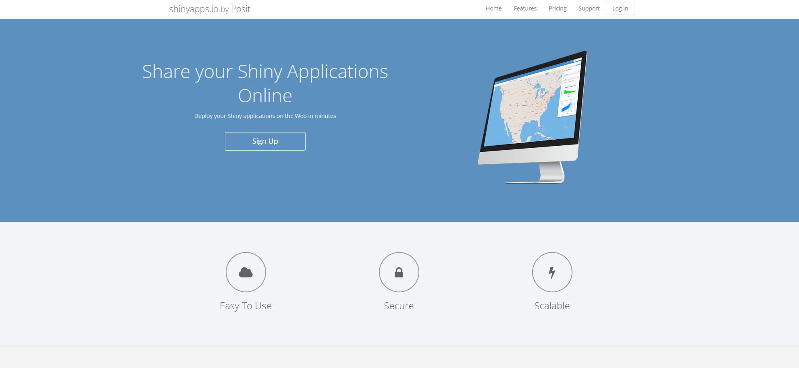]

---
# How to publish your shiny app for FREE

2. Install the *rsconnect* package

```{r, eval = FALSE}
install.packages('rsconnect')
```

--
3. Get your token and "secret"
.center[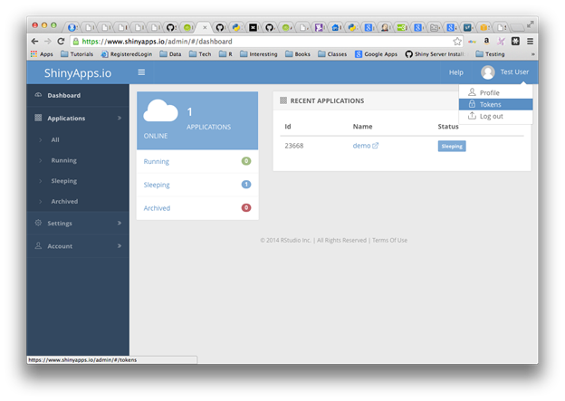]
.center[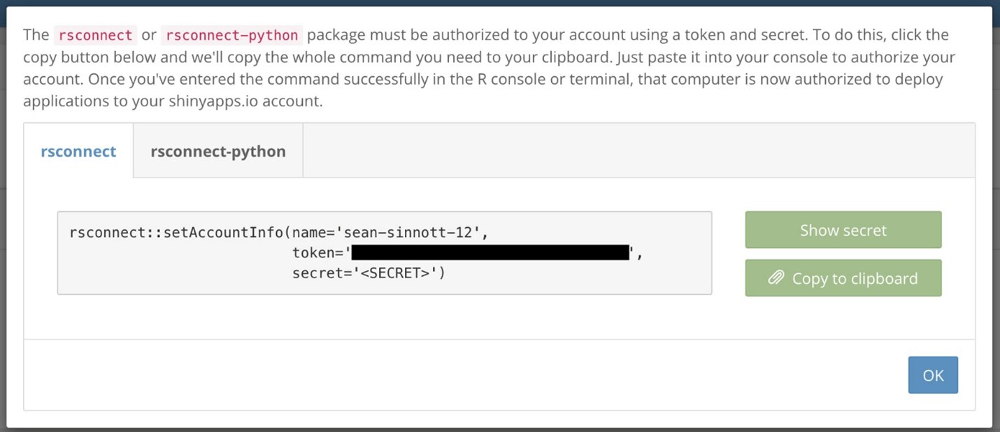]

---
# How to publish your shiny app for FREE

4. Copy and paste your token and secret into your console

```{r, eval = FALSE}
rsconnect::setAccountInfo(name="<ACCOUNT>", token="<TOKEN>", secret="<SECRET>")
```

4. Deploy your app either by pressing "publish" or deploying in the console

```{r, eval = FALSE}
# do this in the console after you already ran you shiny app
library(rsconnect)
deployApp() ## re-run this or republish after every update you make to your code
```
---
# There is SO much more you can do

Check out these resources.

[Intro to shiny](https://github.com/rstudio/webinars/blob/master/47-introduction-to-shiny/intro-to-shiny.pdf)  
[More tutorials](https://github.com/rstudio-education/shiny.rstudio.com-tutorial)
[Mastering Shiny - THE BIBLE OF SHINY](https://mastering-shiny.org/)  
[RStudio Gallery](https://shiny.rstudio.com/gallery/widget-gallery.html)  
[Shiny Tutorial](https://shiny.rstudio.com/tutorial/)  
[Shiny Widgets](https://dreamrs.github.io/shinyWidgets/)  

--

[See other peoples apps and code](https://shiny.rstudio.com/gallery/)
---
# Other cool things

[Shiny themes](https://rstudio.github.io/shinythemes/)  
[Shiny Dashboards](https://rstudio.github.io/shinydashboard/)  

---
# Homework

Use any data set to make a shiny app. Your app must have at least one dynamic figure and one other output (can be anything). You must publish it on shinyapps.io so that we can view your app online.

---
class: center, middle

# Thanks!

Slides created via the R package [**xaringan**](https://github.com/yihui/xaringan).  
Many slides modified from [mine-cetinkaya-rundel](https://github.com/rstudio-education/shiny.rstudio.com-tutorial)