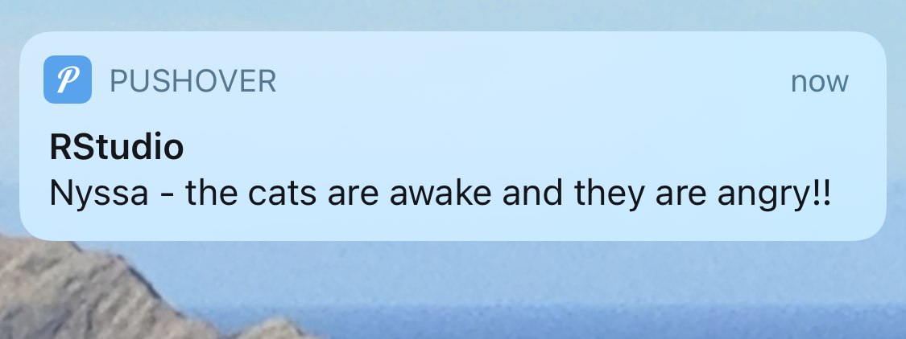

```{r setup, include=FALSE}
options(htmltools.dir.version = FALSE, htmltools.preserve.raw = FALSE)
library(anicon)
```
<div style = "position:fixed; visibility: hidden">
$$\require{color}\definecolor{yellow}{rgb}{1, 0.8, 0.16078431372549}$$
$$\require{color}\definecolor{orange}{rgb}{0.96078431372549, 0.525490196078431, 0.203921568627451}$$
$$\require{color}\definecolor{green}{rgb}{0, 0.474509803921569, 0.396078431372549}$$
</div>

<script type="text/x-mathjax-config">
MathJax.Hub.Config({
  TeX: {
    Macros: {
      yellow: ["{\\color{yellow}{#1}}", 1],
      orange: ["{\\color{orange}{#1}}", 1],
      green: ["{\\color{green}{#1}}", 1]
    },
    loader: {load: ['[tex]/color']},
    tex: {packages: {'[+]': ['color']}}
  }
});
</script>

<style>
.yellow {color: #FFCC29;}
.orange {color: #F58634;}
.green {color: #007965;}
</style>


```{r flair_color, echo=FALSE, warning=FALSE, message=FALSE}
library(flair)
yellow <- "#FFCC29"
orange <- "#F58634"
green <- "#007965"
```

---
# Outline of class

Intro to modeling 

1. Intro to basic linear modeling
2. Viewing results in base R, broom, and modelsummary
3. Running many models at the same time with purrr
4. Intro to tidy models


---
# Set-up your script


```{r, eval=FALSE}
install.packages('modelsummary') # to show model output
install.packages('tidymodels') # for tidy models
install.packages('broom') # for clean model output
install.packages('flextable') # to look at model results in a nice table
install.packages('peformance') # to check model assumptions
install.packages('see') # needs to be installed, but does not need to be loaded in the library, required for performance
```


```{r, warning=FALSE, message=FALSE}
library(tidyverse)
library(here)
library(palmerpenguins)
library(broom)
library(performance) 
library(modelsummary)
library(tidymodels)
```


.pull-left[

]

.pull-right[

]

---
# Intro to basic linear modeling

#### WARNING: This is NOT a stats class.  Please make sure you understand the theory behind the statistics that you are using before you use them. Also, even though we spent the semester learning about cleaning and visualization you MUST use stats to interpret your data. 

Today, I am going to show you a few cool packages that help with some modeling. There are TONS of packages and you should choose what makes the most sense to your unique type of data. 

---
# Anatomy of a basic linear model

To run a **simple linear model** you use the following formula: 

`mod<-lm(y~x, data = df)`  

lm = linear model, y = dependent variable, x = independent variable(s), df = dataframe.

You read this as *y is a function of x*  

--

**Multiple regression**  
`mod<-lm(y~x1 + x2, data = df)`  

--

**Interaction term**  
`mod<-lm(y~x1*x2, data = df)`  the * will compute x1+x2+x1:x2


---
# Model the penguin dataset
We've tidied and visualized the data and have our set of hypotheses that we want to test. Now we can start modeling... 

.center[
```{r, echo = FALSE, out.width='35%', warning = FALSE, message = FALSE}
penguins %>%
  ggplot(aes(y = bill_length_mm, x = bill_depth_mm, color = species))+
  geom_point()+
  geom_smooth(method = "lm")+
  labs(color = "Species",
       y = "Bill Length (mm)",
       x = "Bill Depth (mm)")+
  theme_bw()

```


]

```{r}
# Linear model of Bill depth ~ Bill length by species
Peng_mod<-lm(bill_length_mm ~ bill_depth_mm*species, data = penguins)
```

---
# Check model assumptions with performace

.pull-left[
ALWAYS check the assumptions of your specific model. Make sure you know what your model is doing behind the scenes and that you meet all assumptions before interpreting your results.  The [{performance}](https://github.com/easystats/performance) package makes this super easy. 


```{r plot1, out.width="50%", warning = FALSE, message = FALSE, eval = FALSE}
check_model(Peng_mod) # check assumptions of an lm model
```
]

.pull-right[
```{r plot1-out, ref.label="plot1", echo=FALSE, warning = FALSE, message = FALSE}

```
]
---
# View results: base R

### ANOVA Table

```{r}
anova(Peng_mod)
```

---
# View results: base R

### Coefficients (effect size) with error 

```{r, out.width="50%"}
summary(Peng_mod)
```

---
# View results with broom

These results are not in a clean form and it is hard to extract specific values. Using [{broom}](https://cran.r-project.org/web/packages/broom/vignettes/broom.html) we can "tidy" the results so that it is easier to view and extract. Functions tidy(), glance(), and augment() will clean up your results

```{r}
# Tidy coefficients
coeffs<-tidy(Peng_mod) # just put tidy() around it
coeffs
```
---
# View results with broom

**glance** extracts R-squared, AICs, etc of the model
```{r}
# tidy r2, etc
results<-glance(Peng_mod) 
results
```

---
# View results with broom

**augment** add residuals and predicted values to your original data and requires that you put both the model and data
```{r}
# tidy residuals, etc

resid_fitted<-augment(Peng_mod)
resid_fitted
```

---
# Results in {modelsummary}

[{modelsummary}](https://vincentarelbundock.github.io/modelsummary/) creates tables and plots to summarize statistical models and data in `R`. 

modelsummary includes two families of functions:

Model Summary  
`modelsummary`: Regression tables with side-by-side models.  
`modelsummary_wide`: Regression tables for categorical response models or grouped coefficients.  
`modelplot`: Coefficient plots.  

Data Summary  
`datasummary`: Powerful tool to create (multi-level) cross-tabs and data summaries.  
`datasummary_balance`: Balance tables with subgroup statistics and difference in means (aka “Table 1”).  
`datasummary_correlation`: Correlation tables.  
`datasummary_skim`: Quick overview (“skim”) of a dataset.  
`datasummary_df`: Turn dataframes into nice tables with titles, notes, etc.  
---
# Results in {modelsummary}

Export summary tables to word, markdown, or tex document. You can also modify the tables to make them pub quality.  


Let's compare the Peng_mod with one that does not have species as an interaction term.
```{r}
# New model
Peng_mod_noX<-lm(bill_length_mm ~ bill_depth_mm, data = penguins)

#Make a list of models and name them
models<-list("Model with interaction" = Peng_mod,
             "Model with no interaction" = Peng_mod_noX)

#Save the results as a .docx
modelsummary(models, output = here("Week_13","output","table.docx"))
```


---
# Modelplot 

.pull-left[
Canned coefficient [modelplots](https://vincentarelbundock.github.io/modelsummary/articles/modelplot.html)

```{r plot2, eval = FALSE}
#install.packages(wesanderson)
library(wesanderson)

modelplot(models) +
    labs(x = 'Coefficients', 
         y = 'Term names') +
    scale_color_manual(values = wes_palette('Darjeeling1'))
```
]


.pull-right[
```{r plot2-out, ref.label="plot2", echo=FALSE, warning = FALSE, message = FALSE}

```
]

---

# Many models with purrr, dplyr, and broom

Let's say you want to plot and compare lots of different models at the same time and view the results. For example, instead of using species as an interaction term, let's make an individual model for every species.

We can essentially make a set of lists that have each dataset that we want to model and use the `map` functions to run the same model to every dataset. We will test it step by step

--

First, let's call the penguin data and create a list for the data by each species.  We do this using `nest()`. We are going to nest the data by species. 

```{r, warning=FALSE}
 models<- penguins %>%
  ungroup()%>% # the penguin data are grouped so we need to ungroup them #<<
    nest(.by = species) # nest all the data by species #<<

models
```

---
# Many models with purrr, dplyr, and broom

map a model to each of the groups in the list
```{r, warning=FALSE}
 models<- penguins %>%
  ungroup()%>% # the penguin data are grouped so we need to ungroup them
  nest(.by = species) %>% # nest all the data by species 
  mutate(fit = map(data, ~lm(bill_length_mm~body_mass_g, data = .))) #<<
  
  models
```


```{r}
models$fit # shows you each of the 3 models
```

---
# Many models with purrr, dplyr, and broom

View the results. First, let's mutate the models list so that we have a tidy coefficient dataframe (using `tidy()`) and a tidy model results dataframe (using `glance()`) 

```{r, warning=FALSE}
 
 results<-models %>%
   mutate(coeffs = map(fit, tidy), # look at the coefficients #<<
          modelresults = map(fit, glance))  # R2 and others #<<
   
results
```

---
# Many models with purrr, dplyr, and broom

Next, select what we want to show and unnest it to bring it back to a dataframe
```{r, warning=FALSE}
 
 results<-models %>%
   mutate(coeffs = map(fit, tidy), # look at the coefficients
          modelresults = map(fit, glance)) %>% # R2 and others 
   select(species, coeffs, modelresults) %>% # only keep the results #<<
   unnest() # put it back in a dataframe and specify which columns to unnest #<<

```
```{r, eval = FALSE}
view(results) # view the results
```

```{r, echo = FALSE}
results
```

---
# Other very common stats packages

- `stats`: General (`lm`)and generalized (`glm`) linear models (already loaded with base R)   
- `lmer` : mixed effects models  
- `lmerTest`' : getting results from lmer  
- `nlme` : non-linear mixed effects models  
- `mgcv`, `gam` : generalized additive models  
- `brms`, `rstan`, and many more  : Bayesian modeling  
- `lavaan`, `peicewiseSEM` : Structural Equation Models  
- `rpart`, `randomForest`, `xgboost`, and more : Machine learning models  

And so many more!

Check out [here](https://r4ds.had.co.nz/model-basics.html) for more modeling tips

Also, more info on nest models [here](https://www.kaylinpavlik.com/linear-regression-with-nested-data/) and [here](https://r4ds.had.co.nz/many-models.html)
---
# {Tidymodels}

Like almost everything else there is a modeling package that uses the tidyverse language to create models. It is called [{tidymodels}](https://www.tidymodels.org/start/models/). For full transparency, I have not used it, but it looks cool and seems particularly useful for machine learning style modeling.


In tidymodels you start by specifying the *functional form* using the [parsnip package](https://tidymodels.github.io/parsnip/). In our case, we will use a *linear regression* which is coded like this:

```{r}
linear_reg()
```

--

Next, we need to set the *engine* for what type of linear regression we are modeling. For example, we could use an OLS regression or Bayesian or several other options.  We will stick with OLS.

```{r}
lm_mod<-linear_reg() %>%
  set_engine("lm") #<<

lm_mod
```

---
# {Tidymodels}

Next, we add the model fit.

```{r}
lm_mod<-linear_reg() %>%
  set_engine("lm") %>%
  fit(bill_length_mm ~ bill_depth_mm*species, data = penguins) #<<

lm_mod
```

---
# {Tidymodels}

Lastly, we add the tidy it. And now we can pipe this into plots, etc.  Nice, tidy way to model.

```{r}
lm_mod<-linear_reg() %>%
  set_engine("lm") %>%
  fit(bill_length_mm ~ bill_depth_mm*species, data = penguins) %>%
  tidy()#<<

lm_mod
```
---
# Pipe to a plot

```{r, out.width="30%", fig.align='center'}
lm_mod<-linear_reg() %>%
  set_engine("lm") %>%
  fit(bill_length_mm ~ bill_depth_mm*species, data = penguins) %>%
  tidy() %>%
  ggplot()+ #<<
    geom_point(aes(x = term, y = estimate))+ #<<
    geom_errorbar(aes(x = term, ymin = estimate-std.error, #<<
                      ymax = estimate+std.error), width = 0.1 )+ #<<
  coord_flip() #<<

lm_mod
```

---
# Total awesome R package

[{pushoverr}](https://github.com/briandconnelly/pushoverr): Send push notifications to your phone from R!  Does your code take forever to run and you want to go on a run yourself? Have it send your phone or smartwatch a push notification when it's done!

You will have to follow the directions on the website to download the app to your phone... but, basically with one line of code you can do this!


```{r, eval = FALSE}
install.packages("pushoverr")
library(pushoverr)

pushover("Nyssa - your code is done.")
```


---
# Total awesome R package

[{pushoverr}](https://github.com/briandconnelly/pushoverr): Send push notifications to your phone from R!  Does your code take forever to run and you want to go on a run yourself? Have it send your phone or smartwatch a push notification when it's done!

You will have to follow the directions on the website to download the app to your phone... but, basically with one line of code you can do this!


```{r, eval = FALSE}
install.packages("pushoverr")
library(pushoverr)

pushover("Nyssa - the cats are awake and they are angry!!")
```

---
# This is your last lecture...

.center[

]

# Class evals

Please take ~10 minutes to fill out the class evals. These are VERY important to me and the department.

[https://www.hawaii.edu/ces](https://www.hawaii.edu/ces)


---

.center[]
---
class: center, middle

# Thanks!

Slides created via the R package [**xaringan**](https://github.com/yihui/xaringan).  
Many slides modified from the following resources:   

[R4DS](https://r4ds.had.co.nz/iteration.html) and [Advanced R](https://adv-r.hadley.nz/functionals.html)